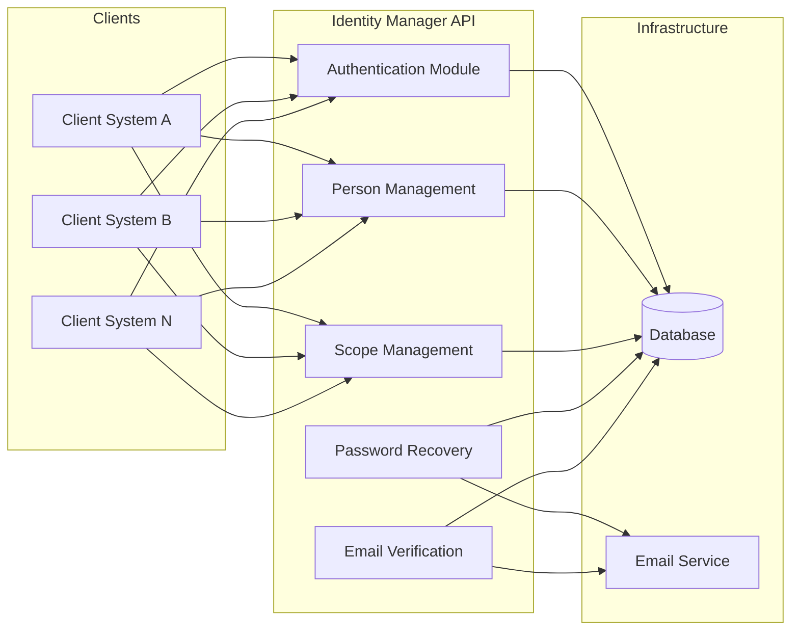
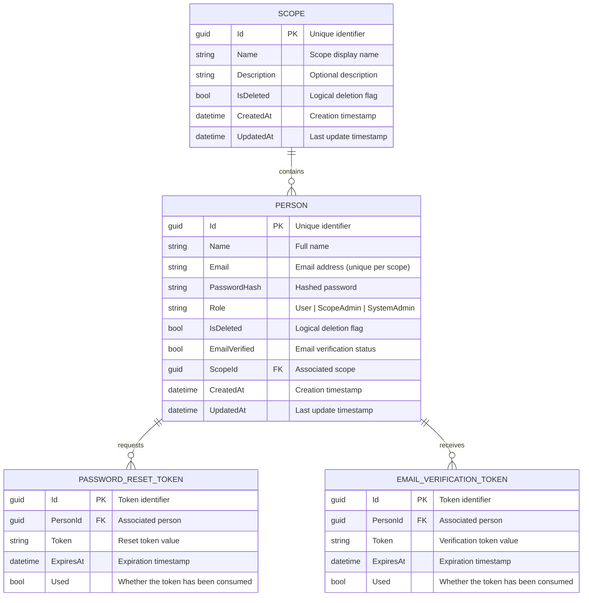
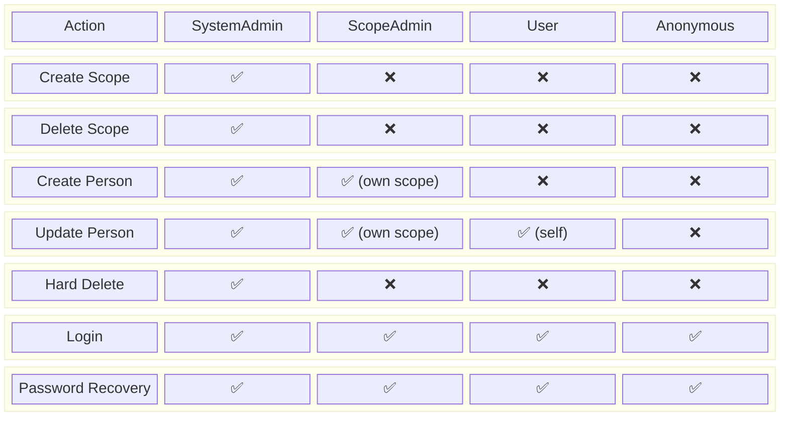
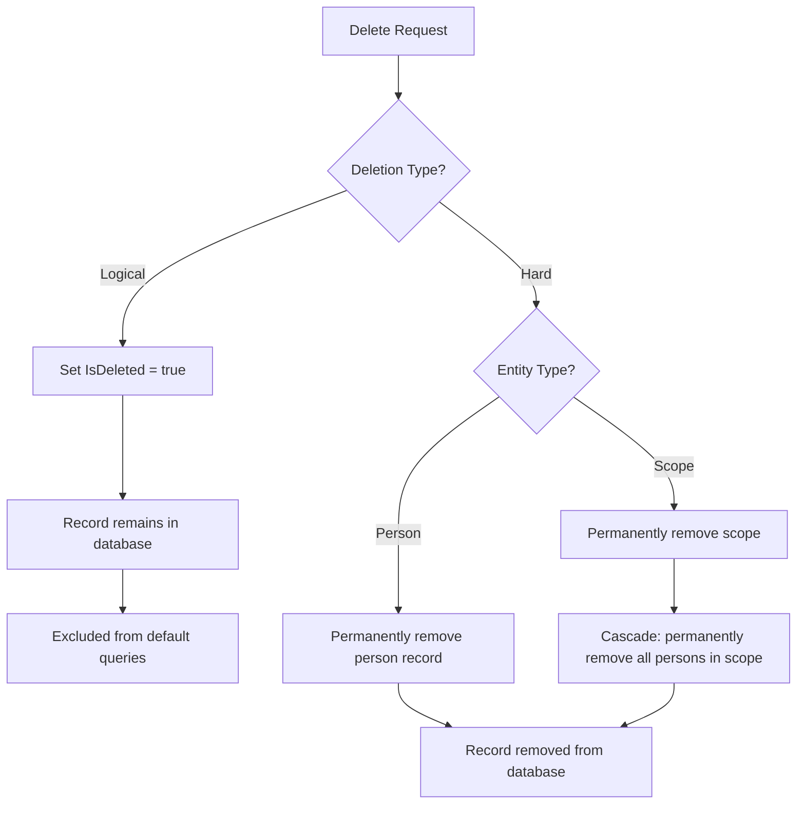

# System Requirements Document — Identity Manager API

## 1. Introduction

### 1.1 Purpose

This document specifies the functional and non-functional requirements for the **Identity Manager API**, a .NET Web API that provides centralized person management, authentication, and authorization for multiple client systems through scope-based tenancy.

### 1.2 Scope

The system encompasses person CRUD, scope CRUD, role-based access control, authentication, password recovery, email verification, and both logical and hard deletion strategies.

### 1.3 Definitions

| Term | Definition |
| ------ | ----------- |
| Person | A registered identity containing id, name, email, role, and deletion status |
| Scope | A logical boundary that groups persons belonging to a specific client system |
| Logical Deletion | Setting the `IsDeleted` flag to `true` without removing the record |
| Hard Deletion | Permanently removing the record from the database |
| Role | One of: `User`, `ScopeAdmin`, `SystemAdmin` |

---

## 2. System Overview

---

## 3. Functional Requirements

### 3.1 Scope Management

| ID | Requirement | Priority |
| ---- | ------------ | ---------- |
| FR-SC-01 | The system shall allow System Admins to **create** a new scope with a unique name | High |
| FR-SC-02 | The system shall allow authorized users to **read** scope details by ID | High |
| FR-SC-03 | The system shall allow authorized users to **list** all scopes (with pagination and filtering) | High |
| FR-SC-04 | The system shall allow System Admins to **update** scope information | High |
| FR-SC-05 | The system shall allow System Admins to **logically delete** a scope by setting `IsDeleted = true` | High |
| FR-SC-06 | The system shall allow System Admins to **hard delete** a scope, permanently removing it and its associated persons | High |
| FR-SC-07 | Logically deleted scopes shall not appear in default query results unless explicitly requested | Medium |

### 3.2 Person Management

| ID | Requirement | Priority |
| ---- | ------------ | ---------- |
| FR-PE-01 | The system shall allow creation of a person with: `Id`, `Name`, `Email`, `Role`, `IsDeleted` | High |
| FR-PE-02 | Every person must be associated with exactly **one** scope at creation time | High |
| FR-PE-03 | The system shall allow reading a person's details by ID | High |
| FR-PE-04 | The system shall allow listing persons within a scope (with pagination and filtering) | High |
| FR-PE-05 | The system shall allow updating person information (name, email, role) | High |
| FR-PE-06 | The system shall allow **logical deletion** of a person by setting `IsDeleted = true` | High |
| FR-PE-07 | The system shall allow **hard deletion** of a person, permanently removing the record | High |
| FR-PE-08 | Logically deleted persons shall not appear in default query results unless explicitly requested | Medium |
| FR-PE-09 | A person's email must be unique within the same scope | High |

### 3.3 Role Assignment

| ID | Requirement | Priority |
| ---- | ------------ | ---------- |
| FR-RO-01 | Every person must have exactly one role: `User`, `ScopeAdmin`, or `SystemAdmin` | High |
| FR-RO-02 | Only System Admins shall be able to assign or change the `SystemAdmin` role | High |
| FR-RO-03 | Scope Admins shall be able to assign `User` or `ScopeAdmin` roles within their scope | High |

### 3.4 Authentication

| ID | Requirement | Priority |
| ---- | ------------ | ---------- |
| FR-AU-01 | The system shall authenticate persons using email and password credentials | High |
| FR-AU-02 | Upon successful authentication, the system shall return an authentication token (e.g., JWT) | High |
| FR-AU-03 | The authentication token shall contain the person's ID, scope ID, and role | High |
| FR-AU-04 | The system shall reject authentication attempts for logically deleted persons | High |
| FR-AU-05 | The system shall reject authentication attempts for persons under logically deleted scopes | High |

### 3.5 Password Recovery

| ID | Requirement | Priority |
| ---- | ------------ | ---------- |
| FR-PR-01 | The system shall allow a person to request a password reset by providing their email | High |
| FR-PR-02 | The system shall generate a time-limited password reset token and send it via email | High |
| FR-PR-03 | The system shall allow the person to set a new password using a valid reset token | High |
| FR-PR-04 | Expired or already-used reset tokens shall be rejected | High |

### 3.6 Email Verification

| ID | Requirement | Priority |
| ---- | ------------ | ---------- |
| FR-EV-01 | Upon person creation, the system shall send a verification email to the person's email address | High |
| FR-EV-02 | The verification email shall contain a time-limited verification token | High |
| FR-EV-03 | The system shall mark the person's email as verified upon receiving a valid verification token | High |
| FR-EV-04 | The system shall allow re-sending the verification email | Medium |

---

## 4. Data Model

### 4.1 Entity Relationship Diagram

### 4.2 Person Fields

| Field | Type | Constraints |
| ------- | ------ | ------------- |
| Id | GUID | Primary key, auto-generated |
| Name | String | Required, max 200 characters |
| Email | String | Required, unique per scope, valid email format |
| PasswordHash | String | Required, stored as a secure hash |
| Role | Enum | Required — `User`, `ScopeAdmin`, `SystemAdmin` |
| IsDeleted | Boolean | Default: `false` |
| EmailVerified | Boolean | Default: `false` |
| ScopeId | GUID | Foreign key to Scope, required |
| CreatedAt | DateTime | Auto-set on creation |
| UpdatedAt | DateTime | Auto-set on update |

---

## 5. API Endpoints Overview

### 5.1 Scope Endpoints

| Method | Endpoint | Description | Auth Required |
| -------- | ---------- | ------------- | --------------- |
| POST | `/api/scopes` | Create a new scope | SystemAdmin |
| GET | `/api/scopes` | List all scopes | SystemAdmin |
| GET | `/api/scopes/{id}` | Get scope by ID | Authenticated |
| PUT | `/api/scopes/{id}` | Update a scope | SystemAdmin |
| DELETE | `/api/scopes/{id}` | Logically delete a scope | SystemAdmin |
| DELETE | `/api/scopes/{id}/hard` | Hard delete a scope | SystemAdmin |

### 5.2 Person Endpoints

| Method | Endpoint | Description | Auth Required |
| -------- | ---------- | ------------- | --------------- |
| POST | `/api/scopes/{scopeId}/persons` | Create a person in a scope | ScopeAdmin+ |
| GET | `/api/scopes/{scopeId}/persons` | List persons in a scope | ScopeAdmin+ |
| GET | `/api/scopes/{scopeId}/persons/{id}` | Get person by ID | Authenticated |
| PUT | `/api/scopes/{scopeId}/persons/{id}` | Update a person | ScopeAdmin+ |
| DELETE | `/api/scopes/{scopeId}/persons/{id}` | Logically delete a person | ScopeAdmin+ |
| DELETE | `/api/scopes/{scopeId}/persons/{id}/hard` | Hard delete a person | SystemAdmin |

### 5.3 Authentication Endpoints

| Method | Endpoint | Description | Auth Required |
| -------- | ---------- | ------------- | --------------- |
| POST | `/api/auth/login` | Authenticate by email + password | No |
| POST | `/api/auth/password-recovery` | Request password reset email | No |
| POST | `/api/auth/password-reset` | Reset password with token | No |
| POST | `/api/auth/verify-email` | Verify email with token | No |
| POST | `/api/auth/resend-verification` | Resend verification email | Authenticated |

---

## 6. Non-Functional Requirements

| ID | Category | Requirement |
| ---- | ---------- | ------------- |
| NFR-01 | Technology | The API shall be built using ASP.NET Core (.NET) |
| NFR-02 | Security | Passwords shall be hashed using a strong algorithm (e.g., bcrypt, Argon2) |
| NFR-03 | Security | Authentication tokens shall be signed and have configurable expiration |
| NFR-04 | Security | All endpoints (except auth) shall require a valid authentication token |
| NFR-05 | Performance | The API shall respond to requests within 500 ms under normal load |
| NFR-06 | Availability | The API shall be designed for horizontal scaling |
| NFR-07 | Data Integrity | Logical deletion must not corrupt referential integrity |
| NFR-08 | Data Integrity | Hard deletion of a scope must cascade to its persons |
| NFR-09 | Logging | All write operations shall produce audit log entries |
| NFR-10 | Validation | All inputs shall be validated before processing |

---

## 7. Authorization Matrix

| Action | SystemAdmin | ScopeAdmin | User | Anonymous |
| -------- | :-----------: | :----------: | :----: | :---------: |
| Create Scope | ✅ | ❌ | ❌ | ❌ |
| Read / List Scopes | ✅ | ✅ (own) | ✅ (own) | ❌ |
| Update Scope | ✅ | ❌ | ❌ | ❌ |
| Delete Scope (logical) | ✅ | ❌ | ❌ | ❌ |
| Delete Scope (hard) | ✅ | ❌ | ❌ | ❌ |
| Create Person | ✅ | ✅ (own scope) | ❌ | ❌ |
| Read Person | ✅ | ✅ (own scope) | ✅ (self) | ❌ |
| Update Person | ✅ | ✅ (own scope) | ✅ (self) | ❌ |
| Delete Person (logical) | ✅ | ✅ (own scope) | ❌ | ❌ |
| Delete Person (hard) | ✅ | ❌ | ❌ | ❌ |
| Login | ✅ | ✅ | ✅ | ✅ |
| Password Recovery | ✅ | ✅ | ✅ | ✅ |
| Email Verification | ✅ | ✅ | ✅ | ❌ |

---

## 8. Deletion Strategy

---

## 9. Traceability

| Feature | Requirements |
| --------- | ------------- |
| Person CRUD | FR-PE-01 through FR-PE-09 |
| Scope CRUD | FR-SC-01 through FR-SC-07 |
| Role Assignment | FR-RO-01 through FR-RO-03 |
| Authentication | FR-AU-01 through FR-AU-05 |
| Password Recovery | FR-PR-01 through FR-PR-04 |
| Email Verification | FR-EV-01 through FR-EV-04 |
