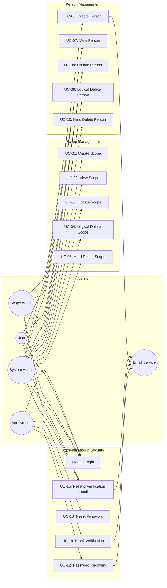
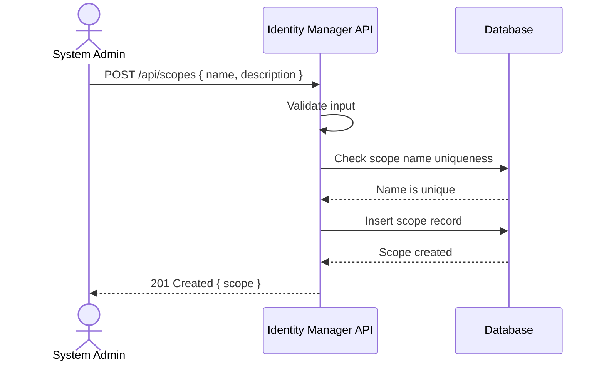
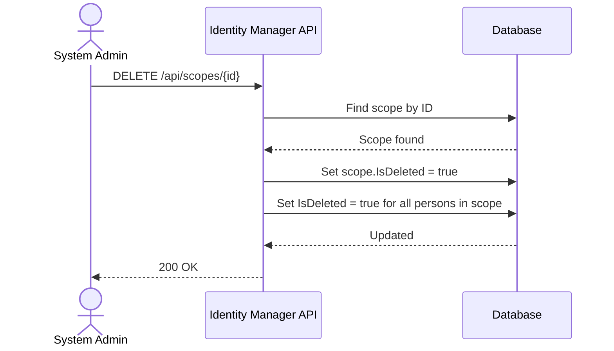
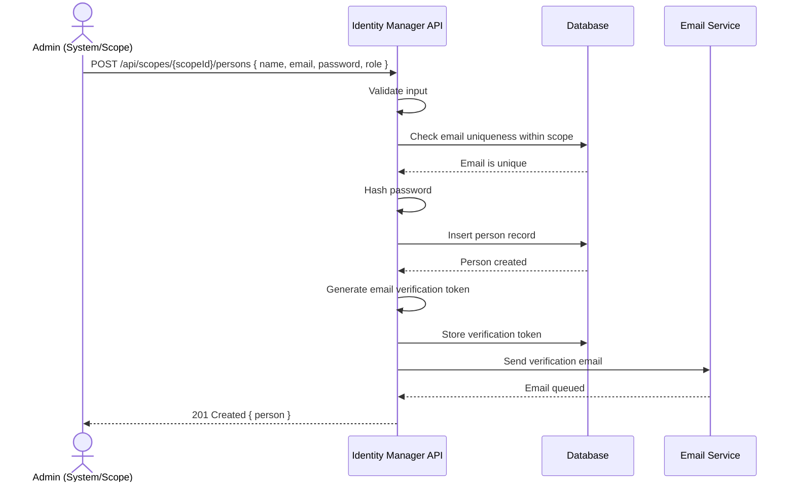
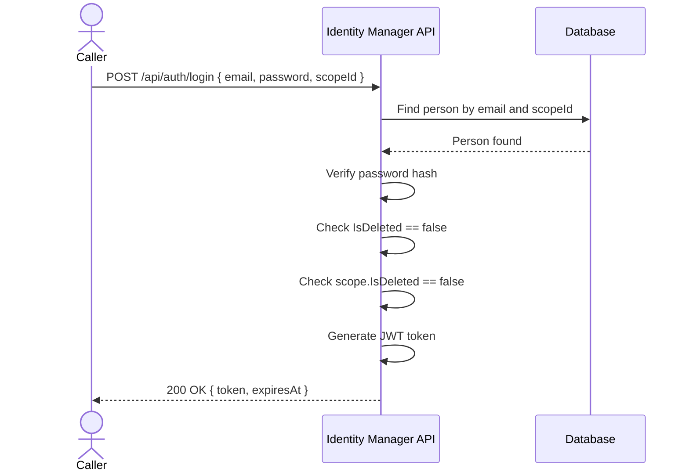
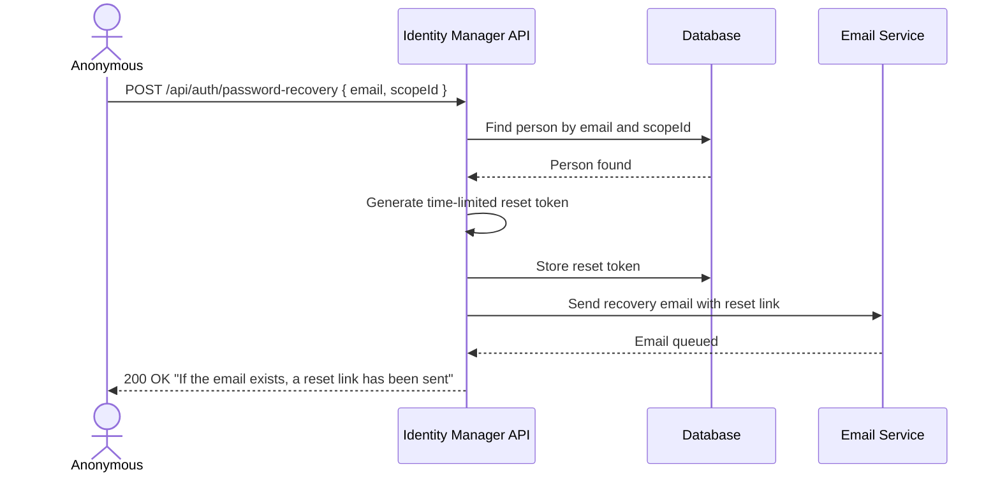
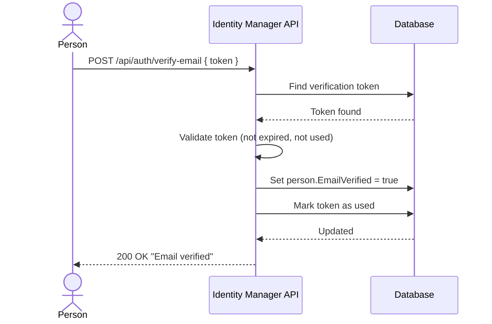
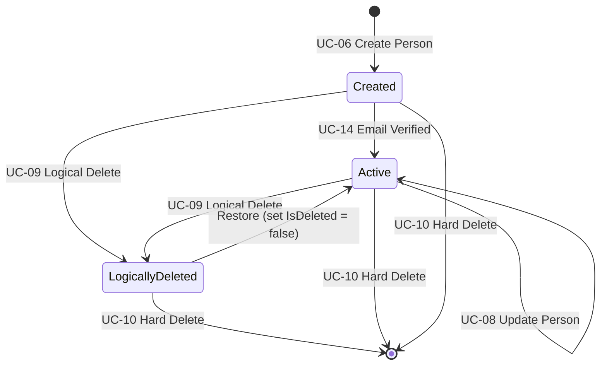
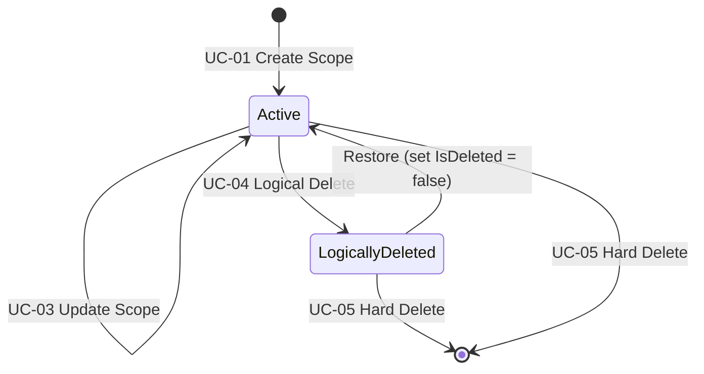

# Use Case Specification Document — Identity Manager API

## 1. Introduction

### 1.1 Purpose

This document specifies the use cases for the **Identity Manager API**. Each use case describes actor interactions, preconditions, postconditions, main flows, and alternative/exception flows.

### 1.2 Actors

| Actor | Description |
| ------- | ------------- |
| **System Admin** | Has full access to all scopes and persons across the entire system |
| **Scope Admin** | Manages persons within their assigned scope |
| **User** | An authenticated person with basic access to their own profile |
| **Anonymous** | An unauthenticated caller (can only access public endpoints) |
| **Email Service** | External system that delivers emails for verification and password recovery |

### 1.3 Use Case Overview

---

## 2. Use Case Specifications

---

### UC-01: Create Scope

| Field | Value |
| ------- | ------- |
| **ID** | UC-01 |
| **Name** | Create Scope |
| **Actors** | System Admin |
| **Description** | Allows a System Admin to create a new scope to onboard a client system |
| **Preconditions** | Actor is authenticated and has the `SystemAdmin` role |
| **Postconditions** | A new scope record exists in the system |

**Main Flow:**

1. System Admin sends a request with scope name and optional description.
2. The system validates the input fields.
3. The system verifies the scope name is unique.
4. The system creates the scope record with `IsDeleted = false`.
5. The system returns the created scope.

**Alternative Flows:**

| ID | Condition | Outcome |
| ---- | ----------- | --------- |
| AF-01a | Scope name already exists | Return `409 Conflict` |
| AF-01b | Invalid input data | Return `400 Bad Request` with validation errors |
| AF-01c | Actor is not System Admin | Return `403 Forbidden` |

---

### UC-02: View Scope

| Field | Value |
| ------- | ------- |
| **ID** | UC-02 |
| **Name** | View Scope |
| **Actors** | System Admin, Scope Admin, User |
| **Description** | Retrieve scope details or list scopes |
| **Preconditions** | Actor is authenticated |
| **Postconditions** | Scope information is returned |

**Main Flow:**

1. Actor requests scope details by ID or requests a list of scopes.
2. The system checks authorization:
   - System Admin: can view all scopes.
   - Scope Admin / User: can view only their own scope.
3. The system filters out logically deleted scopes unless explicitly requested.
4. The system returns the scope data.

**Alternative Flows:**

| ID | Condition | Outcome |
| ---- | ----------- | --------- |
| AF-02a | Scope not found | Return `404 Not Found` |
| AF-02b | Actor not authorized for requested scope | Return `403 Forbidden` |

---

### UC-03: Update Scope

| Field | Value |
| ------- | ------- |
| **ID** | UC-03 |
| **Name** | Update Scope |
| **Actors** | System Admin |
| **Description** | Modify an existing scope's name or description |
| **Preconditions** | Actor is authenticated with `SystemAdmin` role; scope exists and is not logically deleted |
| **Postconditions** | Scope record is updated |

**Main Flow:**

1. System Admin sends an update request with the scope ID and new field values.
2. The system validates the input.
3. The system verifies the scope exists and is not logically deleted.
4. The system applies the updates and sets `UpdatedAt`.
5. The system returns the updated scope.

**Alternative Flows:**

| ID | Condition | Outcome |
| ---- | ----------- | --------- |
| AF-03a | Scope not found or logically deleted | Return `404 Not Found` |
| AF-03b | Name conflicts with another scope | Return `409 Conflict` |

---

### UC-04: Logical Delete Scope

| Field | Value |
| ------- | ------- |
| **ID** | UC-04 |
| **Name** | Logical Delete Scope |
| **Actors** | System Admin |
| **Description** | Soft-delete a scope by setting `IsDeleted = true` |
| **Preconditions** | Actor is authenticated with `SystemAdmin` role; scope exists |
| **Postconditions** | Scope `IsDeleted` is set to `true`; all persons under the scope are also logically deleted |

**Main Flow:**

1. System Admin sends a delete request for a scope.
2. The system locates the scope.
3. The system sets `IsDeleted = true` on the scope.
4. The system sets `IsDeleted = true` on all persons belonging to that scope.
5. The system returns success.

**Alternative Flows:**

| ID | Condition | Outcome |
| ---- | ----------- | --------- |
| AF-04a | Scope not found | Return `404 Not Found` |
| AF-04b | Scope already logically deleted | Return `200 OK` (idempotent) |

---

### UC-05: Hard Delete Scope

| Field | Value |
| ------- | ------- |
| **ID** | UC-05 |
| **Name** | Hard Delete Scope |
| **Actors** | System Admin |
| **Description** | Permanently remove a scope and all its associated persons |
| **Preconditions** | Actor is authenticated with `SystemAdmin` role; scope exists |
| **Postconditions** | Scope and all associated persons are permanently removed from the database |

**Main Flow:**

1. System Admin sends a hard delete request.
2. The system locates the scope.
3. The system permanently deletes all persons belonging to the scope.
4. The system permanently deletes the scope record.
5. The system returns success.

**Alternative Flows:**

| ID | Condition | Outcome |
| ---- | ----------- | --------- |
| AF-05a | Scope not found | Return `404 Not Found` |

---

### UC-06: Create Person

| Field | Value |
| ------- | ------- |
| **ID** | UC-06 |
| **Name** | Create Person |
| **Actors** | System Admin, Scope Admin |
| **Description** | Register a new person within a specific scope |
| **Preconditions** | Actor is authenticated; target scope exists and is not logically deleted |
| **Postconditions** | A new person record exists; a verification email is sent |

**Main Flow:**

1. Admin sends a request with person data (name, email, password, role) targeting a scope.
2. The system validates all fields.
3. The system checks that the email is unique within the scope.
4. The system hashes the password.
5. The system creates the person record with `IsDeleted = false` and `EmailVerified = false`.
6. The system generates a verification token and sends a verification email.
7. The system returns the created person (excluding password hash).

**Alternative Flows:**

| ID | Condition | Outcome |
| ---- | ----------- | --------- |
| AF-06a | Email already exists in scope | Return `409 Conflict` |
| AF-06b | Scope not found or logically deleted | Return `404 Not Found` |
| AF-06c | Scope Admin tries to create a SystemAdmin | Return `403 Forbidden` |
| AF-06d | Invalid input | Return `400 Bad Request` |

---

### UC-07: View Person

| Field | Value |
| ------- | ------- |
| **ID** | UC-07 |
| **Name** | View Person |
| **Actors** | System Admin, Scope Admin, User |
| **Description** | Retrieve a person's details or list persons within a scope |
| **Preconditions** | Actor is authenticated |
| **Postconditions** | Person information is returned |

**Main Flow:**

1. Actor requests a person by ID or a list of persons within a scope.
2. The system checks authorization:
   - System Admin: can view persons in any scope.
   - Scope Admin: can view persons in their own scope.
   - User: can view only their own record.
3. Logically deleted persons are excluded unless explicitly requested.
4. The system returns person data (excluding password hash).

**Alternative Flows:**

| ID | Condition | Outcome |
| ---- | ----------- | --------- |
| AF-07a | Person not found | Return `404 Not Found` |
| AF-07b | Actor not authorized | Return `403 Forbidden` |

---

### UC-08: Update Person

| Field | Value |
| ------- | ------- |
| **ID** | UC-08 |
| **Name** | Update Person |
| **Actors** | System Admin, Scope Admin, User |
| **Description** | Modify person's name, email, or role |
| **Preconditions** | Actor is authenticated; person exists and is not logically deleted |
| **Postconditions** | Person record is updated |

**Main Flow:**

1. Actor sends an update request with the person ID and new values.
2. The system validates the input.
3. The system checks authorization:
   - System Admin: can update any person.
   - Scope Admin: can update persons in their own scope (cannot promote to SystemAdmin).
   - User: can update only their own name and email.
4. If email changes, the system checks uniqueness within the scope and resets `EmailVerified = false`.
5. The system applies updates and sets `UpdatedAt`.
6. The system returns the updated person.

**Alternative Flows:**

| ID | Condition | Outcome |
| ---- | ----------- | --------- |
| AF-08a | Person not found or logically deleted | Return `404 Not Found` |
| AF-08b | New email conflicts within scope | Return `409 Conflict` |
| AF-08c | Unauthorized role change | Return `403 Forbidden` |

---

### UC-09: Logical Delete Person

| Field | Value |
| ------- | ------- |
| **ID** | UC-09 |
| **Name** | Logical Delete Person |
| **Actors** | System Admin, Scope Admin |
| **Description** | Soft-delete a person by setting `IsDeleted = true` |
| **Preconditions** | Actor is authenticated; person exists |
| **Postconditions** | Person's `IsDeleted` is `true` |

**Main Flow:**

1. Actor sends a delete request for a person.
2. The system checks authorization.
3. The system sets `IsDeleted = true` on the person record.
4. The system returns success.

**Alternative Flows:**

| ID | Condition | Outcome |
| ---- | ----------- | --------- |
| AF-09a | Person not found | Return `404 Not Found` |
| AF-09b | Already logically deleted | Return `200 OK` (idempotent) |

---

### UC-10: Hard Delete Person

| Field | Value |
| ------- | ------- |
| **ID** | UC-10 |
| **Name** | Hard Delete Person |
| **Actors** | System Admin |
| **Description** | Permanently remove a person record from the database |
| **Preconditions** | Actor is authenticated with `SystemAdmin` role; person exists |
| **Postconditions** | Person record and all associated tokens are permanently removed |

**Main Flow:**

1. System Admin sends a hard delete request.
2. The system permanently deletes all tokens (password reset, email verification) associated with the person.
3. The system permanently deletes the person record.
4. The system returns success.

**Alternative Flows:**

| ID | Condition | Outcome |
| ---- | ----------- | --------- |
| AF-10a | Person not found | Return `404 Not Found` |

---

### UC-11: Login

| Field | Value |
| ------- | ------- |
| **ID** | UC-11 |
| **Name** | Login (Authenticate) |
| **Actors** | Anonymous, User, Scope Admin, System Admin |
| **Description** | Authenticate a person with email and password to obtain a token |
| **Preconditions** | None |
| **Postconditions** | An authentication token is issued |

**Main Flow:**

1. Caller sends email, password, and scope ID.
2. The system locates the person by email within the specified scope.
3. The system verifies the password against the stored hash.
4. The system confirms the person is not logically deleted.
5. The system confirms the person's scope is not logically deleted.
6. The system generates and returns an authentication token containing person ID, scope ID, and role.

**Alternative Flows:**

| ID | Condition | Outcome |
| ---- | ----------- | --------- |
| AF-11a | Person not found | Return `401 Unauthorized` |
| AF-11b | Password mismatch | Return `401 Unauthorized` |
| AF-11c | Person is logically deleted | Return `401 Unauthorized` |
| AF-11d | Scope is logically deleted | Return `401 Unauthorized` |

---

### UC-12: Password Recovery

| Field | Value |
| ------- | ------- |
| **ID** | UC-12 |
| **Name** | Request Password Recovery |
| **Actors** | Anonymous |
| **Description** | Request a password reset email |
| **Preconditions** | None |
| **Postconditions** | A password reset token is generated and emailed to the person |

**Main Flow:**

1. Caller provides their email and scope ID.
2. The system locates the person.
3. The system generates a time-limited password reset token.
4. The system stores the token and sends a recovery email.
5. The system returns a generic success message (does not reveal whether the email exists).

**Alternative Flows:**

| ID | Condition | Outcome |
| ---- | ----------- | --------- |
| AF-12a | Email not found | Return `200 OK` with same generic message (prevents enumeration) |

---

### UC-13: Reset Password

| Field | Value |
| ------- | ------- |
| **ID** | UC-13 |
| **Name** | Reset Password |
| **Actors** | Anonymous |
| **Description** | Set a new password using a valid reset token |
| **Preconditions** | A valid, non-expired reset token exists |
| **Postconditions** | Person's password is updated; the token is marked as used |

**Main Flow:**

1. Caller provides the reset token and a new password.
2. The system validates the token (exists, not expired, not used).
3. The system hashes the new password and updates the person record.
4. The system marks the token as used.
5. The system returns success.

**Alternative Flows:**

| ID | Condition | Outcome |
| ---- | ----------- | --------- |
| AF-13a | Token expired | Return `400 Bad Request` — "Token expired" |
| AF-13b | Token already used | Return `400 Bad Request` — "Token already used" |
| AF-13c | Token not found | Return `400 Bad Request` — "Invalid token" |
| AF-13d | New password fails validation | Return `400 Bad Request` with validation errors |

---

### UC-14: Email Verification

| Field | Value |
| ------- | ------- |
| **ID** | UC-14 |
| **Name** | Verify Email |
| **Actors** | Anonymous (via email link) |
| **Description** | Confirm a person's email address |
| **Preconditions** | A valid, non-expired verification token exists |
| **Postconditions** | Person's `EmailVerified` is set to `true`; the token is marked as used |

**Main Flow:**

1. Person clicks the verification link which calls the API with the token.
2. The system locates and validates the token.
3. The system sets `EmailVerified = true` on the person record.
4. The system marks the token as used.
5. The system returns success.

**Alternative Flows:**

| ID | Condition | Outcome |
| ---- | ----------- | --------- |
| AF-14a | Token expired | Return `400 Bad Request` — "Token expired" |
| AF-14b | Token already used | Return `400 Bad Request` — "Token already used" |
| AF-14c | Token not found | Return `400 Bad Request` — "Invalid token" |

---

### UC-15: Resend Verification Email

| Field | Value |
| ------- | ------- |
| **ID** | UC-15 |
| **Name** | Resend Verification Email |
| **Actors** | User, Scope Admin, System Admin |
| **Description** | Resend the email verification message |
| **Preconditions** | Actor is authenticated; email is not already verified |
| **Postconditions** | A new verification token is generated and emailed |

**Main Flow:**

1. Authenticated person requests a new verification email.
2. The system checks that the email is not already verified.
3. The system invalidates any existing verification tokens.
4. The system generates a new time-limited verification token.
5. The system sends the verification email.
6. The system returns success.

**Alternative Flows:**

| ID | Condition | Outcome |
| ---- | ----------- | --------- |
| AF-15a | Email already verified | Return `400 Bad Request` — "Email already verified" |

---

## 3. Use Case — Requirements Traceability

| Use Case | Requirements Covered |
| ---------- | --------------------- |
| UC-01: Create Scope | FR-SC-01 |
| UC-02: View Scope | FR-SC-02, FR-SC-03, FR-SC-07 |
| UC-03: Update Scope | FR-SC-04 |
| UC-04: Logical Delete Scope | FR-SC-05, FR-SC-07 |
| UC-05: Hard Delete Scope | FR-SC-06 |
| UC-06: Create Person | FR-PE-01, FR-PE-02, FR-PE-09, FR-RO-01, FR-EV-01, FR-EV-02 |
| UC-07: View Person | FR-PE-03, FR-PE-04, FR-PE-08 |
| UC-08: Update Person | FR-PE-05, FR-RO-02, FR-RO-03 |
| UC-09: Logical Delete Person | FR-PE-06, FR-PE-08 |
| UC-10: Hard Delete Person | FR-PE-07 |
| UC-11: Login | FR-AU-01, FR-AU-02, FR-AU-03, FR-AU-04, FR-AU-05 |
| UC-12: Password Recovery | FR-PR-01, FR-PR-02 |
| UC-13: Reset Password | FR-PR-03, FR-PR-04 |
| UC-14: Email Verification | FR-EV-03 |
| UC-15: Resend Verification Email | FR-EV-04 |

---

## 4. State Diagrams

### 4.1 Person Lifecycle

### 4.2 Scope Lifecycle

