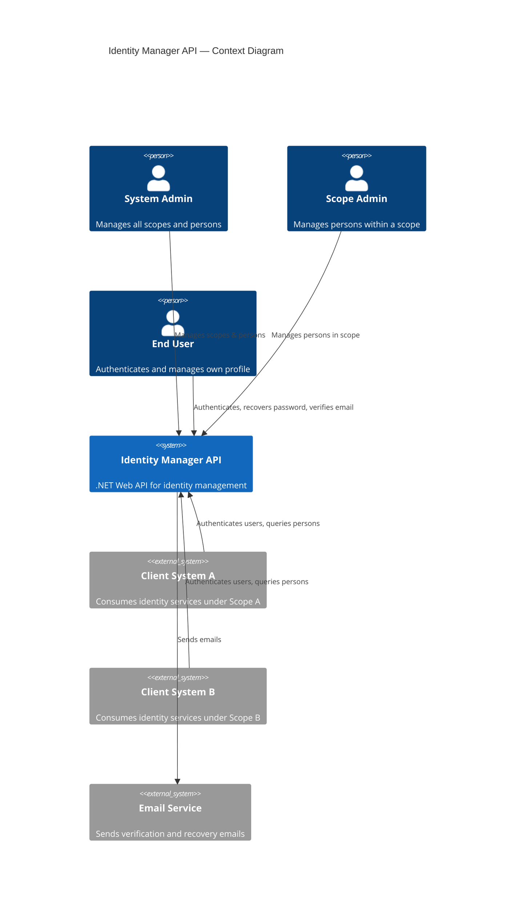
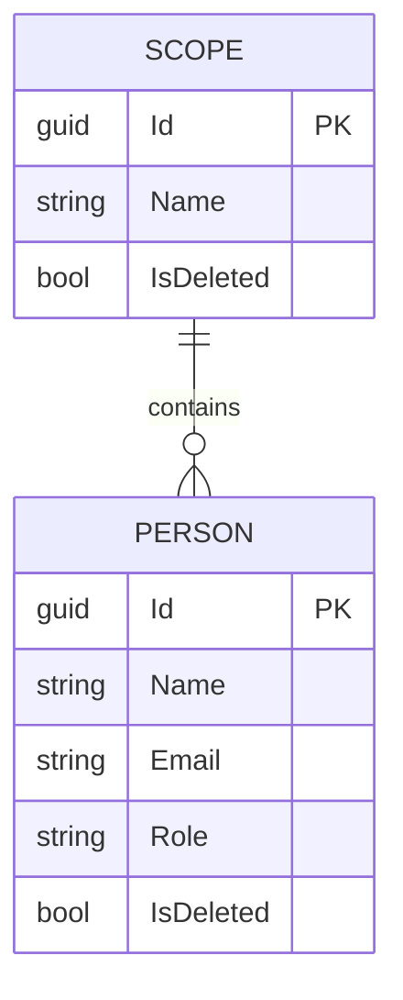
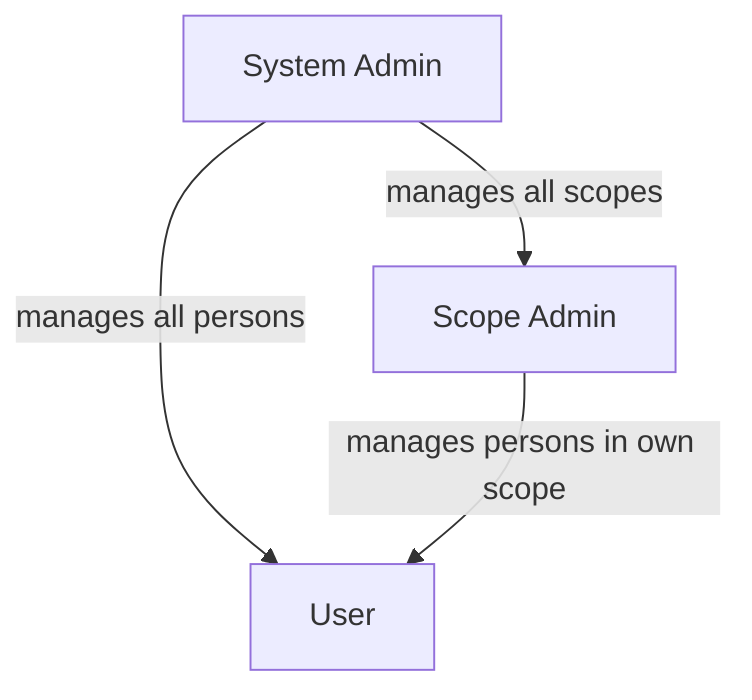

# Vision Document — Identity Manager API

## 1. Introduction

### 1.1 Purpose

This document establishes the vision for the **Identity Manager API**, a .NET Web API responsible for centralized management of user identities, authentication, and authorization across multiple independent systems.

### 1.2 Scope

The Identity Manager API will serve as a single source of truth for person management, authentication, role-based access control, and multi-tenant scoping. It is designed to be consumed by multiple client systems, each operating within its own isolated scope.

### 1.3 Definitions and Acronyms

| Term | Definition |
| ------ | ----------- |
| **Scope** | A logical tenant boundary that isolates persons belonging to different systems |
| **Person** | A registered user within a scope |
| **Role** | A permission level assigned to a person (User, Scope Admin, System Admin) |
| **Logical Deletion** | Soft-deleting a record by flagging it as inactive without removing it from the database |
| **Hard Deletion** | Permanently removing a record from the database |

---

## 2. Problem Statement

Organizations integrating multiple systems face a recurring challenge: each system independently manages users, credentials, and permissions, leading to duplicated data, inconsistent security policies, and poor user experience. There is no unified mechanism for authentication, user lifecycle management, or cross-system identity governance.

---

## 3. Product Position Statement

| Attribute | Description |
| ----------- | ------------- |
| **For** | Development teams and organizations operating multiple systems |
| **Who** | Need centralized user identity and authentication management |
| **The Identity Manager API** | Is a .NET Web API |
| **That** | Provides scoped person management, role-based access, authentication, password recovery, and email verification |
| **Unlike** | System-specific user management modules that create data silos |
| **Our product** | Offers a single, multi-tenant identity service with clear scope isolation and flexible deletion strategies |

---

## 4. Stakeholders

| Stakeholder | Role | Concern |
| ------------- | ------ | --------- |
| System Admin | Global administrator | Full control over all scopes and persons |
| Scope Admin | Tenant administrator | Management of persons within their assigned scope |
| End User | Consumer of client systems | Seamless authentication, password recovery, and email verification |
| Client Systems | External applications | Reliable API for authentication and person data retrieval |

---

## 5. High-Level Architecture

---

## 6. Core Features

| ID | Feature | Description |
| ---- | --------- | ------------- |
| F-01 | Person CRUD | Create, read, update, and delete person records |
| F-02 | Scope CRUD | Create, read, update, and delete scope records |
| F-03 | Logical Deletion | Soft-delete persons and scopes via a boolean flag |
| F-04 | Hard Deletion | Permanently remove persons and scopes from storage |
| F-05 | Scope Isolation | Every person belongs to exactly one scope |
| F-06 | Role Assignment | Each person is assigned a role: User, Scope Admin, or System Admin |
| F-07 | Authentication | Verify credentials and issue authentication tokens |
| F-08 | Password Recovery | Allow users to reset their password via email |
| F-09 | Email Verification | Confirm person email addresses through a verification flow |

---

## 7. Domain Model Overview

---

## 8. Roles Hierarchy

| Role | Permissions |
| ------ | ------------ |
| **System Admin** | Full access: manage all scopes, all persons across scopes |
| **Scope Admin** | Manage persons within their assigned scope |
| **User** | Authenticate, view own profile, recover password, verify email |

---

## 9. Constraints

- The API must be built with **.NET** (ASP.NET Core Web API).
- Every person must belong to exactly one scope.
- Logical deletion must not remove data; it must set a flag.
- Hard deletion must permanently erase data.
- Email verification and password recovery require an external email delivery mechanism.

---

## 10. Success Criteria

- Client systems can register, authenticate, and manage persons within their own scope without affecting other scopes.
- System admins can govern all scopes and persons from a single API.
- Password recovery and email verification flows complete end-to-end.
- Both logical and hard deletion strategies are available and operate correctly.
