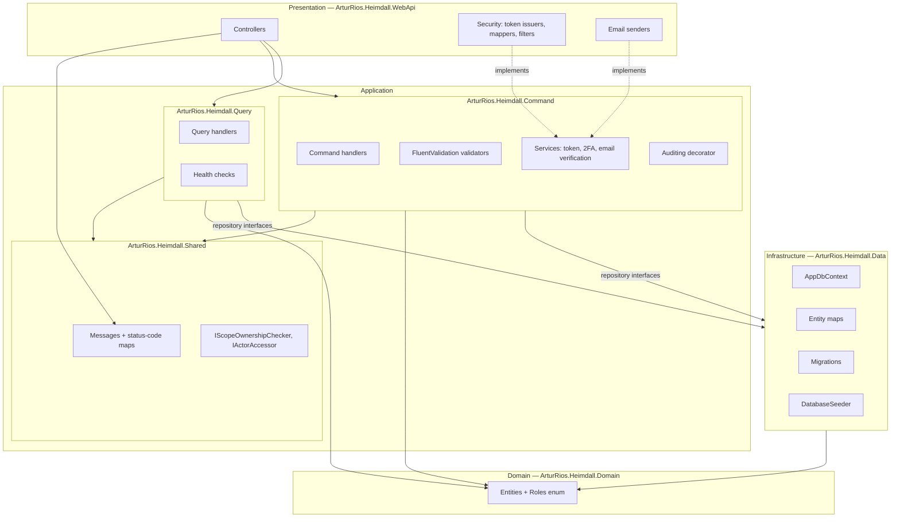
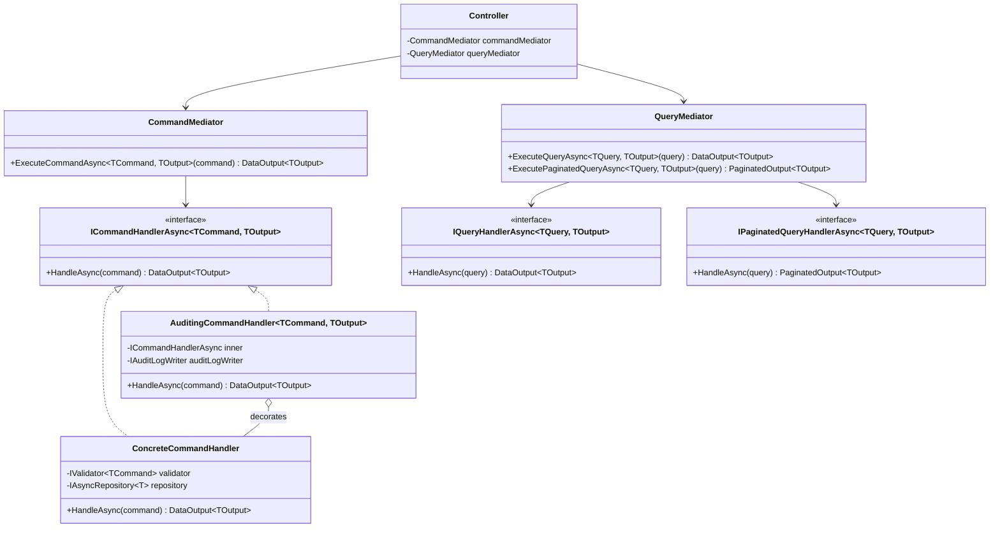

+++
title = 'Architecture'
linkTitle = 'Architecture'
weight = 40
description = 'The four layers, the CQRS mediator, the auditing decorator, and the HTTP request pipeline.'
+++

Heimdall is a layered (DDD-flavoured) solution with **CQRS** in the application layer. Reads and
writes travel different objects, through different mediators, into different handlers.

## The layers



The arrows only ever point inwards or sideways: **Domain depends on nothing**, and Application
depends on Infrastructure only through repository *interfaces* (`IAsyncRepository<T>`,
`IAsyncReadOnlyRepository<T>`) that Infrastructure implements. Presentation supplies the concrete
adapters for the abstractions the Application layer declares — `IAuthTokenIssuer`,
`IEmailVerificationSender`, `IGoogleIdTokenVerifier` — which is why swapping Mailgun for logging, or
the real Google verifier for the refusing one, is a start-up registration decision and nothing else.

| Project | Responsibility |
| --- | --- |
| `ArturRios.Heimdall.Domain` | Entities and the `Roles` enum. No behaviour beyond data shape. |
| `ArturRios.Heimdall.Command` | Write side: commands, validators, handlers, application services, auditing. |
| `ArturRios.Heimdall.Query` | Read side: queries, validators, handlers, health checks, output DTOs. |
| `ArturRios.Heimdall.Shared` | Cross-cutting contracts and the message/status-code maps both sides use. |
| `ArturRios.Heimdall.Data` | `AppDbContext`, entity maps, migrations, seeding. |
| `ArturRios.Heimdall.WebApi` | Controllers, JWT issuing and validation, filters, email and Google adapters, start-up. |

## CQRS: two mediators, two shapes



A controller action is deliberately thin — bind, dispatch, resolve:

```csharp
[HttpPost]
[RoleRequirement((int)Roles.SystemAdmin)]
public async Task<ActionResult<DataOutput<CreateScopeCommandOutput?>>> Create(
    [FromBody] CreateScopeCommand command)
{
    var result = await commandMediator
        .ExecuteCommandAsync<CreateScopeCommand, CreateScopeCommandOutput>(command);

    return ResponseResolver.Resolve(result, statusMap: ScopeMessageMap.StatusCodes);
}
```

No business rule lives in a controller. The handler returns a `DataOutput<T>` carrying data,
messages, and errors; `ResponseResolver` turns that into an HTTP status using the per-area
**message map** — a dictionary from message text to status code — so "which error is a 404 and which
is a 409" is a single table per area rather than scattered `return NotFound()` calls.

## Auditing by decoration

Every write handler is registered through `AddAuditedCommandHandler`, which registers the concrete
handler and then registers the *interface* as an `AuditingCommandHandler` wrapping it (**NFR-09**):

```csharp
services.AddScoped<THandler>();
services.AddScoped<ICommandHandlerAsync<TCommand, TOutput>>(provider =>
    new AuditingCommandHandler<TCommand, TOutput>(
        provider.GetRequiredService<THandler>(),
        provider.GetRequiredService<IAuditLogWriter>(),
        provider.GetRequiredService<ILogger<AuditingCommandHandler<TCommand, TOutput>>>()));
```

The decorator writes one `AuditLog` row per **successful** command, resolving the target from the
output's `Id`/`PublicId` by reflection and the actor from `IActorAccessor` (the current request's
identity). A failure to write the audit entry is logged as a warning and never fails the request the
user already succeeded at.

{}
The concrete `THandler` registration exists only so the decorator factory can resolve it. Resolving
`THandler` directly silently bypasses auditing — always depend on
`ICommandHandlerAsync<TCommand, TOutput>`.
{}

See [Audit logging](../flows/audit-logging/) for the sequence.

## The HTTP request pipeline

```mermaid
graph LR
    REQ([Request]) --> EX[ExceptionMiddleware]
    EX --> CORS["CORS<br/>configured origins only"]
    CORS --> HTTPS[HTTPS redirect]
    HTTPS --> RL[Rate limiter<br/>auth endpoints only]
    RL --> AUTHN[Authentication +<br/>AuthenticationMiddleware]
    AUTHN --> MFA[MfaPendingGuardFilter]
    MFA --> LIVE[ActorLivenessFilter]
    LIVE --> ROLE["RoleRequirement /<br/>AllowAnonymous"]
    ROLE --> CTRL[Controller action]
    CTRL --> MED[Mediator]
    MED --> H[Handler]
    H --> DB[(PostgreSQL)]
    H --> RES[DataOutput]
    RES --> RR["ResponseResolver<br/>+ message map"]
    RR --> RESP([HTTP response])
```



Four things about this pipeline are worth knowing before reading any handler:

**Authentication reads no database.** `AddTokenAuthentication<IdentityUserMapper>` is configured with
`JwtValidationMode.ClaimsOnly` and `TokenSource.Header`: the `IdentityUser` is rebuilt from the
token's claims alone, and nothing is looked up while the token is validated.

**But the identity it names is checked.** `ActorLivenessFilter` runs globally, right after the
challenge-token guard, and refuses a token whose person or Google User is absent or logically
deleted (**FR-AU-05**, **FR-GO-12**). Without it, `ClaimsOnly` meant a token kept working for its
whole lifetime after the account behind it was deleted — and the handlers compensated unevenly:
`ScopeOwnershipChecker` excluded a deleted Scope Admin, while every System Admin bypass and every
"acting on yourself" branch trusted the role claim alone, leaving the protection in place for the
lesser role and absent for the greater one. It costs one indexed read per authenticated request, and
two for a Google User, since the token does not say which table its subject lives in.

**One class owns both directions of the claims.** `IdentityUserMapper` writes the claims when a token
is issued and reads them when one is validated, so the two cannot drift. Every claim value is a
`PublicId`; an internal `bigint` never reaches a token (**NFR-15**).

**A challenge token is inert everywhere but one endpoint.** `MfaPendingGuardFilter` is registered
globally and rejects any request whose identity carries `MfaPending` with a 401 (**FR-2F-10**,
**NFR-17**). The second-factor endpoint itself is unaffected because it is `[AllowAnonymous]` and
takes the challenge token as a *body field*, never as a bearer credential.

## Authorization

Role checks are declarative, via `[RoleRequirement]` on the action:

```csharp
[HttpDelete("{id:guid}/hard")]
[RoleRequirement((int)Roles.SystemAdmin)]
```

Ownership checks — "is this Scope Admin an owner of *this* scope?" — cannot be expressed in an
attribute, so they live behind `IScopeOwnershipChecker`, resolved inside the handler. A handful of
endpoints carry **no** role attribute on purpose: `GET /api/scopes/{scopeId}/google-users/{id}`, for
example, must admit the Google User themselves, whose token is `User`-role, so any attribute strong
enough to exclude other users would exclude the actor the use case grants.

The complete matrix — every action against every role — is §7 of the
[System Requirements Document](../requirements/system-requirements-document/), summarised per
endpoint in the [API reference](../api-reference/).

## Validation

Input validation is FluentValidation, one validator per command or query, registered alongside its
handler (**NFR-10**). Where a command has no validator it is a documented decision, not an omission —
the start-up registrations carry the reason inline. The two recurring reasons:

- **Nothing to validate.** Every field is a typed route value already constrained by the route
  (`{id:guid}`), or the request carries no caller-supplied input at all because the subject comes
  from the bearer token.
- **The rule needs the database.** Which second factor is required depends on the stored
  `AppEnabled`/`EmailEnabled` of the person's configuration — a read only the handler can make.

Every paginated list query *does* have a validator, so page size and filters are checked before a
query reaches the database.

## Persistence

`AppDbContext` applies one **entity map** per entity (`PersonDbMap`, `ScopeDbMap`, …) rather than
annotating the domain classes, keeping storage concerns out of the domain. Handlers never touch the
context: they depend on `IAsyncRepository<T>` for writes and `IAsyncReadOnlyRepository<T>` for reads,
the latter exposing `Query()` so a handler can compose an `IQueryable` and let the database do the
filtering.

EF diagnostics — sensitive data logging and detailed errors — are enabled outside Production only;
they would otherwise print parameter values including password hashes, salts, and email addresses.

## Where to go next

- [Domain model](../domain-model/) — entities, relationships, and deletion cascades.
- [Flows](../flows/) — the same pipeline traced end-to-end for specific use cases.
- [Operations](../operations/) — migrations, health checks, logging, and rate limiting.
