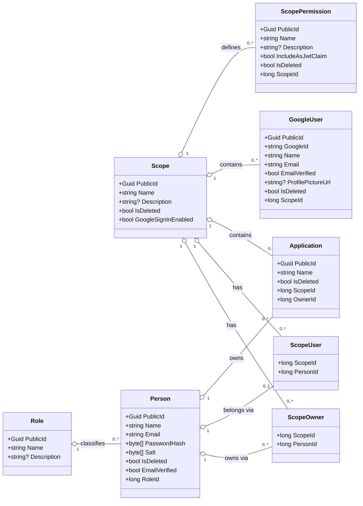
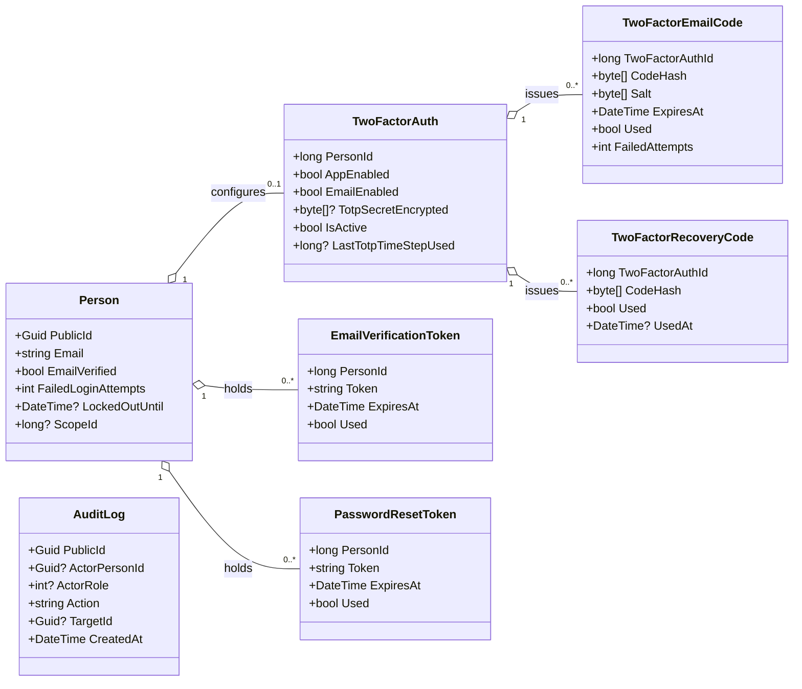
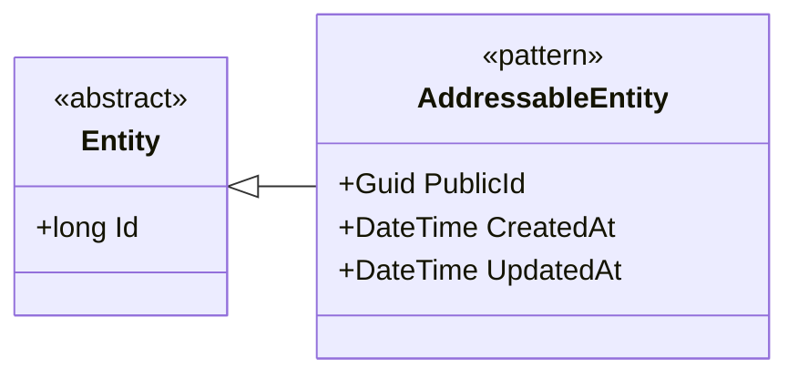
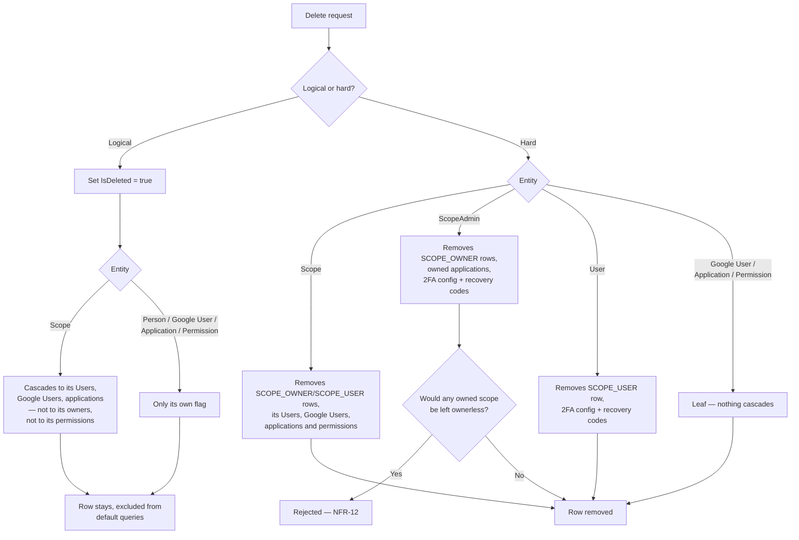

+++
title = 'Domain model'
linkTitle = 'Domain model'
weight = 50
description = 'The entities, their relationships, and the deletion cascade rules — as class diagrams.'
+++

The domain layer is intentionally anemic: entities are data holders with properties and navigation
collections. Decisions live in the command and query handlers, so the diagrams below are a map of
*shape and relationship*, not of behaviour.

## The core model

The entities every request touches: a scope, the persons related to it through the two join tables,
the applications and Google Users it contains, and the permissions it defines.

## Credentials, tokens and the audit trail

The entities hanging off a person: their two-factor configuration with its codes, the two kinds of
single-use token, and the append-only audit log.

`AuditLog` is deliberately unconnected. Its `ActorPersonId` is a bare `PublicId`, **not** a foreign
key, so an entry survives the hard deletion of the person who made the write.

## Common shape

Every entity above derives from `Entity`, which contributes the internal key, and each one that is
addressable from outside also carries timestamps:

`Scope`, `Role`, `Person`, `Application`, `GoogleUser`, `ScopePermission` and `AuditLog` follow the
addressable pattern. The join rows, token rows and two-factor rows carry only the internal `Id` —
see the table below for why.

## Which entities carry a `PublicId`

| Has `PublicId` | Internal `Id` only |
| --- | --- |
| `Scope`, `Role`, `Person`, `Application`, `GoogleUser`, `ScopePermission`, `AuditLog` | `ScopeOwner`, `ScopeUser`, `TwoFactorAuth`, `TwoFactorEmailCode`, `TwoFactorRecoveryCode`, `EmailVerificationToken`, `PasswordResetToken` |

The right-hand column is never addressed by ID from outside:

- **Join rows** (`ScopeOwner`, `ScopeUser`) are not independently addressable resources — they are
  reached through the scope and person they connect.
- **Token rows** are reached by their random `Token` string, which is already the caller-facing
  reference.
- **Two-factor rows** are reached implicitly through the authenticated person's own identity — a
  person's configuration is never named by ID in a path.

## Secrets at rest

| Value | How it is stored | Ever returned? |
| --- | --- | --- |
| Password | Argon2id hash + per-person random salt | Never |
| TOTP secret | Encrypted via ASP.NET Core Data Protection (`ITotpSecretProtector`) | Once, at provisioning, so the authenticator app can be enrolled |
| Recovery codes | Hash only, no per-code salt (high-entropy random strings) | Once, in the response that generates them |
| 2FA email code | Hash + per-code salt (only 10⁶ possible values, so it is treated as a user-grade secret) | Never — it is mailed |
| Email verification / password reset token | Plain random string | Once, by email |

That split is **NFR-16**. The email code gets a salt and the recovery code does not for a concrete
reason: a six-digit code has a million possible values and would fall to a rainbow table without one,
while a recovery code is long random text where a plain one-way hash already makes the plaintext
unrecoverable.

## Deletion cascades

The rules that most often catch people out:

**Logically deleting a scope does not touch its permissions.** Applications cascade; permissions do
not. They become unreachable anyway — the listing endpoint gates on the scope's `IsDeleted`, and the
JWT-claim fold at login reads only permissions of non-deleted scopes — so a restored scope recovers
its permission set unchanged. A *hard* delete does purge them, through the foreign key's
`ON DELETE CASCADE`.

**Logically deleting a scope does not touch its owners.** A Scope Admin may own other, active scopes.

**A scope must always retain at least one owner (NFR-12)** — removing the last owner, or hard-deleting
the last owning person, is rejected. NFR-12 does not guard the other direction: hard-deleting a
*scope* can leave a Scope Admin owning nothing. That record is left in place on purpose (they may be
about to be given another scope), and it grants no access in the meantime, because a `ScopeAdmin`
with no live owned scope cannot authenticate (**FR-AU-07**).

**Logical deletion never touches two-factor state.** A restored person keeps whatever configuration
they had. Hard deletion removes it, via `two_factor_recovery_code → two_factor_auth → person`.

The authoritative version of all of this — including the reasoning per rule — is §8 of the
[System Requirements Document](../requirements/system-requirements-document/).

## Persistence mapping

Each entity has a map class under `ArturRios.Heimdall.Data/EntityMaps/` (`PersonDbMap`,
`ScopeOwnerDbMap`, …) applied by `AppDbContext`. Constraints that the C# class cannot express live
there: the composite key of `ScopeOwner`, the uniqueness of `ScopeUser.PersonId` (which is what makes
"a User belongs to exactly one scope" true rather than merely intended), the per-scope uniqueness of
`GoogleUser.GoogleId` and `GoogleUser.Email`, and the cascade behaviour above.

### Email uniqueness

FR-PE-09 and FR-GO-07 make an address unique in a namespace chosen by role, and the three halves
differ in how far the database can enforce them.

| Rule | Enforced by |
| --- | --- |
| An administrator's address is unique system-wide among live `ScopeAdmin`s and `SystemAdmin`s | `ux_person_admin_email`, a partial unique index on `LOWER(email) WHERE role_id IN (1, 2) AND is_deleted = false` |
| A Google User's address is unique within their scope | `ix_google_user_scope_id_email`, unique on `(scope_id, LOWER(email))` |
| A User's address is unique within their scope | `ux_person_scope_user_email`, unique on `(scope_id, LOWER(email))` where `role_id = 3 AND is_deleted = false` |
| …jointly with that scope's Google Users | The application layer — `CreateUserCommandHandler`, `UpdatePersonCommandHandler`, `GoogleSignInCommandHandler` |

All three indexes are over `LOWER(email)` because the handlers compare addresses case-insensitively;
an index over the raw column would enforce a different rule than the one the code applies, and
accept pairs a handler had already refused.

### The scope a User belongs to, twice

`PERSON.scope_id` is a copy of the owning `SCOPE_USER` row's scope, and exists for one reason: the
third rule above could not otherwise be enforced. The scope lives in `SCOPE_USER` and the address in
`PERSON`, a PostgreSQL unique index covers one table, and a trigger closes nothing — under
`READ COMMITTED` two concurrent inserts see the same pre-write snapshot and both find the address
free. Only a unique index serialises them, and an index needs its columns on one table.

`SCOPE_USER` remains the relationship (§4.6) and every read goes through it. The copy is written by
the three handlers that write the membership — UC-06 path a sets both, UC-23 and UC-08's role change
clear both — and the index's condition matches `CreateUserCommandHandler`'s check term for term, so
the rule itself did not change. Only who enforces it under concurrency did.

A caller who loses that race is answered by AF-06a, the same conflict they would have got had the
address already been taken when they asked, rather than a persistence failure: losing a race is not
something the API makes visible.

{}
The joint rule with Google Users spans `PERSON` and `GOOGLE_USER`, so no single index can hold it —
both identity kinds would have to write into one. It remains a check-then-insert, and a Google
sign-up racing a `User` creation on the same address in the same scope can still produce both. The
window is far narrower than the one just closed, since it needs two different endpoints to interleave
rather than two calls to the same one.
{}
