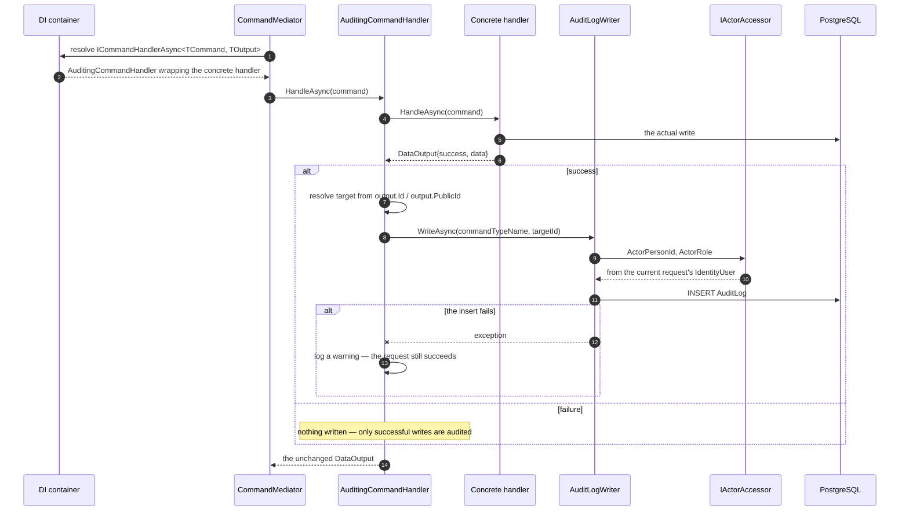

+++
title = 'Audit logging'
linkTitle = 'Audit logging'
weight = 70
description = 'NFR-09 — one decorator, every write, no handler changes.'
+++

**NFR-09**: all write operations shall produce audit log entries.

Rather than a line in every handler — forgettable, and duplicated forty times — this is a decorator
applied at registration.

## How a handler gets audited



Registration is the whole mechanism:

```csharp
services.AddScoped<THandler>();
services.AddScoped<ICommandHandlerAsync<TCommand, TOutput>>(provider =>
    new AuditingCommandHandler<TCommand, TOutput>(
        provider.GetRequiredService<THandler>(),
        provider.GetRequiredService<IAuditLogWriter>(),
        provider.GetRequiredService<ILogger<AuditingCommandHandler<TCommand, TOutput>>>()));
```

Every write handler in `Startup.AddDependencies` is registered with `AddAuditedCommandHandler`, so
adding a new command means adding one registration line and inheriting the audit trail.

{}
The concrete `THandler` registration exists only so the decorator factory can resolve it. Resolving
`THandler` directly — in a handler, a service, or a test that then asserts on production wiring —
**silently bypasses auditing**. Always depend on `ICommandHandlerAsync<TCommand, TOutput>`.
{}

## What an entry records

| Column | Value |
| --- | --- |
| `PublicId` | The entry's own GUID |
| `ActorPersonId` | The acting person's `PublicId`, or `null` for an anonymous write |
| `ActorRole` | The acting person's role value, or `null` for an anonymous write |
| `Action` | The command's CLR type name, e.g. `"CreateApplicationCommand"` |
| `TargetId` | Best-effort `PublicId` of the affected entity, or `null` if none could be resolved |
| `CreatedAt` | UTC timestamp |

Three design choices are worth calling out.

**`ActorPersonId` is not a foreign key.** It is a bare `PublicId`, so an entry survives the *hard*
deletion of the person who made the write — which is exactly the case an audit trail exists for.

**The table is append-only.** Entries are never updated and never logically deleted.

**The target is resolved reflectively**, from the output's `Id` or `PublicId` property. Commands
whose output carries neither record a `null` target rather than failing.

## Failures never fail the request

If writing the entry throws, the decorator logs a warning and returns the original result. The user's
write already succeeded and committed; turning that into a 500 would misreport what happened and
invite a retry of an operation that already took effect.

The trade is explicit: audit-trail completeness is best-effort against a database failure, and the
warning in the log is the record that a gap exists.

## Anonymous writes

`IActorAccessor` reads the current request's `IdentityUser`, which is `null` on an anonymous request.
The anonymous write endpoints — login, password recovery, password reset, email verification, Google
sign-in, second-factor verification — therefore produce entries with a `null` actor. The `Action`
still names the command, so the entry records *what* happened even when it cannot record *who*.
