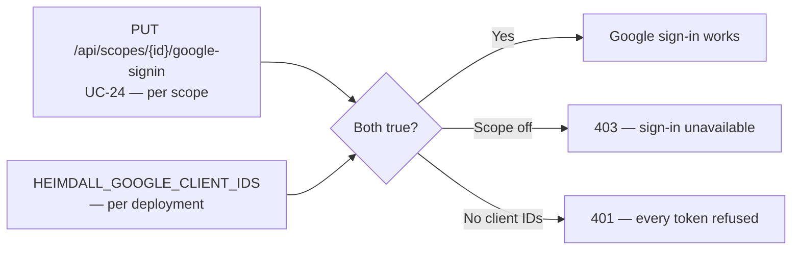
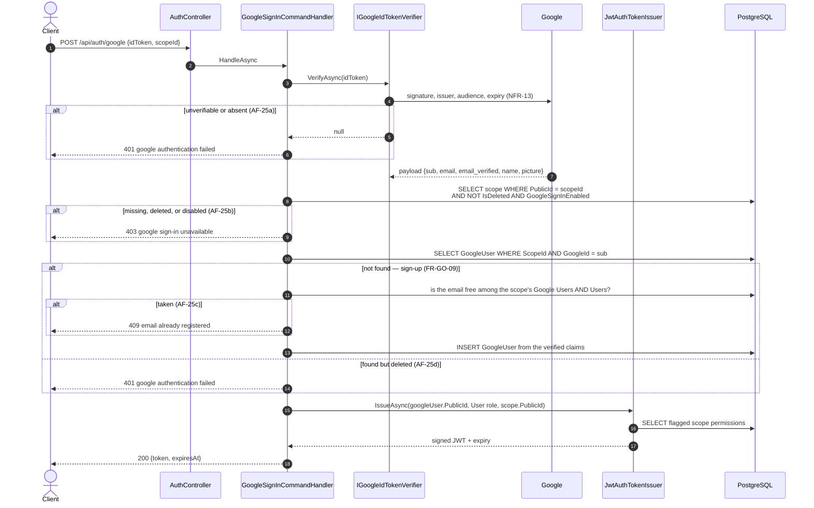

+++
title = 'Google Sign-In'
linkTitle = 'Google Sign-In'
weight = 30
description = 'UC-24 to UC-29 — enabling the feature per scope, sign-up and sign-in down one endpoint, and administering Google Users.'
+++

Google Sign-In is **off by default** and enabled per scope. A Google identity is always
`User`-equivalent — it can never create or authenticate a Scope Admin or System Admin, whatever the
Google account is (**FR-GO-04**).

## Enabling it — two independent switches

With no client IDs configured, the API registers a verifier that **refuses every token** and warns
once at start-up. This is not a convenience fallback: verification needs an audience to check against
(**NFR-13**), and a verifier with no configured client could only reject everything or trust
everything — so it rejects. Every other endpoint keeps working.

## Sign-up and sign-in — UC-25

One endpoint, `POST /api/auth/google`, does both. The first call for a given Google account in a
given scope creates the Google User; every later one authenticates it.

**Verification comes first, before the scope is even read.** An unverified caller learns nothing
about which scopes exist. It is also what answers a request that omitted the token entirely — which
is why UC-25 needs no 400 flow at all.

**AF-25b answers alike for three different situations** — the scope is missing, logically deleted, or
has the feature switched off. The alternative flow names all three as one outcome, so one filter
answers for all three.

**AF-25c is named separately, on purpose.** Being told the address is already registered reveals
something — but the caller has just proved to Google that the address is theirs, so it tells them
only about themselves. Uniqueness is checked jointly against the scope's Google Users **and** its
password Users.

## Signing out — UC-26

`POST /api/auth/google/sign-out` revokes nothing: tokens are stateless signed JWTs with an expiry.
What the endpoint does is *check* — it confirms the caller still holds a live Google session and then
answers the success that tells the client to drop the token.

That check is the substance. Authentication reads no database per request, so a token outlives the
account it names; one naming a deleted or unknown Google User is refused here.

## Administering Google Users — UC-27 to UC-29

All four endpoints are nested under the scope the Google User belongs to (**FR-GO-06**), and each
refuses a Google User reached through the wrong scope.

| Endpoint | Use case | Who |
| --- | --- | --- |
| `GET /api/scopes/{scopeId}/google-users` | UC-27 | System Admin, or an owner of the scope |
| `GET /api/scopes/{scopeId}/google-users/{id}` | UC-27 | The above, **or the Google User themselves** |
| `DELETE /api/scopes/{scopeId}/google-users/{id}` | UC-28 | System Admin, or an owner of the scope |
| `DELETE /api/scopes/{scopeId}/google-users/{id}/hard` | UC-29 | System Admin only |

The by-id read is the one that admits a Google User, and it is why that endpoint carries no
`[RoleRequirement]`: a Google User's token is `User`-role, so anything strong enough to keep other
Users out would lock out the actor UC-27 grants. The listing admits none of them.

The logical delete is **idempotent** — repeating it answers 200 with `alreadyDeleted: true` and
writes nothing — and it is honoured everywhere it matters: a deleted account cannot sign in, cannot
sign out, and is absent from reads unless `includeDeleted=true`. The hard delete has no idempotent
path; a second call is a 404. Neither cascades, because a Google User owns nothing.

## Testing without Google

A third verifier exists for the functional suite, which cannot override a DI registration and must
still reach the flows behind verification. It is guarded twice — never in Production, and never
without an explicitly set signing secret — and is checked *before* the real verifier so a test
environment cannot accidentally run both.
