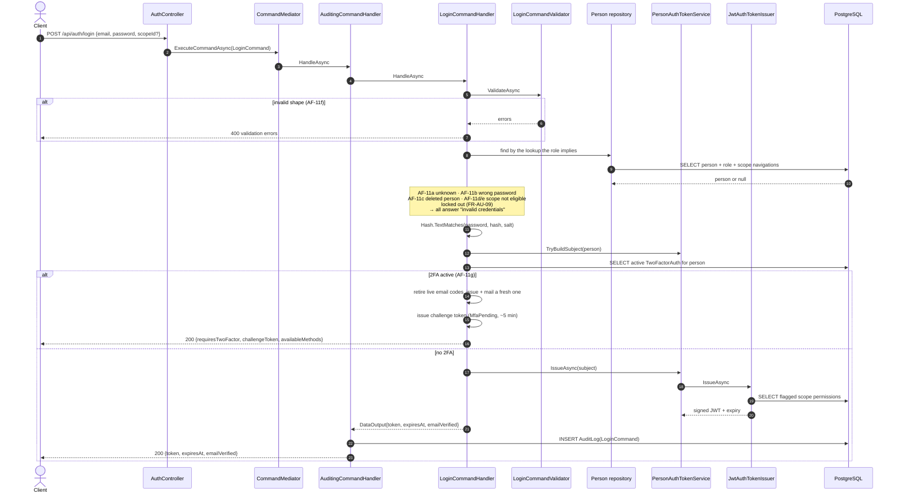
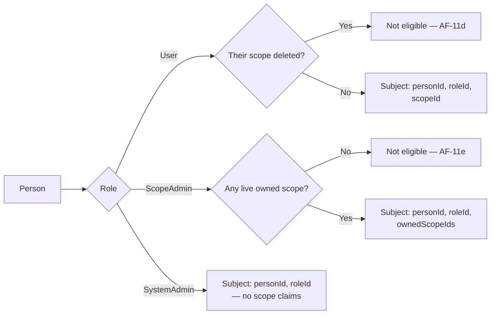

+++
title = 'Login'
linkTitle = 'Login'
weight = 10
description = 'UC-11 — password authentication, the uniform rejection, and the branch into a two-factor challenge.'
+++

`POST /api/auth/login` — anonymous, rate-limited.

## The sequence

## Which lookup, and why

`Person` has no scope column, so *how* the person is found depends on the role being sought:

| Role | Found by |
| --- | --- |
| `User` | Email **within the scope named by the request** — the same address may exist as a User in several scopes. |
| `ScopeAdmin` / `SystemAdmin` | Email alone — those addresses are unique system-wide. |

The lookup deliberately omits an `!IsDeleted` filter. AF-11c exists to *reject* a logically deleted
person, so the person has to be found before they can be rejected.

## One answer for five causes

AF-11a (unknown email), AF-11b (wrong password), AF-11c (deleted person), AF-11d (a `User` whose
scope is logically deleted) and AF-11e (a `ScopeAdmin` with no live owned scope) all return the same
`invalid credentials` error.

The checks still run in the specification's order, so the code reads against UC-11 line by line —
only the *answer* is uniform. An anonymous endpoint that distinguished them would be a directory of
which addresses are registered and which accounts still exist.

**The answer has to be uniform in time as well as in text.** AF-11a used to return without hashing
anything, since there was no stored hash to compare against — so "no such account" came back in
single-digit milliseconds while every other rejection paid a full Argon2id verification (600 MB / 16
threads) and took hundreds. That gap answered the question the shared message refuses, and varying
the scope id turned it into a per-scope directory. The handler now verifies the submitted password
against a decoy hash — of a random secret generated once per process, belonging to nobody — and
discards the result. A lockout takes the same path, so it is not detectable either.

## Scope eligibility

`PersonAuthTokenService.TryBuildSubject` is the single place the eligibility rules live, shared with
[two-factor verification](../two-factor/) so a gated login ends exactly like a direct one:

## What the token carries

Claims are written by `IdentityUserMapper`, the same class that reads them back on validation:

| Claim | Present for |
| --- | --- |
| `id` | Everyone — the person's `PublicId` |
| `roleId` | Everyone |
| `scopeId` | `User` only |
| `ownedScopeIds` | `ScopeAdmin` only, comma-separated |
| `scopePermissions` | Anyone acting within a scope that has flagged permissions ([details](../scope-permission-claims/)) |
| `mfaPending` | **Challenge tokens only** |

The claims are omitted rather than emitted empty, so a token never suggests a scope association the
person does not have. Every value is a `PublicId` — an internal id never reaches a token (**NFR-15**).

## The 2FA branch

When the person has an **active** two-factor configuration, login does not return an authentication
token at all. It returns a short-lived **challenge token** carrying `mfaPending`, which
`MfaPendingGuardFilter` rejects at every endpoint except `POST /api/auth/2fa/verify`.

If the Email method is enabled, login retires every live email code for that configuration and mails
a fresh one first — so only the code mailed *for this attempt* can complete it.

Continue at [Two-factor authentication](../two-factor/).
