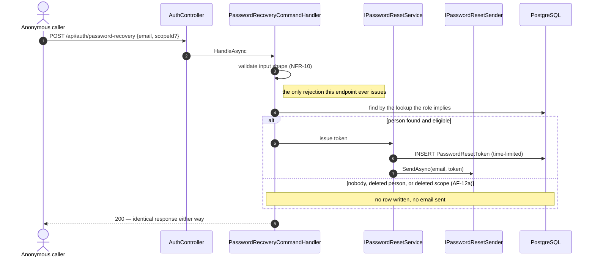
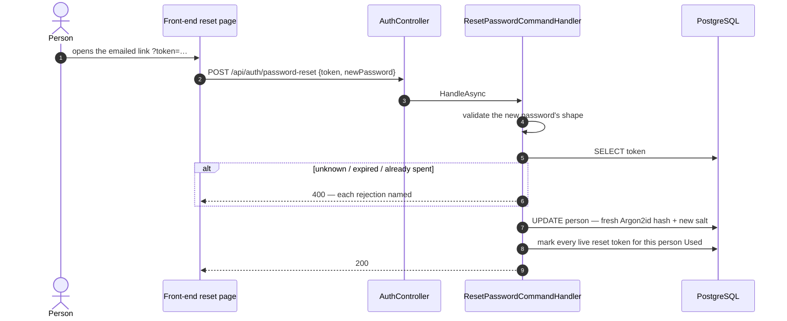

+++
title = 'Password recovery'
linkTitle = 'Password recovery'
weight = 50
description = 'UC-12 and UC-13 — an endpoint whose whole design is about what it must not reveal.'
+++

Two anonymous, rate-limited endpoints: one asks for a link, the other spends it.

## Requesting a link — UC-12

**Every path returns the same success output.** AF-12a — the address belongs to nobody — is not an
error flow but the *absence* of one: the handler issues no token and answers exactly as it would
have. A logically deleted person, and a `User` whose scope is deleted, are treated the same way.

The only thing that distinguishes the two paths is a row that does not get written and an email that
consequently never arrives — neither of which is visible to the caller.

{}
A Mailgun failure here is **logged, never surfaced**. If a delivery error turned into a 500, the
difference between "your guess was a real account" and "it wasn't" would be an HTTP status code.
{}

## Setting the new password — UC-13

Both endpoints are **anonymous** because someone arriving from a link in their mail client holds no
token of any other kind.

Spending a reset token retires every other live reset token the person holds. A second "forgot
password" click cannot be replayed after the first has already changed the password.

## Why login costs what it costs

Password verification is Argon2id — by this codebase's hashing library defaults, 600 MB and 16
threads per verification. That is deliberate for a stored credential, and it is also precisely why
these endpoints are rate-limited: an unthrottled burst against `/login` is a memory and CPU
exhaustion vector before it is a brute-force one. See
[Operations](../../operations/#rate-limiting).
