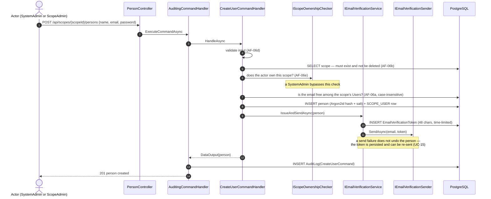
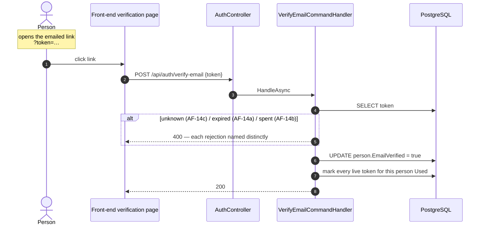
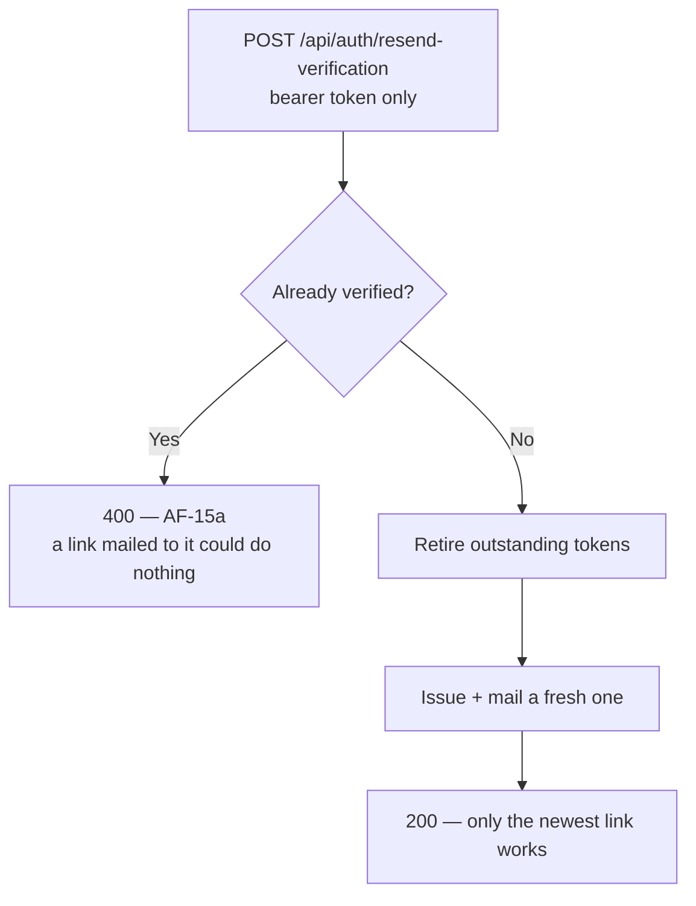

+++
title = 'Person onboarding'
linkTitle = 'Person onboarding'
weight = 40
description = 'UC-06, UC-14 and UC-15 — creating a person, the verification email, and replacing a lost link.'
+++

Creating a person is one use case (UC-06) with **three paths**, decided by which endpoint is called
rather than by a field in the body.

| Endpoint | Path | Creates |
| --- | --- | --- |
| `POST /api/persons` | b | A `ScopeAdmin` or `SystemAdmin` with no scope |
| `POST /api/scopes/{scopeId}/persons` | a | A `User` in that scope, with a `SCOPE_USER` row |
| `POST /api/scopes/{scopeId}/owners` | c | A brand-new `ScopeAdmin` directly as a co-owner, with a `SCOPE_OWNER` row |

## Creating a User — UC-06 path a

Email uniqueness is scoped to the role: a `User`'s address must be unique **within their scope**
(compared case-insensitively, `LOWER()` in SQL), while a `ScopeAdmin`'s or `SystemAdmin`'s is unique
system-wide. The same address can therefore be a User in several different scopes — which is exactly
why login needs a scope identifier to find a User.

## Verifying the address — UC-14

The endpoint is **anonymous** — someone arriving from a link in their mail client holds no token of
any other kind.

Spending a token retires every other live token the person holds of that kind, so a verification link
left in an inbox stops working once the address is verified. An address that was **already** verified
answers 200 rather than an error: UC-14 defines no alternative flow for it, and the caller's intent
has been satisfied either way.

## Replacing a lost link — UC-15

`POST /api/auth/resend-verification` is **authenticated and takes no body**. The person is read from
the bearer token, so a caller can only ever ask for their own link.

Note the asymmetry with UC-14: verifying an already-verified address answers **200**, but *resending*
to one answers **400**. Verification's job is done either way; a resend would mail a link that could
do nothing when clicked.

## Without mail credentials

With Mailgun unconfigured, the API registers logging senders instead: each token is **written to the
log** rather than emailed, with a single warning at start-up. That keeps local runs and the functional
suite working without credentials and off the network.

It is a supported mode, not a broken one — outside Production. An unconfigured **Production**
deployment refuses to start outright, because the fallback would print verification tokens, password
reset tokens, and 2FA codes in plaintext to the logs, which is an account-takeover primitive for
anyone who can read them.

Both emails carry a link built from `HEIMDALL_EMAIL_VERIFICATION_URL` /
`HEIMDALL_PASSWORD_RESET_URL`, with the token appended as a `token` query parameter. If no link is
configured the email carries the bare token instead, which still works — the link is only a
convenience wrapper around it.
