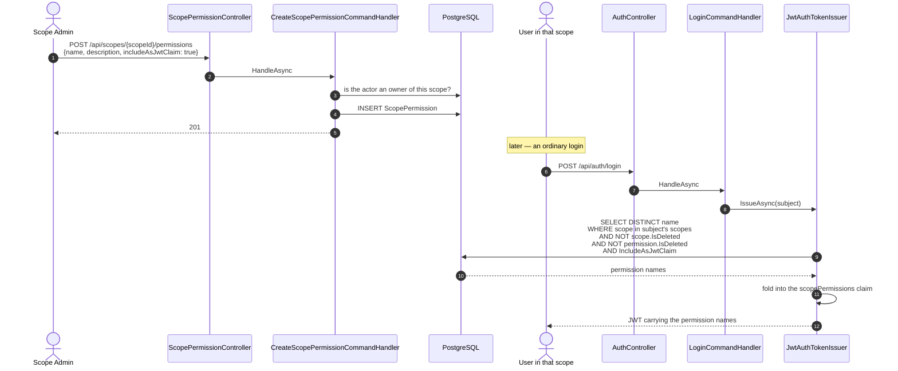
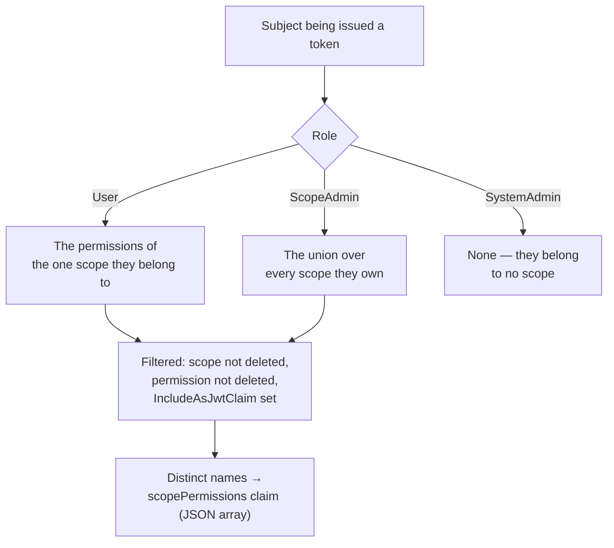

+++
title = 'Scope permission claims'
linkTitle = 'Scope permission claims'
weight = 60
description = 'UC-31 to UC-35 and FR-AU-08 — how a permission defined in a scope ends up inside a caller JWT.'
+++

A **scope permission** is a named permission defined inside one scope. It has no owner of its own —
owning the scope is the whole of the authorization to manage it — and it is a leaf in the data model:
nothing carries a foreign key to it.

Its one moving part is the `IncludeAsJwtClaim` flag.

## From definition to claim

## Which permissions a caller claims

The fold happens **at issuance**, reading the database once. A permission created, flagged, or
deleted after a token was issued does not change that token — the holder picks up the change on their
next login. This is the same trade the rest of the authentication design makes: no database read per
request, in exchange for claims that are a snapshot rather than a live view.

A System Admin carries no `scopePermissions` claim at all. They belong to no scope, so there is
nothing to fold — and nothing they need it for, since their authority is not scope-derived.

## Managing them — UC-31 to UC-35

| Endpoint | Use case | Who |
| --- | --- | --- |
| `POST /api/scopes/{scopeId}/permissions` | UC-31 | System Admin, or an owner of the scope |
| `GET /api/scopes/{scopeId}/permissions/{id}` | UC-32 | Same |
| `GET /api/scopes/{scopeId}/permissions` | UC-32 | Same |
| `PUT /api/scopes/{scopeId}/permissions/{id}` | UC-33 | Same |
| `DELETE /api/scopes/{scopeId}/permissions/{id}` | UC-34 | Same |
| `DELETE /api/scopes/{scopeId}/permissions/{id}/hard` | UC-35 | System Admin only |

The hard delete is System-Admin-only for the same reason it is on applications and Google Users: a
Scope Admin may retire a permission in a scope they own, but never purge it.

## Deletion behaviour

Both deletions are simple, because a permission is a leaf:

- **Logical delete (UC-34)** flips only its own `IsDeleted` flag. Nothing cascades. It stops being
  folded into new tokens immediately.
- **Hard delete (UC-35)** removes the row. Nothing cascades.

The interesting case is the *scope's* deletion:

| Scope operation | Effect on its permissions |
| --- | --- |
| **Logical delete (UC-04)** | **None.** They keep whatever `IsDeleted` state they had. |
| **Hard delete (UC-05)** | Purged, via the `scope_permission → scope` foreign key's `ON DELETE CASCADE`. |

Not cascading the logical delete is deliberate. The permissions become unreachable anyway — the
listing endpoint gates on the scope's `IsDeleted`, and the claim fold above excludes permissions of
deleted scopes — so nothing is exposed. Leaving them untouched means a restored scope recovers its
permission set unchanged, which cascading would have destroyed.
