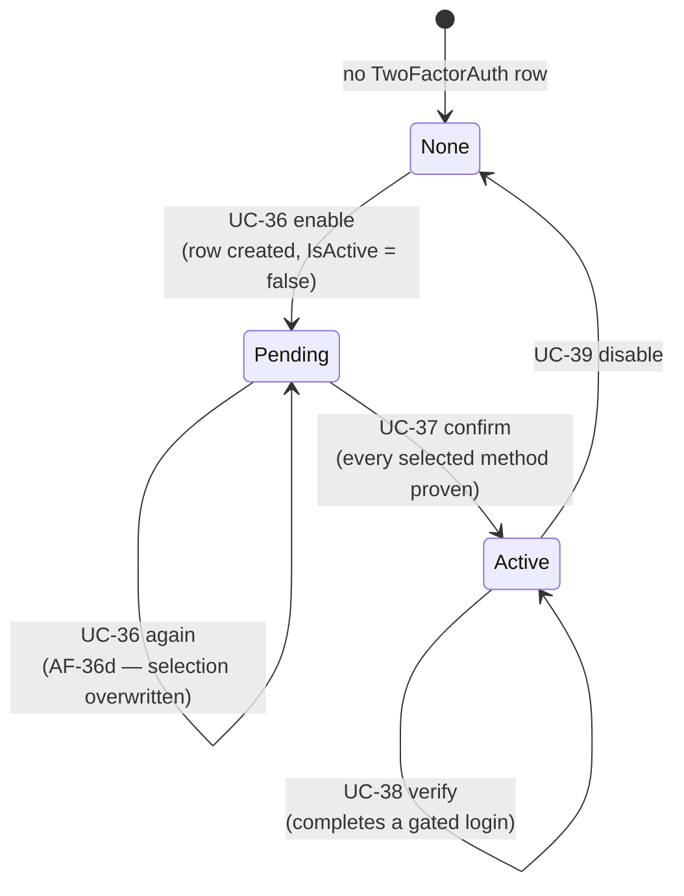
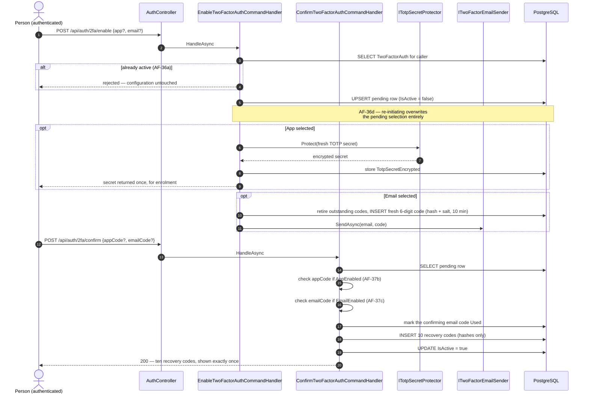
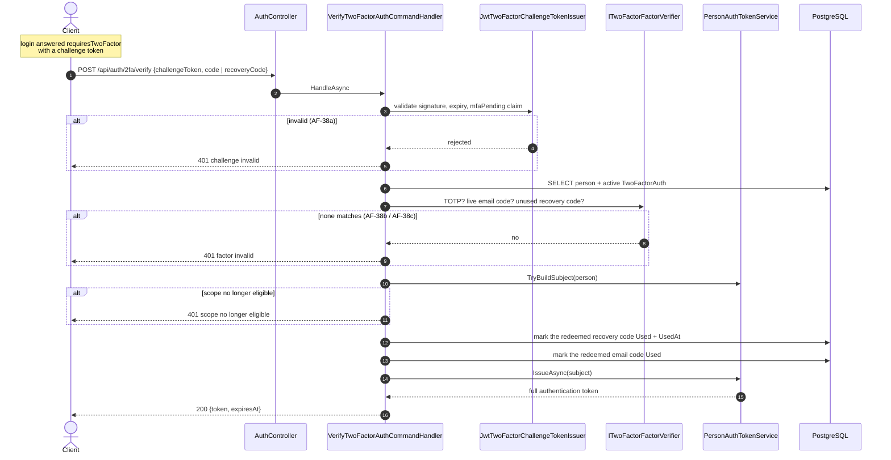

+++
title = 'Two-factor authentication'
linkTitle = 'Two-factor'
weight = 20
description = 'UC-36 to UC-40 — setup, confirmation, the challenge-token round trip, and recovery codes.'
+++

Two-factor authentication is opt-in, per person, and available to `User`, `ScopeAdmin`, and
`SystemAdmin` alike. It is **not** available to Google Users, who are already subject to Google's own
account security.

Every 2FA endpoint acts on the caller themselves — the person comes from the bearer token, never from
a path or body — so no caller can reach another person's configuration.

## The lifecycle

## Setup — UC-36 and UC-37

`IsActive` is what separates a *confirmed* configuration from one still pending. A row with
`IsActive = false` means UC-36 created it and UC-37 has not yet activated it — and only an active
configuration gates a login.

Confirmation requires proof of **every** method selected at setup: an `appCode` if `AppEnabled`, an
`emailCode` if `EmailEnabled`, both if both.

## Completing a gated login — UC-38

Three details in that diagram carry real weight:

**AF-38b and AF-38c answer identically.** A wrong code and an already-used recovery code both return
`factor invalid`, 401 — the same reasoning that collapses UC-11's five rejections into one.

**Scope ineligibility gets its own message.** If the challenge token and the second factor were both
valid but the person's scope eligibility no longer holds, the answer is
`scope no longer eligible`, not `challenge invalid`. Collapsing that case would misdescribe what
actually happened — nothing the caller supplied was wrong.

**Nothing can be replayed.** The redeemed recovery code and the redeemed email code are both marked
used before the token is issued.

The final token is issued by `PersonAuthTokenService` — the same service a direct login uses — so a
2FA-gated login ends with exactly the token a direct one would have produced.

## Why the guard filter never fires here

`MfaPendingGuardFilter` runs on every controller action and rejects any identity carrying
`MfaPending`. It never trips on `POST /api/auth/2fa/verify` because that endpoint is
`[AllowAnonymous]` and reads the challenge token as a **body field**, not as an
`Authorization: Bearer` credential — so the pipeline never attaches an MFA-pending identity for that
call. The filter only ever fires when a challenge token is misused as a bearer token somewhere
else — exactly the case **FR-2F-10** wants blocked.

## Disable and regenerate — UC-39 and UC-40

Both require a valid second factor as well as authentication, and both reuse
`ITwoFactorFactorVerifier`, so "match against TOTP, or the current email code, or an unused recovery
code" is implemented in exactly one place.

| | UC-39 disable | UC-40 regenerate |
| --- | --- | --- |
| Requires | Bearer token + second factor | Bearer token + second factor |
| Effect | Removes the configuration | Replaces all ten recovery codes |
| Response | Confirmation | The ten new codes, shown once |

## Storage of secrets

| | Stored as | Returned |
| --- | --- | --- |
| TOTP secret | Encrypted at rest via ASP.NET Core Data Protection | Once, at provisioning |
| Recovery codes | Hash only — high-entropy random text needs no per-code salt | Once, when generated |
| Email codes | Hash **+ per-code salt** — only 10⁶ possible values | Never; mailed |

That is **NFR-16**. See [Domain model](../../domain-model/#secrets-at-rest).
