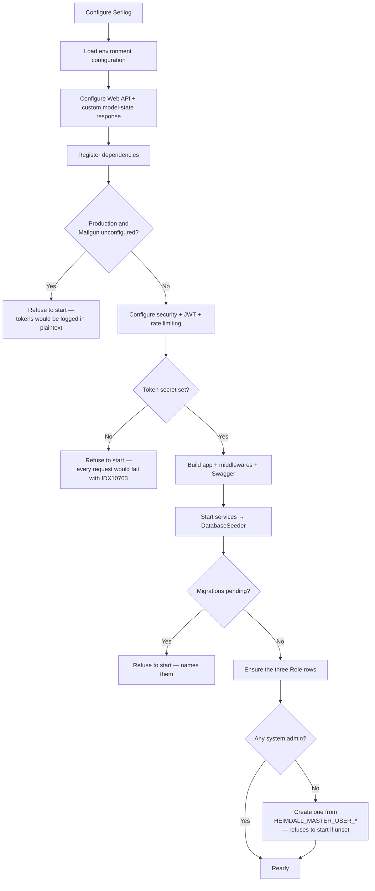

+++
title = 'Operations'
linkTitle = 'Operations'
weight = 80
description = 'Migrations, start-up guards, health checks, logging, rate limiting, data retention, and the integrations.'
+++

## Migrations

The schema is managed with **EF Core migrations, applied explicitly**:

```bash
python scripts/migrations.py
```

The script asks which environment file to load (for the connection string), then offers **list**,
**create (generate)**, and **apply**. Creating a migration prompts for its name and adds it to
`src/Infrastructure/ArturRios.Heimdall.Data/Migrations`. It needs `dotnet tool restore` to have been
run once, for the pinned EF Core CLI tool.

**The API never migrates on startup, and refuses to start when migrations are pending.** The seeder
checks `GetPendingMigrationsAsync` first and throws with the missing migration names:

```
The database is missing 2 migration(s): 20260811_AddAuditLog, 20260812_AddTwoFactorEmailCode.
Apply them with scripts/migrations.py before starting the API.
```

Automatic migration on startup is convenient exactly until two instances start at once, or until a
deployment silently applies a migration nobody reviewed. An explicit step makes schema change a
decision rather than a side effect.

## Start-up sequence



The seeder is idempotent, so it runs on every start-up: it ensures every `Roles` member exists as a
row and that at least one system administrator exists to sign in as. It never applies migrations.

Each of those refusals replaces a failure that would otherwise appear far from its cause — an opaque
`IDX10703` on every authenticated request, a plaintext token in a production log, or a runtime error
against a column that does not exist yet.

## Health checks — UC-30

| Endpoint | Who | What it does |
| --- | --- | --- |
| `GET /healthcheck` | Anonymous | Liveness. Confirms the process is up and responding. Reads no database. |
| `GET /healthcheck/detailed` | System Admin | Reports the status of each verified dependency. |

```json
{
  "status": "Healthy",
  "services": [
    { "name": "Database", "status": "Healthy" }
  ]
}
```

The aggregate `status` is `Healthy` only when **every** entry is healthy (**FR-HC-05**).

The liveness endpoint is anonymous because a load balancer cannot authenticate; the detailed one is
System-Admin-only because "which of my dependencies is down" is operational intelligence.

Each dependency is one `IServiceHealthCheck` registration. `DatabaseHealthCheck` issues a trivial
read through the repository abstraction and catches everything — an unreachable database throws on
execution, and the check reports unhealthy rather than propagating, so the aggregate can still be
reported (AF-30c). Adding a verification is one more registration; the detailed handler resolves them
all as `IEnumerable<IServiceHealthCheck>`.

## Logging

Serilog, configured before anything else so that even configuration failures are recorded:

- **Console** — JSON formatted.
- **Rolling files** — `<HEIMDALL_LOG_DIRECTORY>/<yyyy/MM>/log-<date>.json`, a new file per day inside
  a folder per month. `HEIMDALL_LOG_DIRECTORY` defaults to `logs`.

**EF Core diagnostics are enabled outside Production only.** `SensitiveDataLogging` and
`DetailedErrors` print parameter and column values — password hashes, salts, email addresses — so
they stay off where those logs are retained.

### Retention and redaction — NFR-22

Log files are written flat under the log directory, one per day, and removed once older than
`HEIMDALL_RETENTION_LOG_DAYS` (365 by default). They used to be nested in year/month directories via
Serilog's `Map` sink, which created a new sink per month — a retention limit bounds files *within* a
sink, so it bounded each month's directory and never removed a month. The flat sink is the shape
where the limit applies.

**No log statement writes an email address.** Where a line needs to refer to one so an operator can
correlate, it writes a stable non-reversible reference (`{EmailRef}`) instead. `LogRedactionTests`
scans the source and fails if an `{Email}` placeholder reappears anywhere.

The reference is pseudonymisation, not anonymisation: somebody who already suspects an address can
hash it and look for it. What it defeats is reading addresses out of the logs in bulk.

## Rate limiting and lockout

Brute force is bounded in two independent places, because each covers what the other misses.

**Per caller — a fixed-window limiter** of **10 requests per minute, partitioned by client IP**,
applied to `AuthController`'s anonymous, credential-checking endpoints: login, password recovery,
password reset, email verification, Google sign-in, and second-factor verification. Rejections
answer **429**. None of these requires a bearer token, so nothing else bounds how fast one caller
can hit them, and each login attempt costs a full Argon2id verification (600 MB / 16 threads by the
hashing library's defaults) — so memory exhaustion is realistic without it.

**Per account — a failure budget**, which is what an attacker spread across many source addresses
defeats the limiter with:

| Target | Budget | On exhaustion |
| --- | --- | --- |
| Password (UC-11) | 10 consecutive failures | The account is locked for 15 minutes. `PERSON.failed_login_attempts` counts, `PERSON.locked_out_until` holds the window; a successful login clears both. |
| 2FA email code (UC-37, UC-38) | 5 wrong guesses per issued code | The code is retired. `TWO_FACTOR_EMAIL_CODE.failed_attempts` counts; guessing again costs a fresh login, which is itself limited and mails the account holder a code they did not ask for. |
| 2FA app code | Single use | `TWO_FACTOR_AUTH.last_totp_time_step_used` records the accepted time step, so an observed code cannot be replayed within the ±1-step verification window (RFC 6238 §5.2). |

A lockout is a window rather than a latch an administrator clears: reaching the threshold needs
nothing but wrong guesses, so a permanent lock would hand any anonymous caller a denial of service
against any address they know. It answers with UC-11's ordinary `InvalidCredentials`, and spends the
same Argon2id work a real check would, so it is not observable — by message or by timing — to a
caller who does not already know the password.

{}
The limiter's partition key is the connection's remote IP. Behind a reverse proxy or load balancer
that does not forward the real client IP (via `X-Forwarded-For` with `ForwardedHeadersMiddleware`
configured), **every caller shares one partition**. This is a per-instance, defence-in-depth
throttle — not a replacement for a WAF or an API gateway's own rate limiting in front of a real
deployment. The per-account budgets above are in the database, so they hold across instances.
{}

## Data retention — NFR-19

Personal data is kept only as long as its purpose requires (GDPR Art. 5(1)(e), LGPD Art. 15). The
schedule — every table holding personal data, its period, and the reason for it — is the
[Data Retention Schedule Document](../requirements/data-retention-schedule-document/), and it is the
source of truth these settings are configured against.

The schedule marks which periods are enforced and which are not yet, so it never describes a
guarantee the code does not make. Read it there rather than inferring enforcement from the presence
of a setting here.

**Single-use tokens are purged on a schedule.** A hosted service dispatches a purge hourly by
default, removing password reset tokens, email verification tokens, and two-factor email codes that
are past their expiry by the grace period. Each run removes at most a bounded batch per table,
oldest first, so a backlog drains over several runs rather than in one long transaction — a purge is
delete pressure on the same tables the login and recovery paths write to, and the write path
degrades with table size (SRD §6.3.2).

The grace period is not zero, deliberately. UC-13 answers a presented token with `TokenInvalid`,
`TokenExpired` or `TokenAlreadyUsed`, and purging the moment a token expires collapses the last two
into the first — telling someone following a stale link that their token never existed. A live token
is never at risk: the cutoff is strictly in the past.

Every instance runs its own purge and none coordinates with the others (NFR-06). The delete re-reads
its batch, so an instance whose rows another already removed simply deletes fewer than it selected.
Each run writes one audit entry (NFR-09) as an anonymous write — the evidence that the schedule was
enforced, and when. A run that removes nothing is a success; most runs find nothing to do.

**Logically deleted identities are anonymised on a schedule.** A soft delete is a restriction of
processing, not an erasure — the name, the address and the credential material all stay in the row.
A second pass gives it a terminal state: once the retention window has elapsed, the record is
anonymised in place, and the person's single-use tokens and two-factor configuration go with it.

The window depends on why the record was deleted. Where the data subject asked (UC-42), it is 30
days — GDPR Art. 12(3)'s outer limit rather than a chosen period, and refused if configured higher.
Where an administrator deleted it, it is 90 days, a reversal window. Records deleted before this
existed carry no reason and take the longer one.

A subject's request stores its own deadline when it is made, and that stored value wins over the
configured window: a later change to the setting must not move an obligation already owed. Where
NFR-12 blocked a request — the subject was a scope's last owner — the pass retries it once ownership
has been transferred, dating the suspension from the request rather than from the moment the block
cleared, so a long-blocked request is due immediately rather than handed a fresh deadline.
`GET /api/auth/erasure-requests` is the queue that surfaces those before they are late.

Anonymisation overwrites rather than removes, because NFR-07 requires every foreign key to keep
resolving and the audit trail, the scope join rows and an owner's applications all point at the
record. Hard deletion (UC-10) remains available for callers that want the row gone.

**The audit trail stops naming people on its own schedule.** A third pass clears the actor
attribution from entries past their attribution period, and immediately from entries naming an
identity that has been anonymised. The entry itself is never removed and never altered — what
happened, when and how often all survive.

The rule is enforced by a database trigger rather than by the pass, because this is the one table
whose immutability is a security control. It permits the attribution to be set to null and nothing
else: no deletion, no truncation, no change to any other column, and no reassignment to a different
identity. A thirty-day floor stops somebody clearing their own attribution for something they did
this week; it is an anti-tamper backstop, not the retention period, which is eighteen months.

| Variable | Default | Accepted range | Meaning |
| --- | --- | --- | --- |
| `HEIMDALL_RETENTION_TOKEN_GRACE_DAYS` | `7` | more than 0, up to 3650 | Days a single-use token is kept past expiry |
| `HEIMDALL_RETENTION_PURGE_INTERVAL_MINUTES` | `60` | 1 to 10080 (7 days) | Interval between purge runs |
| `HEIMDALL_RETENTION_PURGE_BATCH_SIZE` | `500` | any positive integer | Most rows removed from one table per run |
| `HEIMDALL_RETENTION_PURGE_ENABLED` | `true` | `true` / `false` | Set `false` to stop scheduling the purge |
| `HEIMDALL_RETENTION_ERASURE_DEADLINE_DAYS` | `30` | more than 0, up to 30 | Days before a requested erasure is anonymised |
| `HEIMDALL_RETENTION_DELETION_WINDOW_DAYS` | `90` | more than 0, up to 730 | Days before an administrative deletion is anonymised |
| `HEIMDALL_RETENTION_ANONYMISATION_ENABLED` | `true` | `true` / `false` | Set `false` to stop scheduling the anonymisation |
| `HEIMDALL_RETENTION_AUDIT_ACTOR_DAYS` | `548` (18 months) | 30 to 3650 | Days an audit entry stays attributed |
| `HEIMDALL_RETENTION_AUDIT_PSEUDONYMISATION_ENABLED` | `true` | `true` / `false` | Set `false` to stop scheduling it |
| `HEIMDALL_RETENTION_LOG_DAYS` | `365` (12 months) | 1 to 3650 | Days a log file is kept |

A deployment that sets none of these still gets the published periods — an unset variable must not
mean "keep forever". A malformed or out-of-range value falls back to the default and is named in a
start-up warning rather than failing start-up: a typo in a retention setting should not take down
the identity provider every client system authenticates against. Falling back *silently* would be
worse than either, since an operator would believe a setting was applied.

Each bound is enforced for a reason. A grace period beyond ten years is a stray unit rather than a
policy. An interval below a minute turns a purge into continuous delete pressure on the tables the
login path writes to; one above seven days is past what `PeriodicTimer` accepts, and the exception
it would throw inside a hosted service stops the host by default.

## Cross-origin requests

`HEIMDALL_CORS_ALLOWED_ORIGINS` lists the browser front ends allowed to call the API, comma
separated, as scheme and host (`https://app.example.com`). **With the variable unset, no
cross-origin request is allowed.**

Refusing by default is deliberate. The same-origin policy is what stops a page on an unrelated
origin from reading an authenticated response, and an identity API is the last place to switch it
off: any site the caller visited could otherwise read `/api/persons/{id}` with a token it scraped,
and drive the anonymous endpoints from every visitor's browser at once. A missing entry costs a
front end its access until an operator adds one — visible, and quickly fixed. Defaulting to "any
origin" would instead leave a deployment open with nothing to indicate it.

Server-to-server callers are unaffected: CORS is a browser rule, and non-browser clients send no
`Origin` header.

## Integrations

### Email delivery (Mailgun)

> **Region: United States.** This is a deliberate choice, not an inherited default — Mailgun also
> offers an EU region. Data is hosted in Brazil, so every send is an international transfer under
> LGPD Art. 33 whichever region is picked; the choice is about which second jurisdiction is
> involved. The mechanism relied on is recorded in
> [§7 of the Data Protection Document](../requirements/data-protection-document/). Changing the
> region means updating that section and the sub-processor list in the
> [Data Processing Agreement](../requirements/data-processing-agreement/).

Verification (UC-06) and password reset (UC-12) emails, and 2FA email codes, go out through Mailgun
via [`ArturRios.Messaging`](https://github.com/artur-rios/dotnet-messaging). Delivery is enabled only
when **both** credentials are present:

| Variable | Value |
| --- | --- |
| `MAILGUN_API_KEY` | Your Mailgun private API key |
| `MAILGUN_DOMAIN` | The Mailgun sending domain |
| `MAILGUN_API_VERSION` | Optional; defaults to `v3` |

| Variable | Value |
| --- | --- |
| `HEIMDALL_EMAIL_VERIFICATION_URL` | Front-end page that verifies an email address |
| `HEIMDALL_PASSWORD_RESET_URL` | Front-end page that sets a new password |

Each page finishes the job by posting its token back — the verification page to
`POST /api/auth/verify-email`, the reset page to `POST /api/auth/password-reset` with the new
password. If no link is configured the email carries the bare token instead, which still works.

| State | Behaviour |
| --- | --- |
| Configured | Emails are sent. |
| Unconfigured, **not** Production | Each token is **logged** instead of emailed, with one warning at start-up. This keeps local runs and the functional suite working without credentials and off the network. |
| Unconfigured, **Production** | **Start-up fails.** The fallback would print verification tokens, reset tokens and 2FA codes in plaintext — an account-takeover primitive for anyone who can read the logs. |

### Google Sign-In

| Variable | Value |
| --- | --- |
| `HEIMDALL_GOOGLE_CLIENT_IDS` | Comma-separated Google OAuth client IDs accepted as an ID token's audience |

Unset, the API registers a verifier that **refuses every token** with a 401 and warns once at
start-up. Unlike the email fallback this is not a convenience mode: verification needs an audience to
check against (**NFR-13**), so a verifier with no configured client could only reject everything or
trust everything. Every other endpoint is unaffected, as is any scope that never enabled the feature.

Google sign-in also requires the scope itself to have it switched on, through
`PUT /api/scopes/{id}/google-signin` — it is off by default. See
[Google Sign-In](../flows/google-sign-in/).

## Rotating the signing secret

`HEIMDALL_AUTH_TOKEN_SECRET` signs every token the API issues, so replacing it used to invalidate
every token in flight the moment the new value took effect. `HEIMDALL_AUTH_TOKEN_SECRET_PREVIOUS`
makes that a rotation instead: both secrets are accepted while only the current one signs.

1. Set `HEIMDALL_AUTH_TOKEN_SECRET_PREVIOUS` to the secret currently in use, set
   `HEIMDALL_AUTH_TOKEN_SECRET` to a new one, and restart. Tokens issued before the restart keep
   working; new ones are signed with the new secret.
2. Wait one `HEIMDALL_AUTH_TOKEN_EXPIRATION_IN_SECONDS` — an hour by default — so that no token
   signed with the old secret can still be alive.
3. Clear `HEIMDALL_AUTH_TOKEN_SECRET_PREVIOUS` and restart again.

Do step 3 immediately when the reason for rotating is that the old secret leaked. Withdrawing a key
invalidates its tokens at once, which is the point: signing everybody out is the correct response to
a compromised key and the wrong response to a routine replacement.

Every instance must carry the same pair, so roll the change out to all of them before step 3 — an
instance that has already dropped the old secret will refuse tokens its neighbours still accept.

## Environment variables at a glance

| Variable | Required | Default |
| --- | --- | --- |
| `HEIMDALL_DATA_CONNECTIONSTRING` | ✅ | — |
| `HEIMDALL_DATA_DATABASETYPE` | ✅ | — (`PostgreSql`) |
| `HEIMDALL_AUTH_TOKEN_SECRET` | ✅ | — |
| `HEIMDALL_MASTER_USER_NAME` / `_EMAIL` / `_PASSWORD` | ✅ | — |
| `HEIMDALL_AUTH_TOKEN_ISSUER` / `_AUDIENCE` | | empty |
| `HEIMDALL_AUTH_TOKEN_EXPIRATION_IN_SECONDS` | | `3600` |
| `HEIMDALL_AUTH_TOKEN_SECRET_PREVIOUS` | | empty |
| `HEIMDALL_AUTH_MAX_CONCURRENT_PASSWORD_HASHES` | | `4` |
| `HEIMDALL_EMAIL_VERIFICATION_TOKEN_EXPIRATION_IN_SECONDS` | | `86400` |
| `HEIMDALL_PASSWORD_RESET_TOKEN_EXPIRATION_IN_SECONDS` | | `3600` |
| `HEIMDALL_RETENTION_TOKEN_GRACE_DAYS` | | `7` |
| `HEIMDALL_RETENTION_PURGE_INTERVAL_MINUTES` | | `60` |
| `HEIMDALL_RETENTION_PURGE_BATCH_SIZE` | | `500` |
| `HEIMDALL_RETENTION_PURGE_ENABLED` | | `true` |
| `HEIMDALL_RETENTION_ERASURE_DEADLINE_DAYS` | | `30` |
| `HEIMDALL_RETENTION_DELETION_WINDOW_DAYS` | | `90` |
| `HEIMDALL_RETENTION_ANONYMISATION_ENABLED` | | `true` |
| `HEIMDALL_RETENTION_AUDIT_ACTOR_DAYS` | | `548` |
| `HEIMDALL_RETENTION_AUDIT_PSEUDONYMISATION_ENABLED` | | `true` |
| `HEIMDALL_RETENTION_LOG_DAYS` | | `365` |
| `HEIMDALL_LOG_DIRECTORY` | | `logs` |
| `HEIMDALL_CORS_ALLOWED_ORIGINS` | | unset → every cross-origin request is refused |
| `HEIMDALL_GOOGLE_CLIENT_IDS` | | unset → Google sign-in refuses every token |
| `MAILGUN_API_KEY` / `MAILGUN_DOMAIN` | | unset → tokens logged (fails start-up in Production) |
| `MAILGUN_API_VERSION` | | `v3` |
| `HEIMDALL_EMAIL_VERIFICATION_URL` / `HEIMDALL_PASSWORD_RESET_URL` | | unset → the email carries the bare token |

`Environments/.env` in the Web API project is a **tracked template** listing every variable; real
values live in per-environment files that are gitignored.

## Scaling

The API is designed for horizontal scaling (**NFR-06**), and the authentication design is what makes
that cheap: tokens are stateless and validated from their claims, so no session store or sticky
routing is needed. The rate limiter's window is per instance as a result, which is why the
per-account failure budgets above live in the database instead.

A token still carries no revocation list, but it no longer outlives the identity it names:
`ActorLivenessFilter` resolves the caller on every authenticated request and refuses a token whose
person or Google User has been deleted (**FR-AU-05**, **FR-GO-12**). That costs one indexed read per
request — the price of making logical deletion take effect immediately rather than whenever the
token happens to expire.

The full operational specification is the
[Operations & Infrastructure Document](../requirements/operations-infrastructure-document/).
