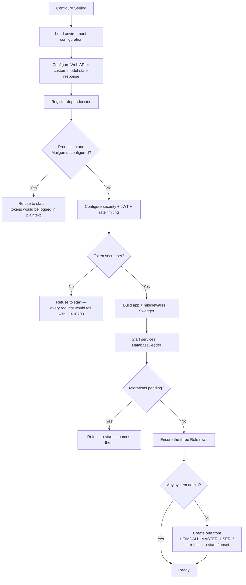

+++
title = 'Operations'
linkTitle = 'Operations'
weight = 80
description = 'Migrations, start-up guards, health checks, logging, rate limiting, and the integrations.'
+++

## Migrations

The schema is managed with **EF Core migrations, applied explicitly**:

```bash
python scripts/migrations.py
```

The script asks which environment file to load (for the connection string), then offers **list**,
**create (generate)**, and **apply**. Creating a migration prompts for its name and adds it to
`src/Infrastructure/ArturRios.Heimdall.Data/Migrations`. It needs `dotnet tool restore` to have been
run once, for the pinned EF Core CLI tool.

**The API never migrates on startup, and refuses to start when migrations are pending.** The seeder
checks `GetPendingMigrationsAsync` first and throws with the missing migration names:

```
The database is missing 2 migration(s): 20260811_AddAuditLog, 20260812_AddTwoFactorEmailCode.
Apply them with scripts/migrations.py before starting the API.
```

Automatic migration on startup is convenient exactly until two instances start at once, or until a
deployment silently applies a migration nobody reviewed. An explicit step makes schema change a
decision rather than a side effect.

## Start-up sequence



The seeder is idempotent, so it runs on every start-up: it ensures every `Roles` member exists as a
row and that at least one system administrator exists to sign in as. It never applies migrations.

Each of those refusals replaces a failure that would otherwise appear far from its cause — an opaque
`IDX10703` on every authenticated request, a plaintext token in a production log, or a runtime error
against a column that does not exist yet.

## Health checks — UC-30

| Endpoint | Who | What it does |
| --- | --- | --- |
| `GET /healthcheck` | Anonymous | Liveness. Confirms the process is up and responding. Reads no database. |
| `GET /healthcheck/detailed` | System Admin | Reports the status of each verified dependency. |

```json
{
  "status": "Healthy",
  "services": [
    { "name": "Database", "status": "Healthy" }
  ]
}
```

The aggregate `status` is `Healthy` only when **every** entry is healthy (**FR-HC-05**).

The liveness endpoint is anonymous because a load balancer cannot authenticate; the detailed one is
System-Admin-only because "which of my dependencies is down" is operational intelligence.

Each dependency is one `IServiceHealthCheck` registration. `DatabaseHealthCheck` issues a trivial
read through the repository abstraction and catches everything — an unreachable database throws on
execution, and the check reports unhealthy rather than propagating, so the aggregate can still be
reported (AF-30c). Adding a verification is one more registration; the detailed handler resolves them
all as `IEnumerable<IServiceHealthCheck>`.

## Logging

Serilog, configured before anything else so that even configuration failures are recorded:

- **Console** — JSON formatted.
- **Rolling files** — `<HEIMDALL_LOG_DIRECTORY>/<yyyy/MM>/log-<date>.json`, a new file per day inside
  a folder per month. `HEIMDALL_LOG_DIRECTORY` defaults to `logs`.

**EF Core diagnostics are enabled outside Production only.** `SensitiveDataLogging` and
`DetailedErrors` print parameter and column values — password hashes, salts, email addresses — so
they stay off where those logs are retained.

## Rate limiting and lockout

Brute force is bounded in two independent places, because each covers what the other misses.

**Per caller — a fixed-window limiter** of **10 requests per minute, partitioned by client IP**,
applied to `AuthController`'s anonymous, credential-checking endpoints: login, password recovery,
password reset, email verification, Google sign-in, and second-factor verification. Rejections
answer **429**. None of these requires a bearer token, so nothing else bounds how fast one caller
can hit them, and each login attempt costs a full Argon2id verification (600 MB / 16 threads by the
hashing library's defaults) — so memory exhaustion is realistic without it.

**Per account — a failure budget**, which is what an attacker spread across many source addresses
defeats the limiter with:

| Target | Budget | On exhaustion |
| --- | --- | --- |
| Password (UC-11) | 10 consecutive failures | The account is locked for 15 minutes. `PERSON.failed_login_attempts` counts, `PERSON.locked_out_until` holds the window; a successful login clears both. |
| 2FA email code (UC-37, UC-38) | 5 wrong guesses per issued code | The code is retired. `TWO_FACTOR_EMAIL_CODE.failed_attempts` counts; guessing again costs a fresh login, which is itself limited and mails the account holder a code they did not ask for. |
| 2FA app code | Single use | `TWO_FACTOR_AUTH.last_totp_time_step_used` records the accepted time step, so an observed code cannot be replayed within the ±1-step verification window (RFC 6238 §5.2). |

A lockout is a window rather than a latch an administrator clears: reaching the threshold needs
nothing but wrong guesses, so a permanent lock would hand any anonymous caller a denial of service
against any address they know. It answers with UC-11's ordinary `InvalidCredentials`, and spends the
same Argon2id work a real check would, so it is not observable — by message or by timing — to a
caller who does not already know the password.

{}
The limiter's partition key is the connection's remote IP. Behind a reverse proxy or load balancer
that does not forward the real client IP (via `X-Forwarded-For` with `ForwardedHeadersMiddleware`
configured), **every caller shares one partition**. This is a per-instance, defence-in-depth
throttle — not a replacement for a WAF or an API gateway's own rate limiting in front of a real
deployment. The per-account budgets above are in the database, so they hold across instances.
{}

## Cross-origin requests

`HEIMDALL_CORS_ALLOWED_ORIGINS` lists the browser front ends allowed to call the API, comma
separated, as scheme and host (`https://app.example.com`). **With the variable unset, no
cross-origin request is allowed.**

Refusing by default is deliberate. The same-origin policy is what stops a page on an unrelated
origin from reading an authenticated response, and an identity API is the last place to switch it
off: any site the caller visited could otherwise read `/api/persons/{id}` with a token it scraped,
and drive the anonymous endpoints from every visitor's browser at once. A missing entry costs a
front end its access until an operator adds one — visible, and quickly fixed. Defaulting to "any
origin" would instead leave a deployment open with nothing to indicate it.

Server-to-server callers are unaffected: CORS is a browser rule, and non-browser clients send no
`Origin` header.

## Integrations

### Email delivery (Mailgun)

Verification (UC-06) and password reset (UC-12) emails, and 2FA email codes, go out through Mailgun
via [`ArturRios.Messaging`](https://github.com/artur-rios/dotnet-messaging). Delivery is enabled only
when **both** credentials are present:

| Variable | Value |
| --- | --- |
| `MAILGUN_API_KEY` | Your Mailgun private API key |
| `MAILGUN_DOMAIN` | The Mailgun sending domain |
| `MAILGUN_API_VERSION` | Optional; defaults to `v3` |

| Variable | Value |
| --- | --- |
| `HEIMDALL_EMAIL_VERIFICATION_URL` | Front-end page that verifies an email address |
| `HEIMDALL_PASSWORD_RESET_URL` | Front-end page that sets a new password |

Each page finishes the job by posting its token back — the verification page to
`POST /api/auth/verify-email`, the reset page to `POST /api/auth/password-reset` with the new
password. If no link is configured the email carries the bare token instead, which still works.

| State | Behaviour |
| --- | --- |
| Configured | Emails are sent. |
| Unconfigured, **not** Production | Each token is **logged** instead of emailed, with one warning at start-up. This keeps local runs and the functional suite working without credentials and off the network. |
| Unconfigured, **Production** | **Start-up fails.** The fallback would print verification tokens, reset tokens and 2FA codes in plaintext — an account-takeover primitive for anyone who can read the logs. |

### Google Sign-In

| Variable | Value |
| --- | --- |
| `HEIMDALL_GOOGLE_CLIENT_IDS` | Comma-separated Google OAuth client IDs accepted as an ID token's audience |

Unset, the API registers a verifier that **refuses every token** with a 401 and warns once at
start-up. Unlike the email fallback this is not a convenience mode: verification needs an audience to
check against (**NFR-13**), so a verifier with no configured client could only reject everything or
trust everything. Every other endpoint is unaffected, as is any scope that never enabled the feature.

Google sign-in also requires the scope itself to have it switched on, through
`PUT /api/scopes/{id}/google-signin` — it is off by default. See
[Google Sign-In](../flows/google-sign-in/).

## Environment variables at a glance

| Variable | Required | Default |
| --- | --- | --- |
| `HEIMDALL_DATA_CONNECTIONSTRING` | ✅ | — |
| `HEIMDALL_DATA_DATABASETYPE` | ✅ | — (`PostgreSql`) |
| `HEIMDALL_AUTH_TOKEN_SECRET` | ✅ | — |
| `HEIMDALL_MASTER_USER_NAME` / `_EMAIL` / `_PASSWORD` | ✅ | — |
| `HEIMDALL_AUTH_TOKEN_ISSUER` / `_AUDIENCE` | | empty |
| `HEIMDALL_AUTH_TOKEN_EXPIRATION_IN_SECONDS` | | `3600` |
| `HEIMDALL_EMAIL_VERIFICATION_TOKEN_EXPIRATION_IN_SECONDS` | | `86400` |
| `HEIMDALL_PASSWORD_RESET_TOKEN_EXPIRATION_IN_SECONDS` | | `3600` |
| `HEIMDALL_LOG_DIRECTORY` | | `logs` |
| `HEIMDALL_CORS_ALLOWED_ORIGINS` | | unset → every cross-origin request is refused |
| `HEIMDALL_GOOGLE_CLIENT_IDS` | | unset → Google sign-in refuses every token |
| `MAILGUN_API_KEY` / `MAILGUN_DOMAIN` | | unset → tokens logged (fails start-up in Production) |
| `MAILGUN_API_VERSION` | | `v3` |
| `HEIMDALL_EMAIL_VERIFICATION_URL` / `HEIMDALL_PASSWORD_RESET_URL` | | unset → the email carries the bare token |

`Environments/.env` in the Web API project is a **tracked template** listing every variable; real
values live in per-environment files that are gitignored.

## Scaling

The API is designed for horizontal scaling (**NFR-06**), and the authentication design is what makes
that cheap: tokens are stateless and validated from their claims, so no session store or sticky
routing is needed. The rate limiter's window is per instance as a result, which is why the
per-account failure budgets above live in the database instead.

A token still carries no revocation list, but it no longer outlives the identity it names:
`ActorLivenessFilter` resolves the caller on every authenticated request and refuses a token whose
person or Google User has been deleted (**FR-AU-05**, **FR-GO-12**). That costs one indexed read per
request — the price of making logical deletion take effect immediately rather than whenever the
token happens to expire.

The full operational specification is the
[Operations & Infrastructure Document](../requirements/operations-infrastructure-document/).
