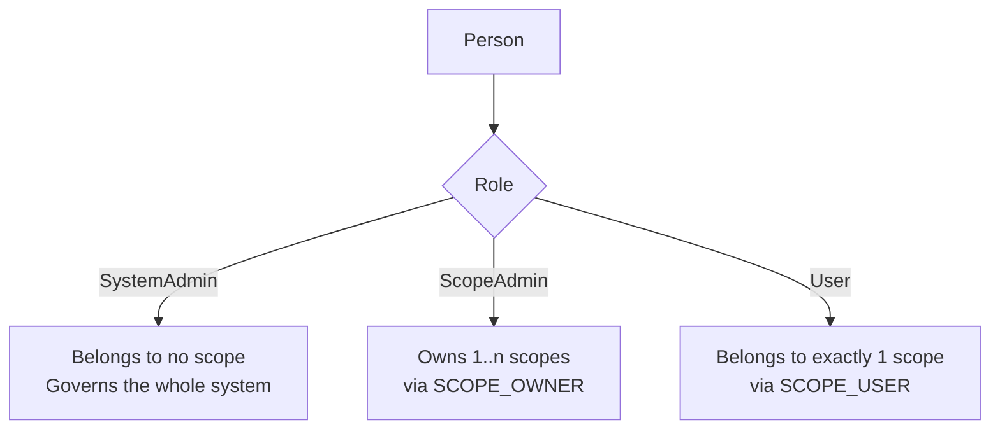
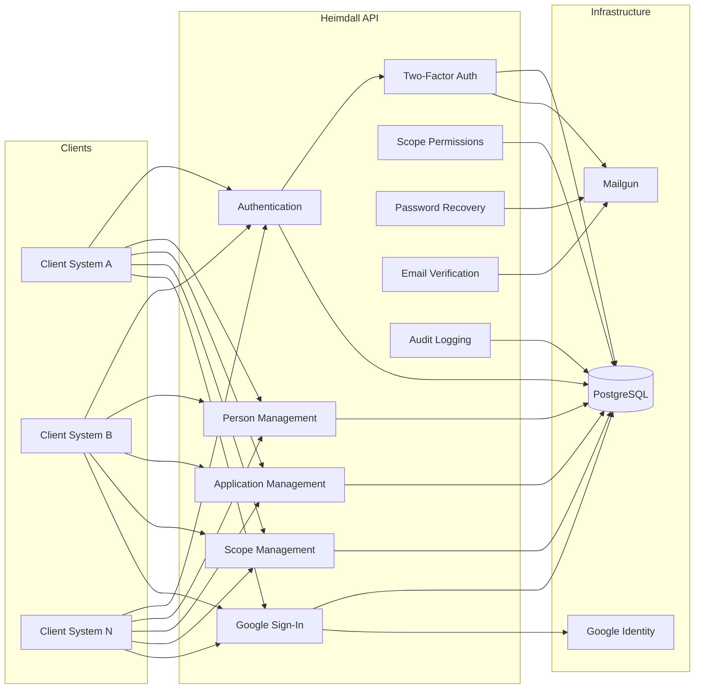

+++
title = 'Overview'
linkTitle = 'Overview'
weight = 10
description = 'The domain vocabulary — scopes, persons, roles, applications, permissions — and the rules that bind them.'
+++

Heimdall is a **centralized identity management API**. Several client systems delegate their
identity concerns to one deployment of it, and each of those systems gets an isolated slice of the
data called a **scope**.

Everything else in the model is defined relative to that boundary.

## The vocabulary

| Term | What it is |
| --- | --- |
| **Scope** | A logical tenant boundary that groups the owners, users, applications, Google Users, and permissions belonging to one client system. |
| **Person** | A registered human identity — name, email, password hash, role, deletion status. A person has **no scope column**; its relationship to scopes is derived from its role. |
| **Role** | One of `SystemAdmin`, `ScopeAdmin`, `User`. A closed set of three rows. |
| **Scope Owner** | A person with the `ScopeAdmin` role who owns a scope. Many-to-many: a scope has one or more owners, an admin may own several scopes. |
| **Scope User** | A person with the `User` role who belongs to **exactly one** scope. |
| **Application** | A registered non-human identity (another system), in exactly one scope, owned by exactly one Scope Admin who owns that scope. |
| **Google User** | An identity authenticated by Google rather than a password. Always `User`-equivalent, always in exactly one scope, stored in its own table with a direct `ScopeId`. |
| **Scope Permission** | A permission defined inside a scope. When `IncludeAsJwtClaim` is set, its name is added as a claim on JWTs issued for that scope. |
| **Two-Factor Auth** | An opt-in second step for a person — authenticator app, email, or both — backed by ten single-use recovery codes. Not available to Google Users. |
| **Logical deletion** | Setting `IsDeleted = true`; the row stays. |
| **Hard deletion** | Removing the row, with defined cascades. |

## How a person relates to a scope

This is the single rule that most often surprises newcomers: `Person` has no `ScopeId`.

A `SystemAdmin` with a scope row, or a `User` with two, is not representable — the join tables carry
the constraints (`SCOPE_USER.PersonId` is unique; `SCOPE_OWNER` has a composite key).

## Two identifiers per entity

Every top-level entity carries both:

- **`Id`** — an auto-incrementing `bigint`. The physical primary key and the target of every foreign
  key. **Never** leaves the database.
- **`PublicId`** — a GUID generated at creation. The identifier used in API paths, response bodies,
  and token claims.

The split keeps record counts and creation order — which a sequential integer would leak — out of
anything a caller can see, while the database keeps compact integer keys for joins and indexes. This
is **NFR-15**; see the [System Requirements Document](../requirements/system-requirements-document/)
for the one documented and accepted exception (`Person.RoleId`).

## Two kinds of caller, two kinds of token

| | Password identities | Google identities |
| --- | --- | --- |
| Entity | `Person` | `GoogleUser` |
| Credentials | Password hash + per-person salt (Argon2id) | Delegated to Google; no hash stored |
| Sign-in | `POST /api/auth/login` | `POST /api/auth/google` |
| Roles reachable | `User`, `ScopeAdmin`, `SystemAdmin` | `User` only, always |
| Second factor | Optional 2FA (app / email / recovery codes) | Google's own account security |

Both produce the same kind of stateless, signed JWT. **Authentication reads no database per
request** — the identity is rebuilt from the token's claims — which is why the sign-out endpoint
revokes nothing and why a token can outlive the account it names until it expires.

## What the API is composed of

Every one of those write paths also produces an audit trail entry (**NFR-09**) — see
[Audit logging](../flows/audit-logging/).

## Where the rules are written down

Nothing on this site is the specification. The specification is the set of numbered requirements and
use cases under [Requirements](../requirements/):

- `FR-…` — functional requirements, grouped by capability (`FR-AU-…` authentication, `FR-GO-…`
  Google Sign-In, `FR-2F-…` two-factor, and so on).
- `NFR-…` — non-functional requirements (security, data integrity, validation, logging).
- `UC-…` — use cases, each with a main flow and numbered alternative flows (`AF-11a`, `AF-11b`, …).

The source code cites these identifiers in its comments, so a line of code can be traced back to the
flow that demanded it.
