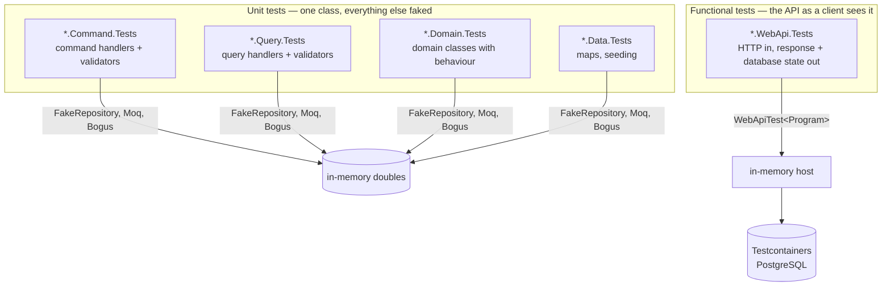

+++
title = 'Testing'
linkTitle = 'Testing'
weight = 30
description = 'Running the unit and functional suites, the conventions they follow, and how to chase a flaky test.'
+++

## Running the suites

Everything:

```bash
dotnet test src/ArturRios.Heimdall.sln
```

One kind at a time — unit tests are isolated, functional tests run end-to-end against a real
PostgreSQL database provisioned by Testcontainers:

```bash
dotnet test src/ArturRios.Heimdall.sln --filter "Category=Unit"
```

```bash
dotnet test src/ArturRios.Heimdall.sln --filter "Category=Functional"
```

The `Category` trait is stamped by the `[UnitFact]` / `[UnitTheory]` and `[FunctionalFact]` /
`[FunctionalTheory]` attributes from `ArturRios.Util.Test`, so the filter works without any
per-project configuration.

{}
Functional tests start a PostgreSQL container per run. Without a working Docker daemon they fail at
setup, not at assertion.
{}

## Every run records a `.trx`

`tests/Directory.Build.props` points every test project at `tests/default.runsettings`, which enables
the `trx` logger. An ordinary `dotnet test` therefore writes a result file per project under that
project's `TestResults/` (git-ignored) and prints its path.

This is not incidental. A console summary is not evidence: a functional test failed once in a
full-solution run, the summary was the only record, the failing test's name was lost, and the failure
never reproduced across 23 subsequent runs. A `.trx` costs nothing per run and means the next
intermittent failure identifies itself.

`ResultsDirectory` is deliberately left at its default — each project's own `TestResults/` — so
projects running concurrently cannot overwrite each other's results.

## Coverage

The published report is at **[/coverage-report/](/coverage-report/)** — also linked as *Test
Coverage* in the top navigation. It is generated by
[ReportGenerator](https://github.com/danielpalme/ReportGenerator) from the Cobertura files
`coverlet.collector` produces.

The report is **built by CI, not committed**. The Tests workflow collects coverage from both suites
on every run and uploads the HTML as an artifact; the Build Docs workflow downloads the artifact
from the latest successful run on `main` and unpacks it into `docs/coverage-report` before Hugo
builds. A change under `src/` therefore moves the published numbers on merge, with nothing to
remember and no generated pages in the repository. `docs/coverage-report` is git-ignored.

The report itself is the only statement of the current numbers. Figures quoted in prose go stale the
first time someone writes a test and, unlike the report, nothing regenerates them.

Regenerate it locally — tests, collection, and HTML in one step:

```bash
python scripts/coverage.py
```

Add `--clean` to purge every `bin/` and `obj/` first:

```bash
python scripts/coverage.py --clean
```

{}
`dotnet build` only overwrites files it produces, so assemblies from a previous project name survive
in the output directories indefinitely. `coverlet` instruments whatever it finds there — which is how
this project's report once ended up a third full of `ArturRios.IdentityManager.*` classes that no
longer exist, years after the rename. `--clean` deletes `bin/` and `obj/` outright, which
`dotnet clean` does not.

The script also empties `docs/coverage-report` before writing, since ReportGenerator does not remove
pages whose class has since disappeared.
{}

`--report-only` builds the HTML from coverage files already on disk, running no tests. That is the
mode CI uses, after its own two test steps have collected coverage.

If `REPORTGENERATOR_LICENSE` is set, the script passes it to ReportGenerator as `-license` and the
PRO version generates the report; the key is never echoed. CI reads it from the repository secret of
the same name. Unset, generation still succeeds with the free version — which is what happens on a
pull request from a fork, where GitHub withholds secrets by design.

Coverage is a signal, not a target — the
[Testing Specification Document](../requirements/testing-specification-document/) defines the
coverage each handler and endpoint actually owes, which is the standard that matters.

## Chasing a flaky test

```bash
python scripts/flake_hunt.py --runs 25
```

It runs the whole solution in a loop, stops at the first failing run (`--keep-going` measures a rate
instead), and prints every test any run recorded as failed.

Hunt with the **whole solution** rather than a single project: a failure that only appears under the
CPU contention of parallel test projects will not reproduce from one project alone.

## The two layers



| | Unit | Functional |
| --- | --- | --- |
| Subject | Exactly one class | The whole API over HTTP |
| Dependencies | Replaced by test doubles (`FakeRepository<T>`, Moq) | Real — in-memory host + real PostgreSQL |
| Asserts | The behaviour of the method under test | Both the **HTTP response** and the **resulting database state** |
| Base class | — | `WebApiTest<TEntryPoint>` (exposes `Gateway`, `AuthenticateAsync`, `Authorize`) |

Every use case that reaches the API **must** have functional coverage, even when its handler is
already unit-tested — the two layers verify different things.

**Anemic domain entities** — plain data holders with only properties and navigation collections, such
as `Scope` — carry no behaviour and therefore get no unit tests. A domain class earns its own tests
the moment it gains a method that makes a decision.

## Conventions

| Item | Convention | Example |
| --- | --- | --- |
| Test project | `<Project>.Tests` | `ArturRios.Heimdall.Command.Tests` |
| Test class | `<ClassUnderTest>Tests` | `CreateScopeCommandHandlerTests` |
| Test method | `Given…_When…_Then…` | `GivenScopeNameAlreadyExists_WhenHandlingCreateScope_ThenReturnsNameAlreadyExistsError` |
| Body sections | `// Given` → `// When` → `// Then`, in that order | — |
| Mocking | **Moq** only — no second mocking framework | — |
| Test data | **Bogus** — never hand-written large object literals or shared mutable fixtures | — |

Test projects mirror the `src/` layout one-for-one:

```
tests/
  Application/
    ArturRios.Heimdall.Command.Tests/
    ArturRios.Heimdall.Query.Tests/
    ArturRios.Heimdall.Shared.Tests/
  Domain/ArturRios.Heimdall.Domain.Tests/
  Infrastructure/ArturRios.Heimdall.Data.Tests/
  Presentation/ArturRios.Heimdall.WebApi.Tests/
  Directory.Build.props        points every project at default.runsettings
  default.runsettings          enables the trx logger
```

## The full standard

This page is the operational summary. The
[Testing Specification Document](../requirements/testing-specification-document/) is the standard
itself — what to test for each use case, required coverage per handler and per endpoint, the
Testcontainers database setup, and the per-use-case workflow to apply every time.
