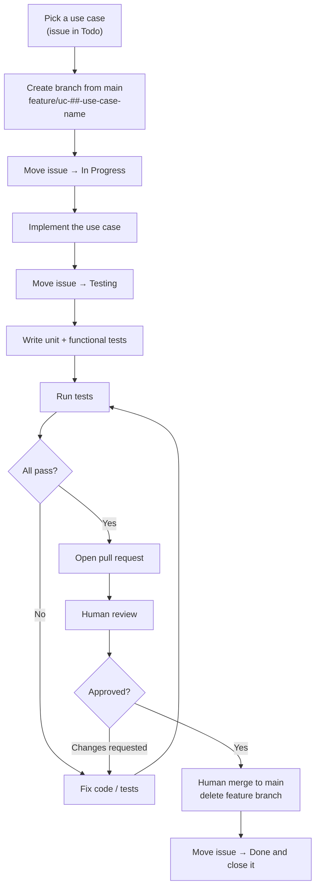

# Development Workflow Document — Heimdall API

## 1. Purpose

This document defines **how a use case moves from backlog to merged** — the branch, the issue status
transitions, the testing gate, and the pull request. It is the standard every contributor (human or
agent) follows so that each use case (UC-01 … UC-29 in the
[Use Case Specification Document](Use%20Case%20Specification%20Document.md), plus later additions
such as UC-30) is delivered the same way.

It complements the [Testing Specification Document](Testing%20Specification%20Document.md), which
defines *how* the tests themselves are written; this document defines *when* they happen in the
delivery flow.

> **One use case = one branch = one issue = one pull request.**

## 2. Workflow at a glance



> The diagram shows the default flow, where a human reviews and merges. In an authorized batch run
> the agent merges its own pull request instead — every other step, including the testing gate, is
> identical. See [Step 7.1](#step-71--authorized-batch-runs).

## 3. Issue status lifecycle

Each use case is tracked by its GitHub issue on the project board. The `Status` field moves through
these columns, in order:

| Order | Status | Set when |
| --- | --- | --- |
| 1 | **Todo** | The use case has not been started (default). |
| 2 | **In Progress** | A feature branch has been created and implementation has begun. |
| 3 | **Testing** | Implementation is finished; unit and functional tests are being written, run, and fixed until green. |
| 4 | **Done** | The pull request has been reviewed and merged to `main`; the issue is then **closed**. |

An issue only ever moves **forward** during normal flow. If review requests changes, work continues
on the same branch (still linked to the same issue) until tests pass again and the PR is re-reviewed.

## 4. Step-by-step

### Step 1 — Branch from `main`

Every use case is implemented on its own branch, created from an up-to-date `main`:

```bash
git switch main
git pull
git switch -c feature/uc-01-create-scope
```

**Branch naming pattern:**

```
feature/uc-##-use-case-name
```

- `##` — the zero-padded use case number (`01`, `02`, … `29`).
- `use-case-name` — the use case name in lower-case kebab-case.

| Use case | Branch |
| --- | --- |
| UC-01: Create Scope | `feature/uc-01-create-scope` |
| UC-11: Login (Authenticate) | `feature/uc-11-login` |
| UC-25: Sign Up / Sign In via Google | `feature/uc-25-sign-up-sign-in-via-google` |

### Step 2 — Move the issue to **In Progress**

As soon as the branch exists and work starts, set the use case's issue `Status` to **In Progress**
on the project board.

### Step 3 — Implement the use case

Implement the use case per its specification (main flow and alternative flows) and the project's
architecture and technology stack. All commits for the use case go on its feature branch.

### Step 4 — Move the issue to **Testing**

When the implementation is finished, set the issue `Status` to **Testing**. This signals that the
feature is code-complete and the testing gate is now in progress.

### Step 5 — Test until green

Following the [Testing Specification Document](Testing%20Specification%20Document.md):

1. Write the **unit tests** for every Command/Query handler and any new Domain behavior (main flow +
   each applicable `AF-xx` alternative flow).
2. Write the **functional tests** for each endpoint (main flow + every `AF-xx`, including the
   authorization flows), end-to-end against Testcontainers PostgreSQL.
3. **Run the tests** (`dotnet test`, and/or filtered by `Category=Unit` / `Category=Functional`).
4. **Fix** any failures — in the implementation or the tests.
5. **Re-run**, and repeat steps 3–4 **until every test passes**.

A use case does not leave the Testing stage until the full suite is green.

### Step 6 — Open a pull request

With all tests passing, push the branch and open a PR from `feature/uc-##-…` into `main`. The PR
description should reference the use case and its issue (e.g. `Closes #<issue-number>`) so the issue
is linked to the PR.

### Step 7 — Human review and merge

- The PR is **reviewed by a human**. Requested changes are addressed on the same branch (back to
  Step 5 whenever code changes, so the suite stays green).
- Once approved, a human **merges the PR into `main`**.
- The **feature branch is deleted** after the merge.

> Review and merge are **human actions**. An agent may prepare and push the PR, but must not
> self-approve or merge it. The single exception is an authorized batch run — see
> [Step 7.1](#step-71--authorized-batch-runs).

### Step 7.1 — Authorized batch runs

When several use cases are delivered in one unattended run, the human approval gates would stop the
run at every use case, which defeats the point of batching them. For a **batch run only**, an agent
may merge its own pull requests, subject to all of the following:

- **The batch was authorized up front.** A human agreed to the specific use cases, in order, and was
  told explicitly that the agent would merge, close the issues, and delete the branches. A general
  instruction to work autonomously is not this authorization.
- **The invariant still holds.** One use case = one branch = one issue = one pull request. Use cases
  are never batched into a shared branch or a shared pull request, so the run stays reviewable after
  the fact.
- **The testing gate is unchanged.** The full suite is run and read for every use case, per Step 5.
  A merge on an unread or failing suite is never permitted.
- **No protection is bypassed.** No `--admin` merge, no self-approval to satisfy a required review,
  no force-push, and no disabling or filtering of a test to make the suite green.
- **A failure stops the whole run.** A red suite, a merge conflict, an ambiguous specification, or a
  requirement that does not exist ends the batch. Already-merged use cases stay merged; the failing
  branch and its pull request are left in place as evidence.

Outside an authorized batch run, Step 7 applies as written: a human reviews and a human merges.

### Step 8 — Close the issue

After the merge, set the issue `Status` to **Done** and **close** it. If the PR used a
`Closes #<issue-number>` reference, the merge closes the issue automatically — still confirm the
board shows it in **Done**.

## 5. Definition of Done

A use case is done only when **all** of the following hold:

- [ ] Implemented on a `feature/uc-##-use-case-name` branch created from `main`.
- [ ] Main flow and every alternative flow from the use case specification are implemented.
- [ ] Unit tests cover each handler and new Domain behavior (main + applicable `AF-xx`).
- [ ] Functional tests cover each endpoint (main + every `AF-xx`, including authorization).
- [ ] The full test suite passes (`Category=Unit` and `Category=Functional`).
- [ ] A pull request was merged to `main` — reviewed by a human, or merged by an agent under an
      authorized batch run (Step 7.1).
- [ ] The feature branch was deleted.
- [ ] The issue is in **Done** and closed.

## 6. References

- [Use Case Specification Document](Use%20Case%20Specification%20Document.md) — the use cases and their flows.
- [Testing Specification Document](Testing%20Specification%20Document.md) — how the tests are written.
- [System Requirements Document](System%20Requirements%20Document.md) — functional/non-functional requirements.
- [Technology Stack Document](Technology%20Stack%20Document.md) — technologies and versions used.
