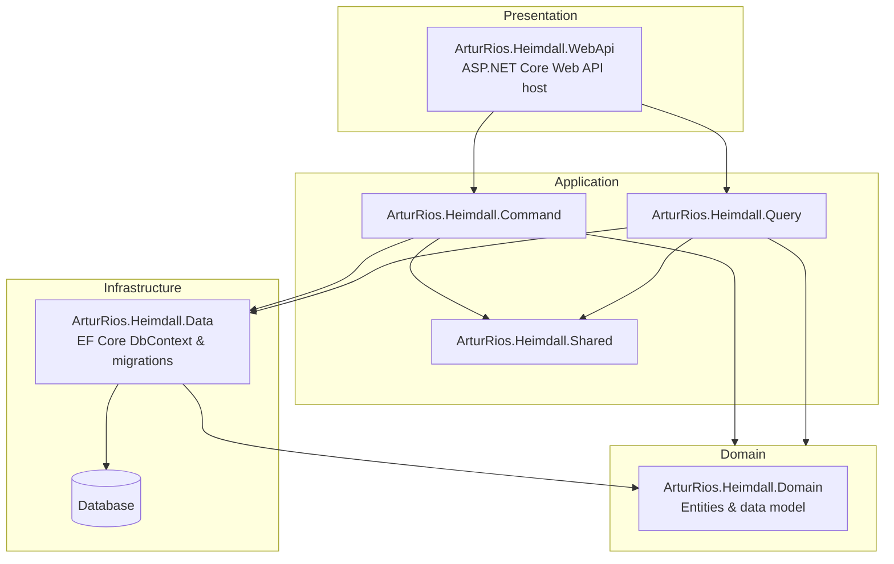
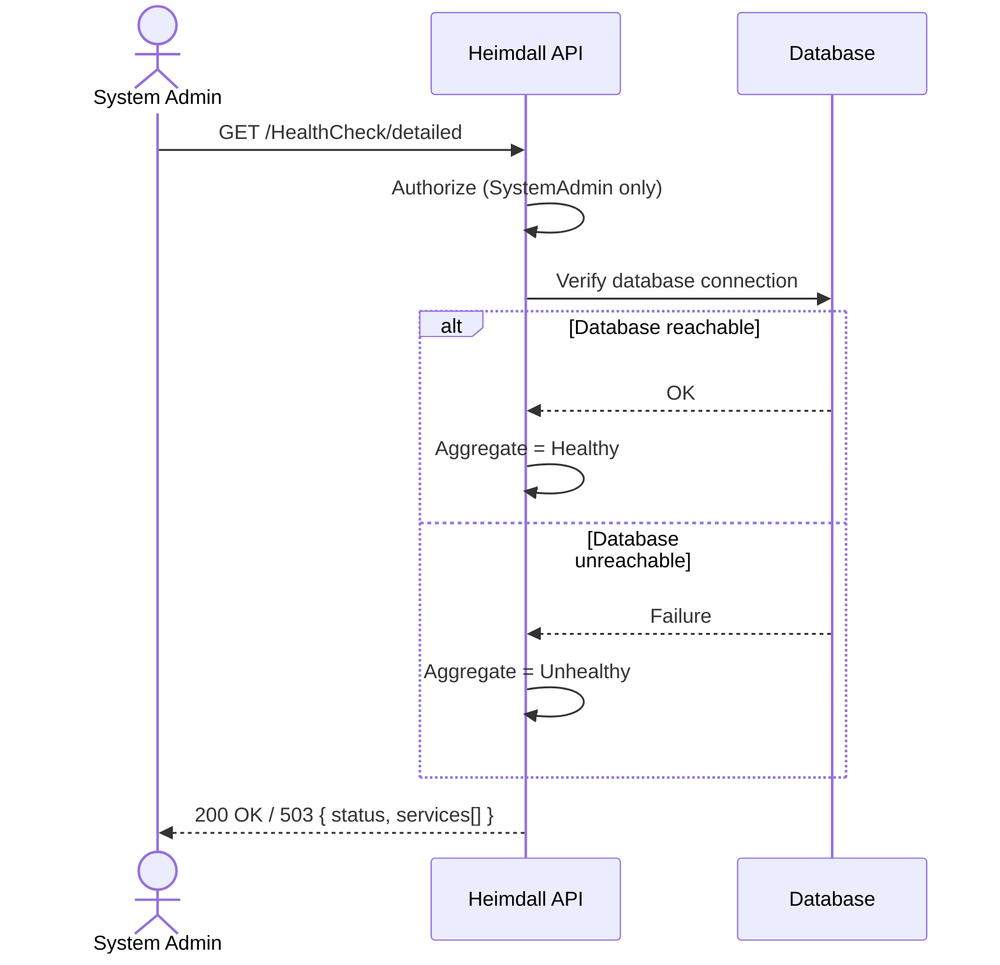

# Operations & Infrastructure Document — Heimdall API

## 0. Hosting region

Personal data is stored in **Brazil**, and that is a constraint rather than an incidental fact: it
determines which transfer rules apply to everything leaving the deployment. Moving the region means
redoing the assessment in
[§7 of the Data Protection Document](Data%20Protection%20Document.md), because the outbound flows to
Mailgun and Google are measured from wherever the data sits.

Note also that Brazil holds no EU adequacy decision. If any tenant scope serves data subjects in the
EEA, hosting here is itself a restricted transfer under GDPR Chapter V — see §7.2 of that document,
which records this as a question the controller must answer rather than an assumption.

## 0.1 Encryption, backups, and restoring without undoing an erasure

NFR-25. This section states what the deployment must provide and what the API does about it. Two of
the three requirements are properties of the hosting rather than of this codebase, and are marked
accordingly: **the controller must confirm them** — they cannot be verified from the repository.

### Encryption at rest

| | |
| --- | --- |
| **Database volume** | ✅ **Confirmed by the controller, 10 September 2026** — the data is encrypted at rest on the server |
| **Backups** | ✅ **Confirmed, 10 September 2026** — encrypted, and held on a private cloud service |
| **Application-level** | ✅ Argon2id password hashes, encrypted TOTP secrets (NFR-16), hashed tokens and recovery codes |

The two rows were confirmed separately, and deliberately so: "encrypted on the server" establishes
the volume, and a backup written elsewhere is a different artefact with its own key management. A
regime that encrypts the live database while shipping plaintext dumps to object storage is common
enough to be worth ruling out rather than assuming away. Both are now confirmed.

> **Still open: where the backup service holds them.** A private cloud service is a *how*, not a
> *where*, and the jurisdiction is what decides whether the backups are themselves an international
> transfer — of every category in §3 at once, since a backup is a full copy. If they leave Brazil
> the transfer needs its own ground in
> [§7 of the Data Protection Document](Data%20Protection%20Document.md), alongside the email flow.
> Tracked in [#125](https://github.com/artur-rios/heimdall-api/issues/125).

The application-level protections are real and tested, and they are not a substitute. The threat
model's TB-3 covers what an attacker recovers from *stolen rows*, which presupposes the rows were
read; it says nothing about a disk or a snapshot leaving the building. Everything not listed in the
third row above — every name, every address, every audit entry — is stored in clear text within the
database and is protected only by whatever the volume beneath it provides.

### Encryption in transit

`UseHttpsRedirection` covers the inbound edge. The database connection is the other half, and the
API **warns at start-up** when the connection string does not require TLS.

Npgsql's default `SSL Mode` is `Prefer`, which silently falls back to an unencrypted connection when
the server does not offer TLS — so a deployment can be sending credentials and addresses in clear
text while looking correctly configured. Set `SSL Mode=Require`, `VerifyCA` or `VerifyFull` in
`HEIMDALL_DATA_CONNECTIONSTRING`.

It warns by default rather than refusing to start, and that is a departure from how this codebase
treats other security configuration — TH-23's email control fails start-up in Production. Failing by
default would take down a working deployment on upgrade over a setting the operator may not control
directly.

**Set `HEIMDALL_DATA_REQUIRE_TLS=true` to turn the warning into a refusal.** That is the right
setting once TLS is confirmed in place: from that point a connection string that does not ask for
encryption is a misconfiguration rather than a known state, and starting anyway would be starting in
the one condition the check exists to prevent. It is opt-in rather than the default only so that
enabling it is a decision somebody makes, not one that happens to them during an upgrade.

### The backup regime

| | | |
| --- | --- | --- |
| **Schedule** | Daily full backup | ✅ Confirmed 10 September 2026 |
| **Encryption** | Encrypted, on a private cloud service | ✅ Confirmed 10 September 2026 |
| **Retention** | 35 days | ✅ Confirmed 10 September 2026 |
| **Location** | Same region as the database — Brazil | ⚠️ **Not confirmed** |
| **Restore testing** | Quarterly, including the reconciliation step below | ⚠️ Proposed |

**Why 35 days**, since the figure is a decision rather than a default. The backup worth having is
usually the one from *before* the problem was noticed, and silent corruption is typically found days
or weeks late — so a short window can mean every copy held is already spoiled. Below 30 days,
recovery is capped at under a month. Above it, a backup can outlive the 30-day erasure deadline,
which is what makes the restore reconciliation below **mandatory rather than optional**. Thirty-five
clears the deadline with margin, at a cost already paid: the reconciliation is built and tested.

Two rows remain, and each carries a consequence if the real value differs:

- **Location is the one that changes obligations rather than practice.** A backup outside Brazil is
  an international transfer of every category in §3 at once — the whole database, not the single
  address the email flow sends. It would need its own ground in
  [§7 of the Data Protection Document](Data%20Protection%20Document.md), and where an EEA tenant's
  users are in the copy, its own Chapter V safeguard. "Private cloud service" describes the
  arrangement, not the jurisdiction.
- **Restore testing** is what turns the reconciliation below from a procedure into a capability. A
  restore that has never been run is a hypothesis.

35 days is chosen against the erasure deadline rather than against recovery convenience: it is
longer than the 30 days §4 of the retention schedule allows an erasure to take, which is what makes
the reconciliation step below **mandatory rather than optional**. A regime keeping backups for less
than 30 days would not need it — but would also cap disaster recovery at under a month, which for
most operators is unacceptable.

### Restoring without undoing an erasure

> An erasure that the next restore silently undoes is not an erasure.

Backups are full copies and are never edited — editing one destroys the integrity that is its whole
purpose. So a restore reinstates whatever the database held when the backup was taken, erased people
included, and the runbook has to put them back.

**Two cases, and only one needs a human.**

Where the backup was taken **after** the subject asked, the restored row still carries its deletion
and its deadline, and NFR-20's scheduled pass completes the erasure again by itself. Nothing is
required.

Where the backup **predates the request**, the row comes back with no trace of the request ever
having been made. Nothing inside the database knows to act, because the evidence was rolled back
along with everything else. This is the case the reconciliation exists for.

**The erasure ledger.** Every run of the anonymisation pass logs the public identifiers it
anonymised. That line is the ledger, and it works precisely because the logs are outside the
database and a restore cannot roll them back. The identifiers are safe to keep and to ship off the
host: a `PublicId` whose identity has been anonymised resolves to nobody, so it is not personal
data.

**The runbook step.** After any restore:

1. Collect the anonymised identifiers from the logs, covering the period from the backup's timestamp
   to now.
2. `POST /api/auth/erasure-reconciliation` with that list, as a System Admin.
3. Check the response: `anonymised` is what the restore had brought back, `alreadyAnonymised` is
   what it had not, and `notFound` is the ordinary case for most of the ledger.
4. Record the run. The reconciliation is itself audited.

The step is safe to repeat — running it twice anonymises nothing extra — and it **refuses an empty
list**, because a reconciliation with nothing to reconcile almost always means the ledger was not
loaded, and reporting success there would let a restore be signed off with erased people back in the
database.

## 1. Introduction

### 1.1 Purpose

This document captures **cross-cutting platform concerns** for the **Heimdall API** that fall outside the identity domain modeled in the [Vision Document](Vision%20Document.md), [System Requirements Document](System%20Requirements%20Document.md), and [Use Case Specification Document](Use%20Case%20Specification%20Document.md).

It covers two areas:

- The **technical foundation** — the project scaffolding, solution architecture, and initial data infrastructure the domain features are built on.
- **Health & monitoring** — the operational endpoints used to observe that the API and its dependencies are up.

These are functional/operational capabilities of the *platform* rather than the identity domain, so they are documented here to keep the domain documents focused while still tracking the work formally. The specific technologies and versions this platform is built on are defined once in the [Technology Stack Document](Technology%20Stack%20Document.md) and referenced from here rather than duplicated.

### 1.2 Related Backlog Items

| Item | GitHub Issue | Status |
| ------ | -------------- | -------- |
| Project scaffolding & initial infrastructure | [#31](https://github.com/artur-rios/heimdall-api/issues/31) | ✅ Implemented |
| Health Check feature | [#32](https://github.com/artur-rios/heimdall-api/issues/32) | ✅ Implemented |

---

## 2. Technical Foundation (Project Scaffolding & Initial Infrastructure)

> Corresponds to issue [#31](https://github.com/artur-rios/heimdall-api/issues/31). **Status: Implemented** (delivered via PR #1 — `feat/data-infrastructure` — and preceding commits).

### 2.1 Overview

The solution is a **layered (DDD-style) .NET Web API**. The foundational scaffolding establishes the project structure, the Entity Framework Core data layer with the initial migration, startup seeding, and the functional test harness that the identity use cases (UC-01 … UC-29) are implemented on top of.

### 2.2 Solution Architecture



### 2.3 Delivered Capabilities

| Area | Requirement | Status |
| ------ | ------------ | -------- |
| IR-01 | The solution shall be organized into `Domain`, `Application` (`Command` / `Query` / `Shared` — CQRS split), `Infrastructure/Data`, and `Presentation/WebApi` layers | ✅ |
| IR-02 | The data layer shall use Entity Framework Core with a design-time factory and an initial migration | ✅ |
| IR-03 | Database tables shall use `snake_case`, singular naming, with EF diagnostics gated | ✅ |
| IR-04 | Role IDs shall be pinned to the `Roles` enum values | ✅ |
| IR-05 | On startup, the system shall seed the roles and the master System Admin | ✅ |
| IR-06 | A migration menu script shall be provided under `scripts/` | ✅ |
| IR-07 | Environment configuration files shall be copied to the build output | ✅ |
| IR-08 | A functional test container shall apply migrations and assert the resulting schema | ✅ |
| IR-09 | The data infrastructure design spec and implementation plan shall be documented under `docs/` | ✅ |

### 2.4 Technology Baseline

The concrete technologies, libraries, and versions behind this foundation (.NET 10 / C# 14, the `ArturRios.*` libraries, Entity Framework Core, PostgreSQL, and the testing tools) are defined in the [Technology Stack Document](Technology%20Stack%20Document.md). This section intentionally does not restate them.

---

## 3. Health & Monitoring

> Corresponds to issue [#32](https://github.com/artur-rios/heimdall-api/issues/32). **Status: Implemented** (delivered via PR #39 — `feature/uc-30-check-api-health`). Both the public liveness endpoint and the System Admin-only detailed health check are in place.

### 3.1 Overview

The API exposes health endpoints so that operators, load balancers, orchestrators, and uptime monitors can observe whether the API process is running and whether its dependencies are healthy. Two endpoints are provided:

1. A **basic liveness ("hello world") endpoint** — a lightweight, **public** check that the API is up.
2. A **detailed health check endpoint** — a **System Admin-only** check that reports the status of each verified service plus an aggregate general status.

The detailed check is intentionally **extensible**: for now the only verified service is the database connection, but new verifications (cache, email service, external identity providers, etc.) can be added later without changing the response contract.

### 3.2 Functional Requirements

| ID | Requirement | Priority |
| ---- | ------------ | ---------- |
| FR-HC-01 | The system shall expose a **public** liveness endpoint (`GET /HealthCheck`) that confirms the API process is running and responding, requiring **no authentication** | High |
| FR-HC-02 | The system shall expose a **detailed** health check endpoint (`GET /HealthCheck/detailed`) accessible **only to System Admins** | High |
| FR-HC-03 | The detailed health check shall verify the **database connection** | High |
| FR-HC-04 | The detailed health check shall report the status of **each verified service individually** | High |
| FR-HC-05 | The detailed health check shall report an **aggregate general status** of `Healthy` when all verified services are up, or `Unhealthy` when one or more verified services are down | High |
| FR-HC-06 | The health check design shall be **extensible**, allowing new service verifications to be added without changing the response contract | Medium |
| FR-HC-07 | The detailed health check endpoint should map the aggregate status to an appropriate HTTP status (e.g., `200 OK` when `Healthy`, `503 Service Unavailable` when `Unhealthy`) | Medium |

### 3.3 Endpoints

| Method | Endpoint | Description | Auth Required |
| -------- | ---------- | ------------- | --------------- |
| GET | `/HealthCheck` | Basic liveness check — confirms the API is on ("hello world") | **No (Public)** |
| GET | `/HealthCheck/detailed` | Detailed health check — reports per-service status and an aggregate `Healthy` / `Unhealthy` general status | **SystemAdmin** |

### 3.4 Detailed Health Check — Response Contract

The detailed response reports a `status` (the aggregate general status) and a `services` array with one entry per verified service.

**All services up:**

```json
{
  "status": "Healthy",
  "services": [
    { "name": "Database", "status": "Healthy" }
  ]
}
```

**Database connection down:**

```json
{
  "status": "Unhealthy",
  "services": [
    { "name": "Database", "status": "Unhealthy" }
  ]
}
```

The aggregate `status` is `Healthy` only when **every** entry in `services` is healthy; if **any** service is unhealthy, the aggregate is `Unhealthy` (FR-HC-05). Adding a new verification (FR-HC-06) simply appends another entry to `services` and participates in the same aggregation rule.

### 3.5 Use Case — UC-30: Check API Health

| Field | Value |
| ------- | ------- |
| **ID** | UC-30 |
| **Name** | Check API Health |
| **Actors** | Anonymous / Monitoring System (liveness), System Admin (detailed) |
| **Description** | Observe whether the API is running (liveness) and whether its dependencies are healthy (detailed) |
| **Preconditions** | For the detailed check, the actor is authenticated with the `SystemAdmin` role. The liveness check has no preconditions |
| **Postconditions** | Health information is returned; no system state is modified |

**Main Flow (liveness):**

1. A caller (monitor, load balancer, or anonymous user) sends `GET /HealthCheck`.
2. The system returns a success response indicating the API is on. No authentication is required.

**Main Flow (detailed):**



1. A System Admin sends `GET /HealthCheck/detailed`.
2. The system authorizes the request; only System Admins may proceed.
3. The system verifies each registered service (currently: the database connection).
4. The system computes the aggregate general status (`Healthy` if all up, `Unhealthy` otherwise).
5. The system returns the per-service statuses and the aggregate status.

**Alternative Flows:**

| ID | Condition | Outcome |
| ---- | ----------- | --------- |
| AF-30a | Detailed check requested by a caller who is not a System Admin | `403 Forbidden` |
| AF-30b | Detailed check requested with no/invalid authentication | `401 Unauthorized` |
| AF-30c | One or more verified services are down | `200 OK` (or `503`, per FR-HC-07) with `status = Unhealthy` and the failing service(s) marked |

### 3.6 Authorization

| Action | SystemAdmin | ScopeAdmin | User | Anonymous |
| -------- | :-----------: | :----------: | :----: | :---------: |
| Basic liveness (`GET /HealthCheck`) | ✅ | ✅ | ✅ | ✅ |
| Detailed health check (`GET /HealthCheck/detailed`) | ✅ | ❌ | ❌ | ❌ |

### 3.7 Extensibility

The detailed health check is designed so that additional service verifications can be registered over time. Each new verification contributes one entry to the `services` array and is folded into the same aggregate rule (any unhealthy service ⇒ `Unhealthy`). Candidate future checks include the email delivery service, caching layer, and the Google Identity Platform integration. Adding them requires no change to the response contract or to consumers that already read `status` + `services`.

---

## 4. Traceability

| Capability | Requirements | Use Case | Issue |
| ------------ | ------------- | ---------- | ------- |
| Project scaffolding & initial infrastructure | IR-01 … IR-09 | — | [#31](https://github.com/artur-rios/heimdall-api/issues/31) |
| Health & monitoring | FR-HC-01 … FR-HC-07 | UC-30 | [#32](https://github.com/artur-rios/heimdall-api/issues/32) |
