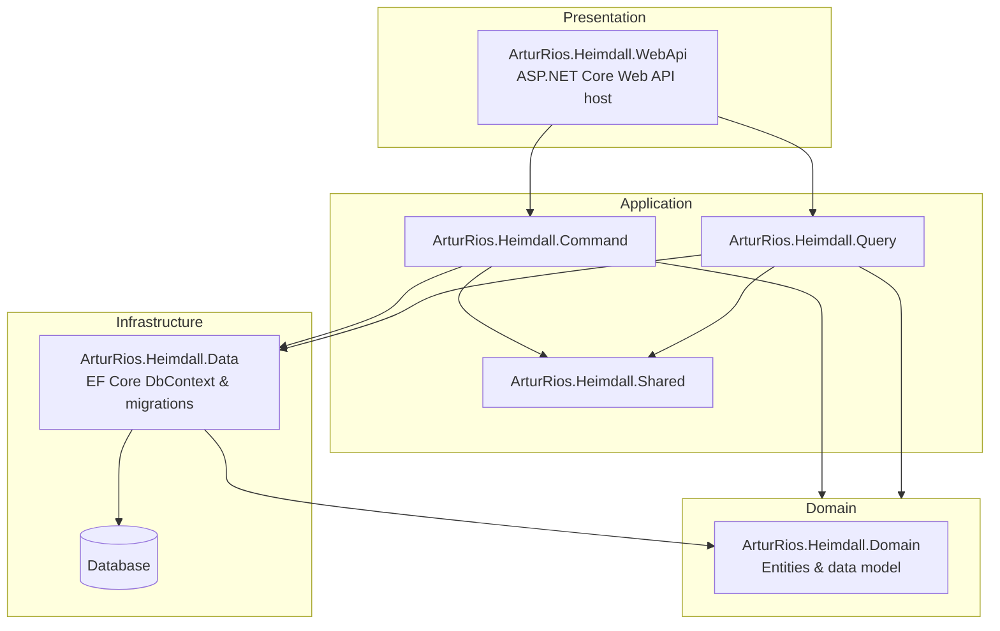
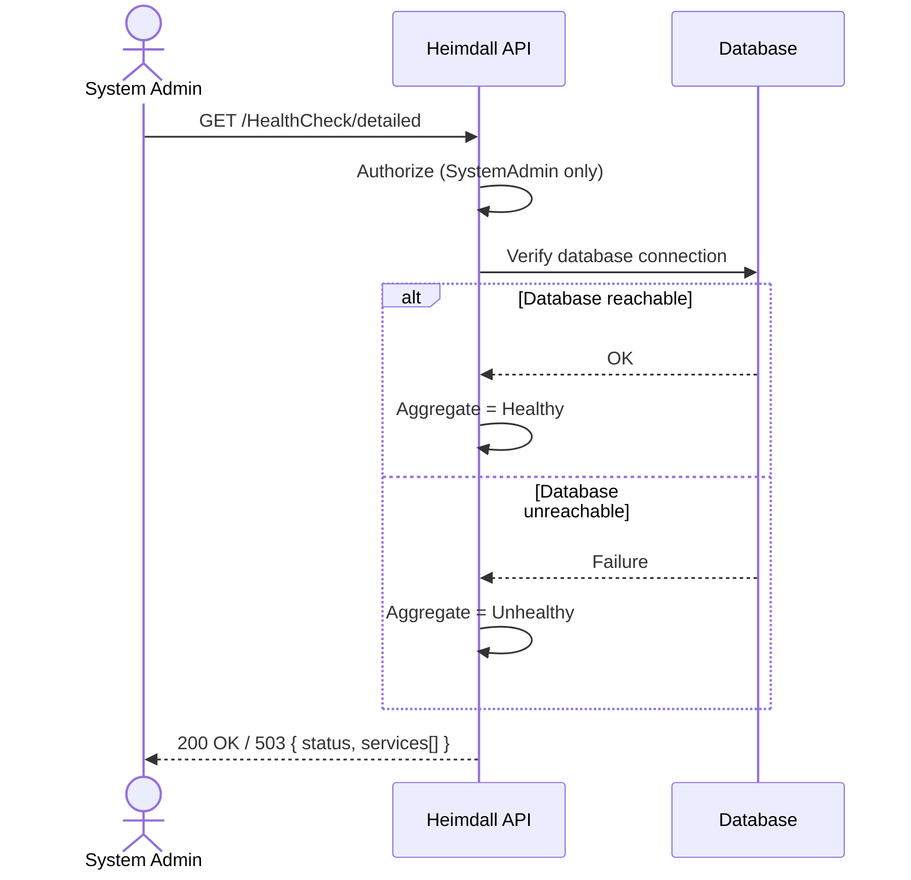

# Operations & Infrastructure Document — Heimdall API

## 1. Introduction

### 1.1 Purpose

This document captures **cross-cutting platform concerns** for the **Heimdall API** that fall outside the identity domain modeled in the [Vision Document](Vision%20Document.md), [System Requirements Document](System%20Requirements%20Document.md), and [Use Case Specification Document](Use%20Case%20Specification%20Document.md).

It covers two areas:

- The **technical foundation** — the project scaffolding, solution architecture, and initial data infrastructure the domain features are built on.
- **Health & monitoring** — the operational endpoints used to observe that the API and its dependencies are up.

These are functional/operational capabilities of the *platform* rather than the identity domain, so they are documented here to keep the domain documents focused while still tracking the work formally. The specific technologies and versions this platform is built on are defined once in the [Technology Stack Document](Technology%20Stack%20Document.md) and referenced from here rather than duplicated.

### 1.2 Related Backlog Items

| Item | GitHub Issue | Status |
| ------ | -------------- | -------- |
| Project scaffolding & initial infrastructure | [#31](https://github.com/artur-rios/heimdall-api/issues/31) | ✅ Implemented |
| Health Check feature | [#32](https://github.com/artur-rios/heimdall-api/issues/32) | ✅ Implemented |

---

## 2. Technical Foundation (Project Scaffolding & Initial Infrastructure)

> Corresponds to issue [#31](https://github.com/artur-rios/heimdall-api/issues/31). **Status: Implemented** (delivered via PR #1 — `feat/data-infrastructure` — and preceding commits).

### 2.1 Overview

The solution is a **layered (DDD-style) .NET Web API**. The foundational scaffolding establishes the project structure, the Entity Framework Core data layer with the initial migration, startup seeding, and the functional test harness that the identity use cases (UC-01 … UC-29) are implemented on top of.

### 2.2 Solution Architecture



### 2.3 Delivered Capabilities

| Area | Requirement | Status |
| ------ | ------------ | -------- |
| IR-01 | The solution shall be organized into `Domain`, `Application` (`Command` / `Query` / `Shared` — CQRS split), `Infrastructure/Data`, and `Presentation/WebApi` layers | ✅ |
| IR-02 | The data layer shall use Entity Framework Core with a design-time factory and an initial migration | ✅ |
| IR-03 | Database tables shall use `snake_case`, singular naming, with EF diagnostics gated | ✅ |
| IR-04 | Role IDs shall be pinned to the `Roles` enum values | ✅ |
| IR-05 | On startup, the system shall seed the roles and the master System Admin | ✅ |
| IR-06 | A migration menu script shall be provided under `scripts/` | ✅ |
| IR-07 | Environment configuration files shall be copied to the build output | ✅ |
| IR-08 | A functional test container shall apply migrations and assert the resulting schema | ✅ |
| IR-09 | The data infrastructure design spec and implementation plan shall be documented under `docs/` | ✅ |

### 2.4 Technology Baseline

The concrete technologies, libraries, and versions behind this foundation (.NET 10 / C# 14, the `ArturRios.*` libraries, Entity Framework Core, PostgreSQL, and the testing tools) are defined in the [Technology Stack Document](Technology%20Stack%20Document.md). This section intentionally does not restate them.

---

## 3. Health & Monitoring

> Corresponds to issue [#32](https://github.com/artur-rios/heimdall-api/issues/32). **Status: Implemented** (delivered via PR #39 — `feature/uc-30-check-api-health`). Both the public liveness endpoint and the System Admin-only detailed health check are in place.

### 3.1 Overview

The API exposes health endpoints so that operators, load balancers, orchestrators, and uptime monitors can observe whether the API process is running and whether its dependencies are healthy. Two endpoints are provided:

1. A **basic liveness ("hello world") endpoint** — a lightweight, **public** check that the API is up.
2. A **detailed health check endpoint** — a **System Admin-only** check that reports the status of each verified service plus an aggregate general status.

The detailed check is intentionally **extensible**: for now the only verified service is the database connection, but new verifications (cache, email service, external identity providers, etc.) can be added later without changing the response contract.

### 3.2 Functional Requirements

| ID | Requirement | Priority |
| ---- | ------------ | ---------- |
| FR-HC-01 | The system shall expose a **public** liveness endpoint (`GET /HealthCheck`) that confirms the API process is running and responding, requiring **no authentication** | High |
| FR-HC-02 | The system shall expose a **detailed** health check endpoint (`GET /HealthCheck/detailed`) accessible **only to System Admins** | High |
| FR-HC-03 | The detailed health check shall verify the **database connection** | High |
| FR-HC-04 | The detailed health check shall report the status of **each verified service individually** | High |
| FR-HC-05 | The detailed health check shall report an **aggregate general status** of `Healthy` when all verified services are up, or `Unhealthy` when one or more verified services are down | High |
| FR-HC-06 | The health check design shall be **extensible**, allowing new service verifications to be added without changing the response contract | Medium |
| FR-HC-07 | The detailed health check endpoint should map the aggregate status to an appropriate HTTP status (e.g., `200 OK` when `Healthy`, `503 Service Unavailable` when `Unhealthy`) | Medium |

### 3.3 Endpoints

| Method | Endpoint | Description | Auth Required |
| -------- | ---------- | ------------- | --------------- |
| GET | `/HealthCheck` | Basic liveness check — confirms the API is on ("hello world") | **No (Public)** |
| GET | `/HealthCheck/detailed` | Detailed health check — reports per-service status and an aggregate `Healthy` / `Unhealthy` general status | **SystemAdmin** |

### 3.4 Detailed Health Check — Response Contract

The detailed response reports a `status` (the aggregate general status) and a `services` array with one entry per verified service.

**All services up:**

```json
{
  "status": "Healthy",
  "services": [
    { "name": "Database", "status": "Healthy" }
  ]
}
```

**Database connection down:**

```json
{
  "status": "Unhealthy",
  "services": [
    { "name": "Database", "status": "Unhealthy" }
  ]
}
```

The aggregate `status` is `Healthy` only when **every** entry in `services` is healthy; if **any** service is unhealthy, the aggregate is `Unhealthy` (FR-HC-05). Adding a new verification (FR-HC-06) simply appends another entry to `services` and participates in the same aggregation rule.

### 3.5 Use Case — UC-30: Check API Health

| Field | Value |
| ------- | ------- |
| **ID** | UC-30 |
| **Name** | Check API Health |
| **Actors** | Anonymous / Monitoring System (liveness), System Admin (detailed) |
| **Description** | Observe whether the API is running (liveness) and whether its dependencies are healthy (detailed) |
| **Preconditions** | For the detailed check, the actor is authenticated with the `SystemAdmin` role. The liveness check has no preconditions |
| **Postconditions** | Health information is returned; no system state is modified |

**Main Flow (liveness):**

1. A caller (monitor, load balancer, or anonymous user) sends `GET /HealthCheck`.
2. The system returns a success response indicating the API is on. No authentication is required.

**Main Flow (detailed):**



1. A System Admin sends `GET /HealthCheck/detailed`.
2. The system authorizes the request; only System Admins may proceed.
3. The system verifies each registered service (currently: the database connection).
4. The system computes the aggregate general status (`Healthy` if all up, `Unhealthy` otherwise).
5. The system returns the per-service statuses and the aggregate status.

**Alternative Flows:**

| ID | Condition | Outcome |
| ---- | ----------- | --------- |
| AF-30a | Detailed check requested by a caller who is not a System Admin | `403 Forbidden` |
| AF-30b | Detailed check requested with no/invalid authentication | `401 Unauthorized` |
| AF-30c | One or more verified services are down | `200 OK` (or `503`, per FR-HC-07) with `status = Unhealthy` and the failing service(s) marked |

### 3.6 Authorization

| Action | SystemAdmin | ScopeAdmin | User | Anonymous |
| -------- | :-----------: | :----------: | :----: | :---------: |
| Basic liveness (`GET /HealthCheck`) | ✅ | ✅ | ✅ | ✅ |
| Detailed health check (`GET /HealthCheck/detailed`) | ✅ | ❌ | ❌ | ❌ |

### 3.7 Extensibility

The detailed health check is designed so that additional service verifications can be registered over time. Each new verification contributes one entry to the `services` array and is folded into the same aggregate rule (any unhealthy service ⇒ `Unhealthy`). Candidate future checks include the email delivery service, caching layer, and the Google Identity Platform integration. Adding them requires no change to the response contract or to consumers that already read `status` + `services`.

---

## 4. Traceability

| Capability | Requirements | Use Case | Issue |
| ------------ | ------------- | ---------- | ------- |
| Project scaffolding & initial infrastructure | IR-01 … IR-09 | — | [#31](https://github.com/artur-rios/heimdall-api/issues/31) |
| Health & monitoring | FR-HC-01 … FR-HC-07 | UC-30 | [#32](https://github.com/artur-rios/heimdall-api/issues/32) |
