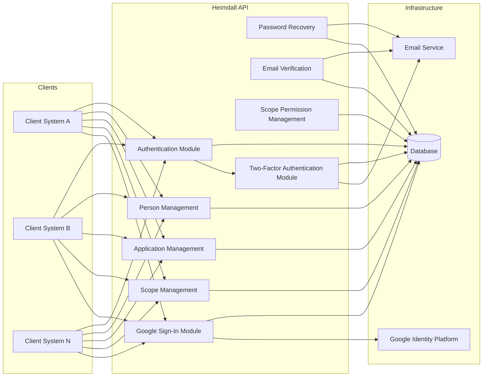
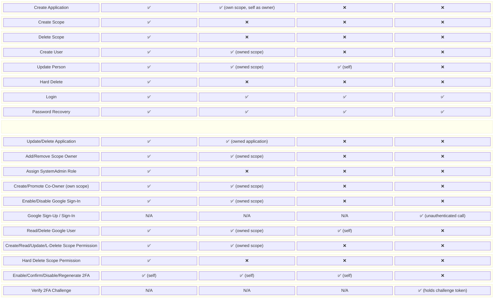
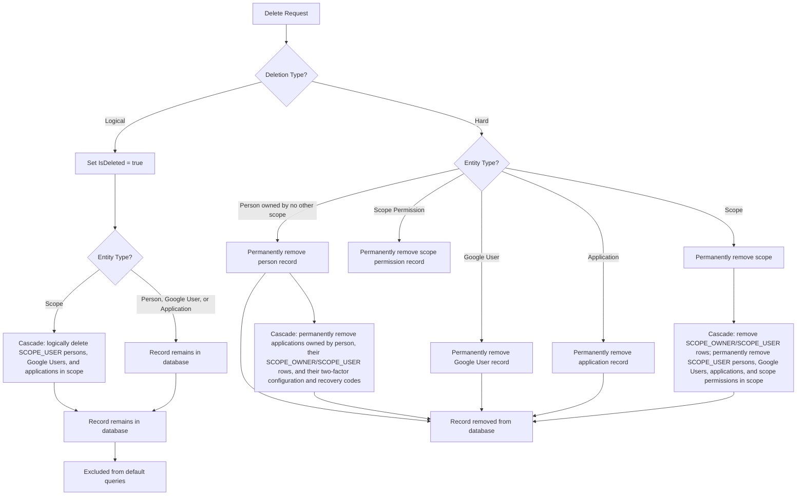

# System Requirements Document — Heimdall API

## 1. Introduction

### 1.1 Purpose

This document specifies the functional and non-functional requirements for the **Heimdall API**, a .NET Web API that provides centralized person management, application management, authentication, and authorization for multiple client systems through scope-based tenancy.

The concrete technology stack — framework and language versions, first-party libraries, database, data-access, and tooling — is defined in the [Technology Stack Document](Technology%20Stack%20Document.md). This document states requirements and refers to that one for specific technologies and versions rather than restating them.

### 1.2 Scope

The system encompasses person CRUD, application CRUD, scope CRUD, scope-specific permission CRUD (permissions that may be folded into the JWT at issue), role-based access control, authentication (including Google Sign-In and optional two-factor authentication), password recovery, email verification, and both logical and hard deletion strategies.

### 1.3 Definitions

| Term | Definition |
| ------ | ----------- |
| Person | A registered identity containing id, name, email, role, and deletion status. Has no direct scope attribute — its relationship to scopes depends on its role |
| Application | A registered non-human identity representing another system, containing id, name, and deletion status, associated with exactly one scope and owned by exactly one `ScopeAdmin` person who owns that scope |
| Scope | A logical boundary that groups owners, persons, and applications belonging to a specific client system |
| Scope Owner | A Person with the `ScopeAdmin` role who owns a scope; a scope may have one or more owners, and a Scope Admin may own one or more scopes (many-to-many relationship) |
| Scope User | A Person with the `User` role who belongs to exactly one scope (many-to-one relationship) |
| Scope Permission | A scope-specific permission associated with exactly one scope, carrying a `Name`, an optional `Description`, and an `IncludeAsJwtClaim` flag. When the flag is set the permission's `Name` is added as a claim on the JWT issued to identities acting within that scope. A scope permission has no separate owner of its own — owning the scope is the whole of the authorization to manage it |
| Google User | A registered identity authenticated via Google Sign-In rather than a password, stored in its own `GOOGLE_USER` table, belonging to exactly one scope, and always equivalent to the `User` role | 
| Two-Factor Authentication (2FA) | An opt-in second authentication step for a `Person` (`User`, `ScopeAdmin`, or `SystemAdmin`; not available to Google Users, who are already subject to Google's own account security). Configured with an authenticator-app method, an email method, or both, and backed by a set of single-use recovery codes | 
| TOTP Secret | A randomly generated shared secret used to compute time-based one-time codes (RFC 6238) for the authenticator-app 2FA method; stored encrypted at rest and never re-exposed once provisioning is confirmed |
| Recovery Code | One of ten single-use codes issued when 2FA is confirmed (or regenerated); stored hashed, shown to the person exactly once, and consumable in place of a normal second-factor code to complete a login |
| Challenge Token | A short-lived, narrowly-scoped token issued in place of a full authentication token when login succeeds for a person with active 2FA; valid only against the second-factor verification endpoint and rejected everywhere else |
| Logical Deletion | Setting the `IsDeleted` flag to `true` without removing the record |
| Hard Deletion | Permanently removing the record from the database |
| Role | A named permission level (`User`, `ScopeAdmin`, or `SystemAdmin`) stored in the `Role` table and referenced by a person via `RoleId` |
| Salt | A randomly generated byte array combined with a person's password prior to hashing, stored alongside the password hash |
| Google ID Token | A signed JSON Web Token issued by Google after a successful Google sign-in, containing identity claims (`sub`, `email`, `email_verified`, `name`, `picture`) that the API verifies and uses to provision or authenticate a Google User |
| Internal Id | An auto-incrementing `bigint` primary key, generated by the database, used only for storage and foreign keys. Never returned in API responses, accepted in API paths, or embedded in tokens |
| Public Id | A GUID generated when a top-level entity (`Scope`, `Role`, `Person`, `Application`, `Google User`, `Scope Permission`) is created, used as its externally-facing identifier everywhere outside the database — API paths, response bodies, and authentication token claims |

---

## 2. System Overview

---

## 3. Functional Requirements

### 3.1 Scope Management

| ID | Requirement | Priority |
| ---- | ------------ | ---------- |
| FR-SC-01 | The system shall allow System Admins to **create** a new scope with a unique name and at least one initial owner (a person with the `ScopeAdmin` role) | High |
| FR-SC-02 | The system shall allow authorized users to **read** scope details by ID: a System Admin any scope, a Scope Admin the scopes they own, a User the scope they belong to | High |
| FR-SC-03 | The system shall allow System Admins to **list** all scopes, with pagination and an optional case-insensitive name filter. The collection endpoint is not exposed to other roles, which reach their own scopes through FR-SC-02 | High |
| FR-SC-04 | The system shall allow System Admins to **update** scope information | High |
| FR-SC-05 | The system shall allow System Admins to **logically delete** a scope by setting `IsDeleted = true` | High |
| FR-SC-06 | The system shall allow System Admins to **hard delete** a scope, permanently removing it and its associated users and applications | High |
| FR-SC-07 | Logically deleted scopes shall not appear in default query results unless explicitly requested | Medium |
| FR-SC-08 | A scope shall be able to have **one or more owners**, each of which must be a person with the `ScopeAdmin` role | High |
| FR-SC-09 | The system shall allow System Admins and existing owners of a scope to **add** an existing Scope Admin as an additional owner of that scope | High |
| FR-SC-10 | The system shall allow System Admins and existing owners of a scope to **remove** an owner from a scope, provided at least one owner remains | High |
| FR-SC-11 | A scope shall be able to contain **one or more Persons** with the `User` role | High |
| FR-SC-12 | The system shall allow System Admins and existing owners of a scope to add a new co-owner by **creating a brand-new `ScopeAdmin` person**, directly made an owner of that scope | High |
| FR-SC-13 | The system shall allow System Admins and existing owners of a scope to add a new co-owner by **promoting an existing `User` of that scope** to `ScopeAdmin`, making them a co-owner and removing their `User` scope membership | High |

### 3.2 Person Management

| ID | Requirement | Priority |
| ---- | ------------ | ---------- |
| FR-PE-01 | The system shall allow creation of a person with: `Id`, `Name`, `Email`, `PasswordHash`, `Salt`, `RoleId`, `IsDeleted`. A person has no direct `ScopeId` attribute | High |
| FR-PE-02 | A person with the `User` role must be associated with exactly **one** scope, via scope membership, at creation time | High |
| FR-PE-03 | The system shall allow reading a person's details by ID | High |
| FR-PE-04 | The system shall allow listing persons (Users) within a scope, and listing owners (Scope Admins) of a scope, with pagination and optional case-insensitive name and email filters | High |
| FR-PE-05 | The system shall allow updating person information (name, email, role) | High |
| FR-PE-06 | The system shall allow **logical deletion** of a person by setting `IsDeleted = true` | High |
| FR-PE-07 | The system shall allow **hard deletion** of a person, permanently removing the record | High |
| FR-PE-08 | Logically deleted persons shall not appear in default query results unless explicitly requested | Medium |
| FR-PE-09 | A `User` person's email must be unique among the `User`s of their scope; a `ScopeAdmin` or `SystemAdmin` person's email must be unique among all `ScopeAdmin` and `SystemAdmin` persons system-wide. The two namespaces are independent: an admin address and a scoped `User` address never collide with each other, because login resolves them by different lookups (FR-AU-01/02). Comparison is case-insensitive | High |
| FR-PE-10 | A person with the `SystemAdmin` role must not be associated with any scope, either as an owner or as a user | High |
| FR-PE-11 | A person with the `ScopeAdmin` role must own **at least one** scope, and must not belong to any scope as a `User`. This is an invariant the scope-assignment operations maintain (UC-01, UC-06 path c, UC-21, UC-23); removing the scope itself (UC-05) or the last ownership row (UC-22) can still leave a `ScopeAdmin` owning none — see §8 | High |

### 3.3 Role Assignment

| ID | Requirement | Priority |
| ---- | ------------ | ---------- |
| FR-RO-01 | Every person must reference exactly one role via `RoleId`, pointing to a row in the `Role` table (`User`, `ScopeAdmin`, or `SystemAdmin`) | High |
| FR-RO-02 | Only System Admins shall be able to assign or change a person's role to `SystemAdmin` | High |
| FR-RO-03 | System Admins may assign or change a person's role to `ScopeAdmin` for any scope. Scope Admins (owners) may also grant the `ScopeAdmin` role, but only as a co-owner of a scope they themselves own — either by creating a new `ScopeAdmin` person (FR-SC-12) or by promoting an existing `User` of that scope (FR-SC-13) | High |
| FR-RO-04 | The system shall store passwords as a `PasswordHash` byte array together with a `Salt` byte array used to compute the hash | High |
| FR-RO-05 | Scope Admins (owners of a scope) shall be able to assign the `User` role to persons within that scope | High |
| FR-RO-06 | System Admins have all permissions across the entire system and are exempt from scope-based authorization checks | High |

### 3.4 Authentication

| ID | Requirement | Priority |
| ---- | ------------ | ---------- |
| FR-AU-01 | The system shall authenticate a `User` using email, password, and scope ID (email is only unique within a scope for Users) | High |
| FR-AU-02 | The system shall authenticate a `ScopeAdmin` or `SystemAdmin` using email and password only, without a scope ID (email is unique system-wide for these roles) | High |
| FR-AU-03 | Upon successful authentication, the system shall return an authentication token (e.g., JWT) | High |
| FR-AU-04 | The authentication token shall contain the person's `PublicId` and role, plus: the scope's `PublicId` for a `User`; the list of owned scopes' `PublicId`s for a `ScopeAdmin`; no scope claim for a `SystemAdmin`. Internal `bigint` Ids are never placed in a token | High |
| FR-AU-05 | The system shall reject authentication attempts for logically deleted persons | High |
| FR-AU-06 | The system shall reject authentication attempts for a `User` whose scope is logically deleted | High |
| FR-AU-07 | The system shall reject authentication attempts for a `ScopeAdmin` if all scopes they own are logically deleted | High |
| FR-AU-08 | Upon successful authentication, the system shall fold into the token the distinct `Name`s of the non-logically-deleted `ScopePermission`s of the acting scope(s) whose `IncludeAsJwtClaim` flag is set: the scope a `User` belongs to for a `User`; the union over the scopes a `ScopeAdmin` owns for a `ScopeAdmin`; none for a `SystemAdmin`, who carries no scope. Logically deleted scopes and permissions are excluded, so a deleted resource is never claimed | Medium |
| FR-AU-09 | The system shall count consecutive failed password attempts per person and, on reaching ten, refuse authentication for that person for fifteen minutes regardless of the password supplied. A successful authentication shall reset the count. The refusal shall be indistinguishable from any other authentication failure — the same message as FR-AU-05 through FR-AU-07, and the same cost, so a lockout is not detectable by response time | High |
| FR-AU-10 | The system shall verify a submitted password against a hash on every authentication attempt, including one for an address that belongs to nobody, so that the uniform rejection of FR-AU-05 through FR-AU-07 and FR-AU-09 is uniform in elapsed time as well as in message | High |

### 3.5 Password Recovery

| ID | Requirement | Priority |
| ---- | ------------ | ---------- |
| FR-PR-01 | The system shall allow a person to request a password reset by providing their email | High |
| FR-PR-02 | The system shall generate a time-limited password reset token and send it via email | High |
| FR-PR-03 | The system shall allow the person to set a new password using a valid reset token | High |
| FR-PR-04 | Expired or already-used reset tokens shall be rejected | High |

### 3.6 Email Verification

| ID | Requirement | Priority |
| ---- | ------------ | ---------- |
| FR-EV-01 | Upon person creation, the system shall send a verification email to the person's email address | High |
| FR-EV-02 | The verification email shall contain a time-limited verification token | High |
| FR-EV-03 | The system shall mark the person's email as verified upon receiving a valid verification token | High |
| FR-EV-04 | The system shall allow re-sending the verification email | Medium |
| FR-EV-05 | On successful authentication, the system shall report whether the authenticated person's email address is verified | Medium |

### 3.7 Application Management

| ID | Requirement | Priority |
| ---- | ------------ | ---------- |
| FR-AP-01 | The system shall allow creation of an application with: `Id`, `Name`, `ScopeId`, `OwnerId`, `IsDeleted` | High |
| FR-AP-02 | Every application must be associated with exactly **one** scope at creation time | High |
| FR-AP-03 | Every application must have exactly **one** owner, which must be an existing, non-logically-deleted `ScopeAdmin` person who owns the application's scope. A `User` may never own an application | High |
| FR-AP-04 | The system shall allow reading an application's details by ID | High |
| FR-AP-05 | The system shall allow listing applications within a scope (with pagination and filtering) | High |
| FR-AP-06 | The system shall allow updating an application's name and owner | High |
| FR-AP-07 | The system shall allow **logical deletion** of an application by setting `IsDeleted = true` | High |
| FR-AP-08 | The system shall allow **hard deletion** of an application, permanently removing the record | High |
| FR-AP-09 | Logically deleted applications shall not appear in default query results unless explicitly requested | Medium |

### 3.8 Google Sign-In

| ID | Requirement | Priority |
| ---- | ------------ | ---------- |
| FR-GO-01 | A scope shall have a boolean `GoogleSignInEnabled` flag, default `false`, controlling whether Google sign-up/sign-in is available for that scope | High |
| FR-GO-02 | Only System Admins and existing owners of a scope shall be able to enable or disable `GoogleSignInEnabled` for that scope | High |
| FR-GO-03 | The system shall allow Google sign-up/sign-in only for scopes where `GoogleSignInEnabled = true` | High |
| FR-GO-04 | Only accounts equivalent to the `User` role may sign up or sign in via Google; Google authentication shall never create or authenticate a `ScopeAdmin` or `SystemAdmin` | High |
| FR-GO-05 | The system shall register a Google User with: `Id`, `GoogleId`, `Name`, `Email`, `EmailVerified`, `ProfilePictureUrl`, `IsDeleted`, `ScopeId` | High |
| FR-GO-06 | A Google User must be associated with exactly **one** scope, matching the scope in which the sign-up/sign-in was initiated | High |
| FR-GO-07 | A Google User's `Email` must be unique within its scope, considered jointly with the emails of `User` persons in that same scope (see FR-PE-09) | High |
| FR-GO-08 | A Google User's `GoogleId` (Google's `sub` claim) must be unique within its scope | High |
| FR-GO-09 | On first sign-in with a given Google account for a scope with Google sign-in enabled, the system shall create (sign up) a new Google User record populated from the verified Google ID token claims | High |
| FR-GO-10 | On subsequent sign-ins with the same Google account and scope, the system shall authenticate the existing Google User by `GoogleId`, without creating a duplicate record | High |
| FR-GO-11 | The system shall verify the Google ID token's signature, issuer, audience, and expiration before trusting its claims | High |
| FR-GO-12 | The system shall reject Google sign-in attempts for logically deleted Google Users | High |
| FR-GO-13 | The system shall reject Google sign-in attempts for a scope that is logically deleted or has `GoogleSignInEnabled = false` | High |
| FR-GO-14 | The system shall allow reading a Google User's details by ID, and listing Google Users within a scope (with pagination and filtering) | High |
| FR-GO-15 | The system shall allow **logical deletion** of a Google User by setting `IsDeleted = true` | High |
| FR-GO-16 | The system shall allow **hard deletion** of a Google User, permanently removing the record | High |
| FR-GO-17 | Logically deleted Google Users shall not appear in default query results unless explicitly requested | Medium |
| FR-GO-18 | The system shall allow a signed-in Google User to sign out, invalidating/discarding their authentication token | High |
| FR-GO-19 | On each sign-in with an existing Google User, the system shall refresh the stored `EmailVerified` from the verified Google ID token claims; when the token carries no `email_verified` claim, the stored value shall be left unchanged | Medium |

### 3.9 Scope Permission Management

| ID | Requirement | Priority |
| ---- | ------------ | ---------- |
| FR-SP-01 | The system shall allow creation of a scope permission with: `Id`, `PublicId`, `Name`, `Description` (optional), `IncludeAsJwtClaim`, `ScopeId`, `IsDeleted` | High |
| FR-SP-02 | Every scope permission must be associated with exactly **one** scope at creation time, and only System Admins and owners of that scope may create it. A scope permission has no separate owner of its own — owning the scope is the whole of the authorization | High |
| FR-SP-03 | A scope permission shall carry an `IncludeAsJwtClaim` boolean flag (default `false`) controlling whether its `Name` is added as a claim on the JWT issued to identities acting within the owning scope (see FR-AU-08) | High |
| FR-SP-04 | The system shall allow reading a scope permission's details by ID within its scope: a System Admin sees any permission, a Scope Admin only one whose scope they own | High |
| FR-SP-05 | The system shall allow listing the permissions of a scope, with pagination and an optional case-insensitive name filter. A System Admin sees every permission in the scope; a Scope Admin who owns the scope sees every permission in it — there is no per-owner narrowing, since a scope permission has no owner of its own | High |
| FR-SP-06 | The system shall allow updating a scope permission's `Name`, `Description`, and `IncludeAsJwtClaim` flag | High |
| FR-SP-07 | The system shall allow **logical deletion** of a scope permission by setting `IsDeleted = true`. Nothing cascades: a scope permission owns no dependent row | High |
| FR-SP-08 | The system shall allow **hard deletion** of a scope permission, permanently removing the record. Restricted to System Admins; nothing cascades | High |
| FR-SP-09 | Logically deleted scope permissions shall not appear in default query results unless explicitly requested | Medium |

### 3.10 Two-Factor Authentication

| ID | Requirement | Priority |
| ---- | ------------ | ---------- |
| FR-2F-01 | The system shall allow an authenticated `User`, `ScopeAdmin`, or `SystemAdmin` to opt in to two-factor authentication by initiating setup with an authenticator-app method, an email method, or both. Google Users are not eligible — Google already governs their account security | High |
| FR-2F-02 | The authenticator-app method shall use standard TOTP (RFC 6238): a per-person secret, 6-digit codes, 30-second time step, provisioned via an `otpauth://` URI for QR scanning. The secret is stored encrypted at rest and is shown to the person only at initiation | High |
| FR-2F-03 | The email method shall deliver a random 6-digit numeric code through the existing email service (see FR-PR-02, FR-EV-02 for the established pattern), single-use and expiring 10 minutes after issue | High |
| FR-2F-04 | Setup initiated under FR-2F-01 shall remain inactive until confirmed: the caller must submit a currently valid code for **every** method they selected (both, if both were selected) in one confirmation request | High |
| FR-2F-05 | Confirming setup shall generate exactly ten recovery codes, returned in the confirmation response in plaintext exactly once, and stored thereafter only as hashes | High |
| FR-2F-06 | Each recovery code shall be usable at most once. Consuming a recovery code to complete a login marks it used; a used or unknown recovery code shall be rejected | High |
| FR-2F-07 | When a person with active two-factor authentication completes FR-AU-01/FR-AU-02's password check, the system shall not issue a full authentication token. Instead it shall issue a short-lived challenge token, scoped only to the second-factor verification endpoint, naming the methods available to that person | High |
| FR-2F-08 | If the email method is enabled for the person, issuing a challenge token shall also send a fresh email code, per FR-2F-03 | High |
| FR-2F-09 | The second-factor verification endpoint shall accept a valid, unexpired challenge token together with either a current app/email code or an unused recovery code, and on success issue the full authentication token exactly as FR-AU-03/FR-AU-04 describe | High |
| FR-2F-10 | The system shall reject a challenge token at every endpoint other than second-factor verification, and shall reject an expired or already-redeemed challenge token at that endpoint too | High |
| FR-2F-11 | Disabling two-factor authentication shall require both the person's current password and a valid second factor (an app/email code or a recovery code). On success the system shall remove the two-factor configuration and all of its recovery codes | High |
| FR-2F-12 | Regenerating recovery codes shall require a valid second factor, shall invalidate every previously issued recovery code for the person, and shall return ten new codes in plaintext exactly once, per FR-2F-05 | High |
| FR-2F-13 | The system shall count failed verification attempts against an issued email code and retire the code on the fifth, so a six-digit code cannot be exhausted by guessing. Obtaining a further code shall require a fresh authentication attempt | High |
| FR-2F-14 | The system shall accept an authenticator-app code at most once: the time step of an accepted code shall be recorded, and a code from that step or any earlier one shall be refused, so a code observed in transit cannot be replayed within the verification window | High |

---

## 4. Data Model

### 4.0 Identifier Strategy

Every top-level entity (`Scope`, `Role`, `Person`, `Application`, `Google User`, `Scope Permission`) has two identifiers:

- **`Id`** — an auto-incrementing `bigint`, the physical primary key used for storage and all foreign keys (`ScopeId`, `RoleId`, `OwnerId`, `PersonId`, and the columns of `SCOPE_OWNER`/`SCOPE_USER`). Never exposed outside the database.
- **`PublicId`** — a GUID generated at creation time, used as the entity's identifier everywhere it is addressed from outside the database: API path segments (e.g. `/api/scopes/{id}`), response bodies, and authentication token claims (e.g. the `personId`/`scopeId` claims in FR-AU-04).

`PASSWORD_RESET_TOKEN` and `EMAIL_VERIFICATION_TOKEN` use only an internal `bigint Id` — they are never addressed by ID at all; the caller-facing reference is the random `Token` string already required by FR-PR-02/FR-EV-02. `SCOPE_OWNER` and `SCOPE_USER` are join rows, not independently addressable resources, so they carry no `PublicId` either — their `ScopeId`/`PersonId` columns are internal `bigint` foreign keys. `TWO_FACTOR_AUTH` and `TWO_FACTOR_RECOVERY_CODE` follow the same no-`PublicId` pattern as the token tables: a person's two-factor configuration is reached implicitly through their own authenticated identity, never by ID in a path.

This split keeps sequential record counts and creation order — which a raw auto-increment `Id` would reveal — out of anything a caller can see, while still giving the database compact integer keys for joins and indexes.

### 4.1 Entity Relationship Diagram

```mermaid
erDiagram
    SCOPE ||--o{ APPLICATION : "contains"
    ROLE ||--o{ PERSON : "classifies"
    PERSON ||--o{ APPLICATION : "owns"
    SCOPE ||--o{ SCOPE_OWNER : "has"
    PERSON ||--o{ SCOPE_OWNER : "owns"
    SCOPE ||--o{ SCOPE_USER : "has"
    PERSON ||--o| SCOPE_USER : "belongs to"
    SCOPE ||--o{ GOOGLE_USER : "contains"
    SCOPE ||--o{ SCOPE_PERMISSION : "defines"
    PERSON ||--o| TWO_FACTOR_AUTH : "configures"
    TWO_FACTOR_AUTH ||--o{ TWO_FACTOR_RECOVERY_CODE : "issues"

    SCOPE {
        bigint Id PK "Internal auto-increment identifier"
        guid PublicId "External identifier, used in API paths/responses"
        string Name "Scope display name"
        string Description "Optional description"
        bool IsDeleted "Logical deletion flag"
        bool GoogleSignInEnabled "Whether Google sign-up/sign-in is enabled for this scope"
        datetime CreatedAt "Creation timestamp"
        datetime UpdatedAt "Last update timestamp"
    }

    GOOGLE_USER {
        bigint Id PK "Internal auto-increment identifier"
        guid PublicId "External identifier, used in API paths/responses"
        string GoogleId "Google's stable 'sub' claim, unique within the scope"
        string Name "Full name, from Google's 'name' claim"
        string Email "Email address, from Google's 'email' claim (unique per scope, jointly with User persons)"
        bool EmailVerified "From Google's 'email_verified' claim"
        string ProfilePictureUrl "From Google's 'picture' claim, optional"
        bool IsDeleted "Logical deletion flag"
        bigint ScopeId FK "Associated scope (internal Id)"
        datetime CreatedAt "Creation timestamp"
        datetime UpdatedAt "Last update timestamp"
    }

    ROLE {
        bigint Id PK "Internal auto-increment identifier"
        guid PublicId "External identifier, used in API paths/responses"
        string Name "Role name: User | ScopeAdmin | SystemAdmin"
        string Description "Optional explanation of the role's purpose and permissions"
    }

    PERSON {
        bigint Id PK "Internal auto-increment identifier"
        guid PublicId "External identifier, used in API paths/responses and token claims"
        string Name "Full name"
        string Email "Email address (unique among a scope's Users; unique among Admins system-wide)"
        bytes PasswordHash "Hashed password, stored as a byte array"
        bytes Salt "Random salt used to hash the password, stored as a byte array"
        bool IsDeleted "Logical deletion flag"
        bool EmailVerified "Email verification status"
        bigint RoleId FK "Associated role (internal Id)"
        datetime CreatedAt "Creation timestamp"
        datetime UpdatedAt "Last update timestamp"
    }

    SCOPE_OWNER {
        bigint ScopeId FK "Owned scope (internal Id)"
        bigint PersonId FK "Owning person (internal Id), must have the ScopeAdmin role"
    }

    SCOPE_USER {
        bigint ScopeId FK "Scope the person belongs to (internal Id)"
        bigint PersonId FK "Person (internal Id), must have the User role, unique across this table"
    }

    PASSWORD_RESET_TOKEN {
        bigint Id PK "Internal auto-increment identifier, never exposed"
        bigint PersonId FK "Associated person (internal Id)"
        string Token "Reset token value — the caller-facing reference"
        datetime ExpiresAt "Expiration timestamp"
        bool Used "Whether the token has been consumed"
    }

    EMAIL_VERIFICATION_TOKEN {
        bigint Id PK "Internal auto-increment identifier, never exposed"
        bigint PersonId FK "Associated person (internal Id)"
        string Token "Verification token value — the caller-facing reference"
        datetime ExpiresAt "Expiration timestamp"
        bool Used "Whether the token has been consumed"
    }

    APPLICATION {
        bigint Id PK "Internal auto-increment identifier"
        guid PublicId "External identifier, used in API paths/responses"
        string Name "Application display name"
        bool IsDeleted "Logical deletion flag"
        bigint ScopeId FK "Associated scope (internal Id)"
        bigint OwnerId FK "Owning person (internal Id)"
        datetime CreatedAt "Creation timestamp"
        datetime UpdatedAt "Last update timestamp"
    }

    SCOPE_PERMISSION {
        bigint Id PK "Internal auto-increment identifier"
        guid PublicId "External identifier, used in API paths/responses"
        string Name "Permission display name, max 200 characters"
        string Description "Optional description, max 500 characters"
        bool IncludeAsJwtClaim "When true, the Name is added as a JWT claim at issue"
        bool IsDeleted "Logical deletion flag"
        bigint ScopeId FK "Associated scope (internal Id)"
        datetime CreatedAt "Creation timestamp"
        datetime UpdatedAt "Last update timestamp"
    }

    PERSON ||--o{ PASSWORD_RESET_TOKEN : "requests"
    PERSON ||--o{ EMAIL_VERIFICATION_TOKEN : "receives"

    TWO_FACTOR_AUTH {
        bigint Id PK "Internal auto-increment identifier, never exposed"
        bigint PersonId FK "Owning person (internal Id), unique — one configuration per person"
        bool AppEnabled "Whether the authenticator-app method is configured"
        bool EmailEnabled "Whether the email method is configured"
        bytes TotpSecretEncrypted "Encrypted TOTP secret, present only when AppEnabled"
        bool IsActive "True once every selected method has been confirmed (FR-2F-04)"
        datetime CreatedAt "Creation timestamp"
        datetime UpdatedAt "Last update timestamp"
    }

    TWO_FACTOR_RECOVERY_CODE {
        bigint Id PK "Internal auto-increment identifier, never exposed"
        bigint TwoFactorAuthId FK "Owning two-factor configuration (internal Id)"
        bytes CodeHash "Hashed recovery code — the plaintext is never stored"
        bool Used "Whether the code has been consumed"
        datetime UsedAt "Timestamp the code was consumed, null until then"
        datetime CreatedAt "Creation timestamp"
    }
```

### 4.2 Person Fields

| Field | Type | Constraints |
| ------- | ------ | ------------- |
| Id | BigInt | Primary key, auto-increment, internal only |
| PublicId | GUID | Required, unique, auto-generated on creation; external identifier |
| Name | String | Required, max 200 characters |
| Email | String | Required, valid email format. Unique among the `User`s of the same scope (via `SCOPE_USER`); unique among all `ScopeAdmin`/`SystemAdmin` persons system-wide. See FR-PE-09 — the two namespaces are independent |
| PasswordHash | Byte array | Required, stores the hash computed from the password and `Salt` |
| Salt | Byte array | Required, randomly generated per person, used to hash the password |
| IsDeleted | Boolean | Default: `false` |
| EmailVerified | Boolean | Default: `false` |
| RoleId | BigInt | Foreign key to Role.Id (internal), required |
| CreatedAt | DateTime | Auto-set on creation |
| UpdatedAt | DateTime | Auto-set on update |

A person has no `ScopeId` column. Its relationship to scopes is derived from its role:

- `User`: exactly one row in `SCOPE_USER`.
- `ScopeAdmin`: one or more rows in `SCOPE_OWNER`.
- `SystemAdmin`: no rows in either `SCOPE_OWNER` or `SCOPE_USER`.

### 4.3 Role Fields

| Field | Type | Constraints |
| ------- | ------ | ------------- |
| Id | BigInt | Primary key, auto-increment, internal only |
| PublicId | GUID | Required, unique, auto-generated on creation; external identifier |
| Name | String | Required, unique — `User`, `ScopeAdmin`, or `SystemAdmin` |
| Description | String | Optional, human-readable explanation of the role's purpose and permissions |

### 4.4 Application Fields

| Field | Type | Constraints |
| ------- | ------ | ------------- |
| Id | BigInt | Primary key, auto-increment, internal only |
| PublicId | GUID | Required, unique, auto-generated on creation; external identifier |
| Name | String | Required, max 200 characters |
| IsDeleted | Boolean | Default: `false` |
| ScopeId | BigInt | Foreign key to Scope.Id (internal), required |
| OwnerId | BigInt | Foreign key to Person.Id (internal), required |
| CreatedAt | DateTime | Auto-set on creation |
| UpdatedAt | DateTime | Auto-set on update |

### 4.5 Scope Owner Fields

| Field | Type | Constraints |
| ------- | ------ | ------------- |
| ScopeId | BigInt | Foreign key to Scope.Id (internal), part of composite primary key |
| PersonId | BigInt | Foreign key to Person.Id (internal), part of composite primary key; the referenced person must have the `ScopeAdmin` role |

A scope may have many rows (one or more owners); a person may have many rows (a Scope Admin may own several scopes). Composite key `(ScopeId, PersonId)` must be unique. This join table has no `PublicId` — it is not an independently addressable API resource.

### 4.6 Scope User Fields

| Field | Type | Constraints |
| ------- | ------ | ------------- |
| ScopeId | BigInt | Foreign key to Scope.Id (internal), required |
| PersonId | BigInt | Foreign key to Person.Id (internal), required and unique; the referenced person must have the `User` role |

`PersonId` is unique across this table, enforcing that a `User` belongs to exactly one scope. A scope may have many rows (one or more users). This join table has no `PublicId`.

### 4.7 Google User Fields

| Field | Type | Constraints |
| ------- | ------ | ------------- |
| Id | BigInt | Primary key, auto-increment, internal only |
| PublicId | GUID | Required, unique, auto-generated on creation; external identifier |
| GoogleId | String | Required, from Google's `sub` claim; unique within the scope |
| Name | String | From Google's `name` claim, max 200 characters |
| Email | String | Required, from Google's `email` claim; unique within the scope, considered jointly with `User` persons' emails in that scope |
| EmailVerified | Boolean | From Google's `email_verified` claim |
| ProfilePictureUrl | String | Optional, from Google's `picture` claim |
| IsDeleted | Boolean | Default: `false` |
| ScopeId | BigInt | Foreign key to Scope.Id (internal), required |
| CreatedAt | DateTime | Auto-set on creation |
| UpdatedAt | DateTime | Auto-set on update |

`GOOGLE_USER` is a separate table from `PERSON`. Unlike `PERSON`, it has a direct `ScopeId` column rather than going through `SCOPE_USER`, because a Google User always represents the `User` role and single-scope membership — it never needs the ownership/multi-scope semantics that `SCOPE_OWNER` exists for. It has no `PasswordHash`, `Salt`, or `RoleId`: authentication is delegated to Google, and the role is implicitly `User`.

### 4.8 Scope Permission Fields

| Field | Type | Constraints |
| ------- | ------ | ------------- |
| Id | BigInt | Primary key, auto-increment, internal only |
| PublicId | GUID | Required, unique, auto-generated on creation; external identifier |
| Name | String | Required, max 200 characters |
| Description | String | Optional, max 500 characters |
| IncludeAsJwtClaim | Boolean | Default: `false`; controls whether `Name` is added as a JWT claim at issue (FR-SP-03, FR-AU-08) |
| IsDeleted | Boolean | Default: `false` |
| ScopeId | BigInt | Foreign key to Scope.Id (internal), required; cascade-deleted when the scope is hard-deleted |
| CreatedAt | DateTime | Auto-set on creation |
| UpdatedAt | DateTime | Auto-set on update |

A scope permission belongs to exactly one scope, and unlike `APPLICATION` it has no separate owner — owning the scope is the whole of the authorization to manage it. The `IncludeAsJwtClaim` flag has no enforcement role of its own; it is read at login time by FR-AU-08, which folds every flagged, non-deleted permission name of the acting scope into the issued token as a `scopePermissions` claim.

### 4.9 Two-Factor Auth Fields

| Field | Type | Constraints |
| ------- | ------ | ------------- |
| Id | BigInt | Primary key, auto-increment, internal only |
| PersonId | BigInt | Foreign key to Person.Id (internal), required and unique — one row per person |
| AppEnabled | Boolean | Default: `false` |
| EmailEnabled | Boolean | Default: `false`; at least one of `AppEnabled`/`EmailEnabled` must be `true` |
| TotpSecretEncrypted | Byte array | Required when `AppEnabled = true`, otherwise null; encrypted at rest, never returned once FR-2F-04 confirmation succeeds |
| IsActive | Boolean | Default: `false`; set `true` only once every selected method is confirmed (FR-2F-04) |
| CreatedAt | DateTime | Auto-set on creation |
| UpdatedAt | DateTime | Auto-set on update |

A person has at most one `TWO_FACTOR_AUTH` row. Its absence means the person has never initiated setup; `IsActive = false` with a row present means setup was initiated but not yet confirmed.

### 4.10 Two-Factor Recovery Code Fields

| Field | Type | Constraints |
| ------- | ------ | ------------- |
| Id | BigInt | Primary key, auto-increment, internal only |
| TwoFactorAuthId | BigInt | Foreign key to TwoFactorAuth.Id (internal), required; cascade-deleted when the two-factor configuration is removed |
| CodeHash | Byte array | Required, hashed with the same approach as `Person.PasswordHash` (see NFR-02) — the plaintext code exists only in the FR-2F-05 response |
| Used | Boolean | Default: `false` |
| UsedAt | DateTime | Set when `Used` transitions to `true`; null until then |
| CreatedAt | DateTime | Auto-set on creation |

Exactly ten rows are created together at confirmation (FR-2F-05) or regeneration (FR-2F-12); regeneration deletes the previous ten and inserts ten new ones in the same operation.

---

## 5. API Endpoints Overview

Every `{id}`, `{scopeId}`, `{personId}` (etc.) path segment below refers to the entity's `PublicId` (GUID), never its internal `bigint Id` (see §4.0).

### 5.1 Scope Endpoints

| Method | Endpoint | Description | Auth Required |
| -------- | ---------- | ------------- | --------------- |
| POST | `/api/scopes` | Create a new scope with at least one initial owner | SystemAdmin |
| GET | `/api/scopes` | List all scopes | SystemAdmin |
| GET | `/api/scopes/{id}` | Get scope by ID | Authenticated |
| PUT | `/api/scopes/{id}` | Update a scope | SystemAdmin |
| DELETE | `/api/scopes/{id}` | Logically delete a scope | SystemAdmin |
| DELETE | `/api/scopes/{id}/hard` | Hard delete a scope | SystemAdmin |
| POST | `/api/scopes/{id}/owners/{personId}` | Add an existing Scope Admin as an owner of the scope | SystemAdmin, existing Owner |
| POST | `/api/scopes/{id}/owners` | Create a brand-new `ScopeAdmin` person, directly made an owner of the scope | SystemAdmin, existing Owner |
| POST | `/api/scopes/{id}/users/{personId}/promote` | Promote an existing `User` of the scope to `ScopeAdmin`, making them a co-owner | SystemAdmin, existing Owner |
| GET | `/api/scopes/{id}/owners` | List the owners of a scope | SystemAdmin, existing Owner |
| DELETE | `/api/scopes/{id}/owners/{personId}` | Remove an owner from the scope (at least one must remain) | SystemAdmin, existing Owner |
| PUT | `/api/scopes/{id}/google-signin` | Enable or disable Google Sign-In for the scope (`{ enabled: bool }`) | SystemAdmin, existing Owner |

### 5.2 Person Endpoints

| Method | Endpoint | Description | Auth Required |
| -------- | ---------- | ------------- | --------------- |
| POST | `/api/persons` | Create a `SystemAdmin` or `ScopeAdmin` person (no scope) | SystemAdmin |
| POST | `/api/scopes/{scopeId}/persons` | Create a `User` person within a scope | ScopeAdmin (owner)+ |
| GET | `/api/scopes/{scopeId}/persons` | List Users within a scope | ScopeAdmin (owner)+ |
| GET | `/api/persons/{id}` | Get person by ID | Authenticated |
| PUT | `/api/persons/{id}` | Update a person | ScopeAdmin (owner)+ / self |
| DELETE | `/api/persons/{id}` | Logically delete a person | ScopeAdmin (owner)+ |
| DELETE | `/api/persons/{id}/hard` | Hard delete a person | SystemAdmin |

### 5.3 Application Endpoints

| Method | Endpoint | Description | Auth Required |
| -------- | ---------- | ------------- | --------------- |
| POST | `/api/scopes/{scopeId}/applications` | Create an application in a scope | SystemAdmin / ScopeAdmin (owner of the scope, self as owner) |
| GET | `/api/scopes/{scopeId}/applications` | List applications in a scope — every one for a SystemAdmin, only the caller's own for a ScopeAdmin | SystemAdmin / ScopeAdmin (owner of the scope) |
| GET | `/api/scopes/{scopeId}/applications/{id}` | Get application by ID | SystemAdmin / ScopeAdmin (owner of the application) |
| PUT | `/api/scopes/{scopeId}/applications/{id}` | Update an application | SystemAdmin / ScopeAdmin (owner of the application) |
| DELETE | `/api/scopes/{scopeId}/applications/{id}` | Logically delete an application | SystemAdmin / ScopeAdmin (owner of the application) |
| DELETE | `/api/scopes/{scopeId}/applications/{id}/hard` | Hard delete an application | SystemAdmin |

### 5.4 Authentication Endpoints

| Method | Endpoint | Description | Auth Required |
| -------- | ---------- | ------------- | --------------- |
| POST | `/api/auth/login` | Authenticate by email + password | No |
| POST | `/api/auth/password-recovery` | Request password reset email | No |
| POST | `/api/auth/password-reset` | Reset password with token | No |
| POST | `/api/auth/verify-email` | Verify email with token | No |
| POST | `/api/auth/resend-verification` | Resend verification email | Authenticated |
| POST | `/api/auth/2fa/enable` | Initiate two-factor setup, selecting App, Email, or both | Authenticated |
| POST | `/api/auth/2fa/confirm` | Confirm setup with a code per selected method; activates 2FA and returns the ten recovery codes | Authenticated |
| POST | `/api/auth/2fa/verify` | Exchange a challenge token plus a code or recovery code for a full authentication token | No (holds a challenge token) |
| POST | `/api/auth/2fa/disable` | Disable two-factor authentication (requires password + a valid second factor) | Authenticated |
| POST | `/api/auth/2fa/recovery-codes/regenerate` | Invalidate the current recovery codes and issue ten new ones | Authenticated |

### 5.5 Google Sign-In Endpoints

| Method | Endpoint | Description | Auth Required |
| -------- | ---------- | ------------- | --------------- |
| POST | `/api/auth/google` | Sign up or sign in with Google (`{ scopeId, idToken }`); creates a Google User on first use, authenticates on subsequent uses | No |
| POST | `/api/auth/google/sign-out` | Sign out a Google User, invalidating/discarding their token | Authenticated (Google User) |
| GET | `/api/scopes/{scopeId}/google-users` | List Google Users within a scope | ScopeAdmin (owner)+ |
| GET | `/api/scopes/{scopeId}/google-users/{id}` | Get a Google User by ID | Authenticated |
| DELETE | `/api/scopes/{scopeId}/google-users/{id}` | Logically delete a Google User | ScopeAdmin (owner)+ |
| DELETE | `/api/scopes/{scopeId}/google-users/{id}/hard` | Hard delete a Google User | SystemAdmin |

### 5.6 Scope Permission Endpoints

| Method | Endpoint | Description | Auth Required |
| -------- | ---------- | ------------- | --------------- |
| POST | `/api/scopes/{scopeId}/permissions` | Create a scope permission within a scope | SystemAdmin / ScopeAdmin (owner of the scope) |
| GET | `/api/scopes/{scopeId}/permissions` | List the permissions of a scope | SystemAdmin / ScopeAdmin (owner of the scope) |
| GET | `/api/scopes/{scopeId}/permissions/{id}` | Get a scope permission by ID within its scope | SystemAdmin / ScopeAdmin (owner of the scope) |
| PUT | `/api/scopes/{scopeId}/permissions/{id}` | Update a scope permission | SystemAdmin / ScopeAdmin (owner of the scope) |
| DELETE | `/api/scopes/{scopeId}/permissions/{id}` | Logically delete a scope permission | SystemAdmin / ScopeAdmin (owner of the scope) |
| DELETE | `/api/scopes/{scopeId}/permissions/{id}/hard` | Hard delete a scope permission | SystemAdmin |

---

## 6. Non-Functional Requirements

| ID | Category | Requirement |
| ---- | ---------- | ------------- |
| NFR-01 | Technology | The API shall be built using ASP.NET Core on the .NET platform (specific framework/language versions and libraries: see the [Technology Stack Document](Technology%20Stack%20Document.md)) |
| NFR-02 | Security | Passwords shall be hashed using a strong algorithm (e.g., bcrypt, Argon2) combined with a per-person random `Salt`, both stored as byte arrays |
| NFR-03 | Security | Authentication tokens shall be signed and have configurable expiration |
| NFR-04 | Security | All endpoints (except auth) shall require a valid authentication token |
| NFR-05 | Performance | The API shall respond to requests within 500 ms under normal load |
| NFR-06 | Availability | The API shall be designed for horizontal scaling |
| NFR-07 | Data Integrity | Logical deletion must not corrupt referential integrity |
| NFR-08 | Data Integrity | Hard deletion of a scope must cascade to its `SCOPE_USER`/`SCOPE_OWNER` rows, its Users, and its Applications |
| NFR-09 | Logging | All write operations shall produce audit log entries |
| NFR-10 | Validation | All inputs shall be validated before processing |
| NFR-11 | Data Integrity | Hard deletion of a person must cascade to the applications they own |
| NFR-12 | Data Integrity | A scope must always retain at least one owner; removing the last owner or hard-deleting the last owning person must be rejected |
| NFR-13 | Security | Google ID tokens must be verified (signature, issuer `accounts.google.com`/`https://accounts.google.com`, audience matching the configured OAuth client ID, and expiration) before their claims are trusted |
| NFR-14 | Data Integrity | Hard deletion of a scope must also cascade to its Google Users |
| NFR-15 | Security | Internal `bigint` primary/foreign keys must never appear in API responses, API paths, or token claims; only `PublicId` (GUID) values may be exposed to callers |
| NFR-16 | Security | A TOTP secret shall be stored encrypted at rest, and a recovery code shall be stored only as a hash; neither is ever returned to a caller after the response that first generates it |
| NFR-17 | Security | A two-factor challenge token shall carry a distinct claim marking it as MFA-pending, expire quickly (target: 5 minutes), and be rejected by every endpoint except second-factor verification |

**Accepted exception to NFR-15: `Person.RoleId`.** `RoleId` is an internal `bigint` foreign key into
the `Role` table, and is exposed as `Role` in `PersonOutput`/`CreatePersonCommandOutput`/
`UpdatePersonCommandOutput` and as a `roleId` JWT claim, rather than `Role.PublicId` or a symbolic
name. This is accepted rather than fixed: `Role` is not an addressable resource — there is no
endpoint that looks a role up by ID, nothing to enumerate, and no per-tenant data behind it — it is a
closed, fixed set of three rows (`SystemAdmin=1`, `ScopeAdmin=2`, `User=3`) that already correspond
1:1 to the public `Roles` enum every caller of this API already knows. NFR-15 exists to keep an
attacker from inferring the existence or count of *other tenants' rows* (scopes, persons,
applications) from a sequential ID; a fixed three-value role lookup carries none of that
information, so threading a second identifier through every response and claim for it would add
surface area without closing a real gap.

---

## 7. Authorization Matrix

| Action | SystemAdmin | ScopeAdmin | User | Anonymous |
| -------- | :-----------: | :----------: | :----: | :---------: |
| Create Scope | ✅ | ❌ | ❌ | ❌ |
| Read Scope by ID | ✅ | ✅ (owned) | ✅ (belongs to) | ❌ |
| List Scopes | ✅ | ❌ | ❌ | ❌ |
| Update Scope | ✅ | ❌ | ❌ | ❌ |
| Delete Scope (logical) | ✅ | ❌ | ❌ | ❌ |
| Delete Scope (hard) | ✅ | ❌ | ❌ | ❌ |
| Add/Remove Scope Owner (existing ScopeAdmin) | ✅ | ✅ (owned scope) | ❌ | ❌ |
| Create User (in scope) | ✅ | ✅ (owned scope) | ❌ | ❌ |
| Create new ScopeAdmin as co-owner (own scope) | ✅ | ✅ (owned scope) | ❌ | ❌ |
| Promote existing User to co-owner (own scope) | ✅ | ✅ (owned scope) | ❌ | ❌ |
| Create ScopeAdmin (no scope, or SystemAdmin) | ✅ | ❌ | ❌ | ❌ |
| Read Person | ✅ | ✅ (owned scope) | ✅ (self) | ❌ |
| Update Person | ✅ | ✅ (owned scope) | ✅ (self) | ❌ |
| Delete Person (logical) | ✅ | ✅ (owned scope, Users only) | ❌ | ❌ |
| Delete Person (hard) | ✅ | ❌ | ❌ | ❌ |
| Login | ✅ | ✅ | ✅ | ✅ |
| Password Recovery | ✅ | ✅ | ✅ | ✅ |
| Email Verification | ✅ | ✅ | ✅ | ❌ |
| Create Application | ✅ | ✅ (owned scope, self as owner) | ❌ | ❌ |
| Read Application | ✅ (any scope) | ✅ (owned application) | ❌ | ❌ |
| Update Application | ✅ | ✅ (owned application) | ❌ | ❌ |
| Delete Application (logical) | ✅ | ✅ (owned application) | ❌ | ❌ |
| Delete Application (hard) | ✅ | ❌ | ❌ | ❌ |
| Enable/Disable Google Sign-In | ✅ | ✅ (owned scope) | ❌ | ❌ |
| Google Sign-Up / Sign-In | N/A | N/A | N/A | ✅ (unauthenticated call) |
| Google Sign-Out | N/A | N/A | ✅ (self, as a Google User) | ❌ |
| Read Google User | ✅ | ✅ (owned scope) | ✅ (self) | ❌ |
| Delete Google User (logical) | ✅ | ✅ (owned scope) | ❌ | ❌ |
| Delete Google User (hard) | ✅ | ❌ | ❌ | ❌ |
| Create Scope Permission | ✅ | ✅ (owned scope) | ❌ | ❌ |
| Read Scope Permission | ✅ | ✅ (owned scope) | ❌ | ❌ |
| Update Scope Permission | ✅ | ✅ (owned scope) | ❌ | ❌ |
| Delete Scope Permission (logical) | ✅ | ✅ (owned scope) | ❌ | ❌ |
| Delete Scope Permission (hard) | ✅ | ❌ | ❌ | ❌ |
| Enable / Confirm / Disable / Regenerate 2FA | ✅ (self) | ✅ (self) | ✅ (self) | ❌ |
| Verify 2FA Challenge | N/A | N/A | N/A | ✅ (holds a valid challenge token) |

---

## 8. Deletion Strategy

Notes on cascading behavior:

- Logically deleting a scope logically deletes its `SCOPE_USER` persons (Users), its Google Users, and its applications, but does **not** affect Scope Admins who own it — they may own other, active scopes.
- Hard deleting a scope permanently removes its `SCOPE_OWNER` and `SCOPE_USER` rows, its Users, its Google Users, its applications, and its scope permissions (the latter via the `scope_permission → scope` foreign key's `ON DELETE CASCADE`). It does not remove Scope Admin person records themselves, since they may still own other scopes. NFR-12 does **not** guard this direction: it protects a scope from losing its owners, and a scope that no longer exists has nothing to protect. A `ScopeAdmin` whose only scope was hard-deleted is therefore left owning none — see the note below.
- Hard deleting a `User` person removes their `SCOPE_USER` row. A `User` cannot own an application (FR-AP-03), so there is nothing further to cascade.
- Hard deleting a `ScopeAdmin` person removes all of their `SCOPE_OWNER` rows and any applications they own; per NFR-12, this is rejected if it would leave any owned scope with zero owners.
- Hard deleting a Google User simply removes its record. A Google User cannot own an application (FR-AP-03 restricts application ownership to a `ScopeAdmin` who owns the scope), so no further cascade is needed.
- Hard deleting a scope permission simply removes its record. A scope permission is a leaf in the data model — no entity carries a foreign key to it — so nothing further cascades (FR-SP-08).
- Logically deleting a scope permission flips only its own `IsDeleted` flag (FR-SP-07); nothing cascades, for the same leaf reason.
- Hard deleting a person permanently removes their `TWO_FACTOR_AUTH` row and its `TWO_FACTOR_RECOVERY_CODE` rows, via the `two_factor_recovery_code → two_factor_auth → person` foreign keys' `ON DELETE CASCADE`. Logical deletion of a person does not touch two-factor state — a restored person keeps whatever 2FA configuration they had.

> **On scope permissions and a logically deleted scope.** Unlike applications, scope permissions are **not** cascaded when their scope is logically deleted (UC-04): the scope's permissions are left with whatever `IsDeleted` state they already had. They become unreachable through the listing endpoint, which gates on the scope's `IsDeleted` (AF-31a reused), and they are excluded from the JWT-claim fold at login (FR-AU-08), which reads only permissions of non-deleted scopes. They are not purged, so a restored scope recovers its permission set unchanged; and a hard delete of the scope (UC-05) does purge them, via the cascade above.

**On a `ScopeAdmin` left owning no scope.** Hard-deleting a scope (UC-05) — and removing an owner (UC-22) — can leave a `ScopeAdmin` person with zero `SCOPE_OWNER` rows, which FR-PE-11 says should not happen. The record is deliberately left in place rather than deleted along with the scope: the person may be about to be given another scope (UC-21), and destroying a person as a side effect of a scope operation is not something either use case promises. Until they own a scope again they cannot authenticate — FR-AU-07 rejects a `ScopeAdmin` with no live owned scope — so the dangling state grants no access. Cleaning it up is UC-10 (Hard Delete Person). Read FR-PE-11 as an invariant the *scope-assignment* operations maintain (UC-01, UC-06 path c, UC-21, UC-23), not one that survives the removal of the scope itself.

---

## 9. Traceability

| Feature | Requirements |
| --------- | ------------- |
| Person CRUD | FR-PE-01 through FR-PE-11 |
| Application CRUD | FR-AP-01 through FR-AP-09 |
| Scope CRUD & Ownership | FR-SC-01 through FR-SC-13 |
| Role Assignment | FR-RO-01 through FR-RO-06 |
| Authentication | FR-AU-01 through FR-AU-10 |
| Password Recovery | FR-PR-01 through FR-PR-04 |
| Email Verification | FR-EV-01 through FR-EV-05 |
| Google Sign-In | FR-GO-01 through FR-GO-19 |
| Scope Permission CRUD | FR-SP-01 through FR-SP-09 |
| Two-Factor Authentication | FR-2F-01 through FR-2F-14 |
