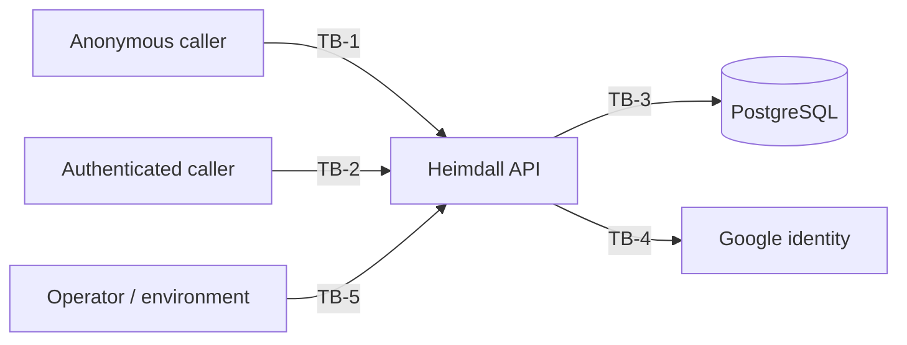

# Threat Model Document — Heimdall API

## 1. Purpose

The [System Requirements Document](System%20Requirements%20Document.md) states the security controls
this API implements. It does not state what they defend against, and a control without a stated
threat cannot be judged: there is no way to tell whether it is sufficient, whether it is the right
control, or whether removing it would matter.

This document states the threats. Each one names the asset at risk, what an attacker must already be
able to do, the control that addresses it — cited as an existing FR or NFR rather than restated — and
how anybody knows the control works. Where nothing addresses a threat, that is written down as a
finding rather than left out.

It uses the same three verification methods as the [Testing Specification
Document](Testing%20Specification%20Document.md) §11, for the same reason:

- **Test** — executed by the suite. Fails the build when the property stops holding.
- **Inspection** — established by reading the code or configuration, and re-established when it
  changes.
- **Measurement** — a number produced by a run and published.

And the same rule: **a threat whose verification method is "none" is a finding.** §7 collects them.

This is a design-level review. It is not a penetration test, and nothing here was established by
attacking a deployment.

## 2. Method

Threats are numbered `TH-nn` and grouped by the trust boundary they cross, not by the feature they
affect. Feature-organised threat models miss the crossings, and the crossings are where the defects
are: two features can each be correct and still combine into a boundary that leaks.

Residual risk is what is left *after* the control, judged on this codebase rather than in the
abstract:

- **Low** — the control addresses the threat and something checks the control.
- **Medium** — the control addresses the threat, but its coverage has a stated limit, or nothing
  checks it.
- **High** — no control, or the control does not cover the case described.

## 3. Trust boundaries

| Boundary | Crossing | What is on the other side |
| --- | --- | --- |
| TB-1 | Anonymous internet → the authentication endpoints | Credentials, tokens, and every account in the system |
| TB-2 | An authenticated caller → data belonging to a tenant | Every other tenant's persons, applications and permissions |
| TB-3 | The API → its database | Password hashes, TOTP secrets, reset tokens, the key ring |
| TB-4 | The API → Google | Whoever a Google ID token claims to be |
| TB-5 | An operator → configuration, logs and images | The signing secret, the master account, delivered tokens |

## 4. TB-1 — Anonymous internet to the authentication endpoints

Every endpoint here is `AllowAnonymous` by necessity (NFR-04): a caller cannot hold a token yet. They
are therefore the only endpoints reachable by someone with nothing at all, and they are where the
expensive work is.

| ID | Threat | Control | Verification | Residual |
| --- | --- | --- | --- | --- |
| TH-01 | Password guessing against a known address | Per-account lockout after 10 failures for 15 minutes (FR-AU-09); per-IP fixed window of 10 requests a minute | Test | Low |
| TH-02 | Enumerating which addresses and scopes exist, from the response or its timing | One message for every rejection, and a decoy Argon2id verification when no person matches (FR-AU-10) | Test + measurement (SRD §6.1) | Low |
| TH-03 | Exhausting the API's memory through login | The per-IP rate limiter, and nothing else | Measurement (SRD §6.3.1) | **High** |
| TH-04 | Guessing a 6-digit second-factor code | Five attempts per code, hashed at rest, short lifetime (FR-2F-13) | Test | Low |
| TH-05 | Guessing a password-reset or verification token | 48 characters from a CSPRNG, single-use, expiring | Inspection | Low |
| TH-06 | Using an MFA-pending challenge token as a full token | Distinct claim, 5-minute fixed lifetime, rejected everywhere but second-factor verification (NFR-17) | Test | Low |

**TH-03 is the one to read twice.** Each login costs a full Argon2id verification at 600 MB and 16
threads. The rate limiter admits ten a minute per IP and releases them together, so one address can
demand roughly **6 GB of working set per minute** and remain entirely within policy — measured at 2.8
seconds per login when it happens (SRD §6.3.1). The limiter is partitioned by remote IP and is
per-instance, so callers spread across addresses multiply that budget rather than share it, and there
is no global bound on concurrent password verification behind it to catch what gets through. The
control was written as an anti-brute-force measure; it is load-bearing for memory, and nothing says
so at the point where the cost is configured.

## 5. TB-2 — An authenticated caller to another tenant's data

Authentication runs in `ClaimsOnly` mode: the caller is rebuilt from the token's claims and no data
store is consulted, which is what keeps an ordinary request free of a per-request lookup. Everything
in this section follows from that decision — a claim is a statement about the past, and the question
each threat asks is what happens when the present disagrees with it.

| ID | Threat | Control | Verification | Residual |
| --- | --- | --- | --- | --- |
| TH-07 | A Scope Admin reaching a scope they do not own | `ScopeOwnershipChecker` re-reads ownership from the database on every attempt, and excludes a deleted person | Test | Low |
| TH-08 | A demoted person keeping the authority they held when their token was issued | None | **None** | **High** |
| TH-09 | A deleted or removed identity continuing to act on an unexpired token | `ActorLivenessFilter` re-reads both identity tables per request (FR-AU-05, FR-GO-12) | Test | Low |
| TH-10 | Inferring another tenant's row counts from sequential identifiers | Only `PublicId` GUIDs cross the boundary (NFR-15) | Test | Low |
| TH-11 | Granting oneself or another person the System Admin role | `UpdatePersonCommandHandler` refuses any role change unless the acting role is System Admin, and supports no transition other than *to* System Admin (UC-08) | Test | Medium — the acting role is read from the claim, see TH-08 |
| TH-12 | Acting on a scope after being removed as its owner | `ScopeOwnershipChecker` re-reads, so removal takes effect immediately | Test | Low |

**TH-08 has no control and no test, and it is the finding this section exists for.** The role is
carried in the `roleId` claim and is never re-read. `ActorLivenessFilter` re-reads the identity, but
it asks only whether the person exists and is not deleted — not what role they now hold. And
`ScopeOwnershipChecker` grants an unconditional bypass when the acting role is `SystemAdmin`, taken
from the claim without a lookup.

So demoting a System Admin does not take effect until their token expires — an hour by default, and
configurable upward. For that hour the demoted account keeps cross-tenant authority over every scope
in the system, and the bypass means it does so without any query that could have noticed. This is the
one case where the design's decision to trust claims has a consequence that deletion does not: an
account that is *deleted* is stopped within one request, and an account that is merely *demoted* is
not stopped at all.

**And the window is enough to make itself permanent.** A role change is refused unless the acting
role is System Admin — read, like everything else, from the claim — and the one transition the
handler supports is a promotion *to* System Admin. A demoted account therefore spends its remaining
token lifetime able to promote itself straight back, or to promote an account it controls, and that
promotion is a database write that outlives every token involved. What looks like a bounded window of
stale privilege is a path to an unbounded one, which is why TH-11 is Medium rather than Low: its own
control is sound, and it inherits this one's weakness through the claim it trusts.

Note the asymmetry with TH-09 and TH-12, both of which are Low precisely because something re-reads
the database. The mechanism to fix TH-08 already exists and is already paid for on every request —
`ActorLivenessFilter` holds the `Person` row it just read.

## 6. TB-3 — The API to its database

The threats here assume an attacker who can read the database and nothing else: a leaked backup, a
compromised read replica, a restored snapshot, or an injection that yields rows. The question each
one asks is what that reader can do with what they find.

| ID | Threat | Control | Verification | Residual |
| --- | --- | --- | --- | --- |
| TH-13 | Recovering passwords from stolen rows | Argon2id with a per-person salt (NFR-02) | Test | Low |
| TH-14 | Taking over an account using a stolen password-reset or email-verification token | None — both are stored in plaintext | Inspection | **High** |
| TH-15 | Recovering TOTP secrets from stolen rows | Encrypted at rest with ASP.NET Data Protection (NFR-16) | Test | Medium |
| TH-16 | Replaying a stolen second-factor recovery code | Stored as a SHA-256 hash, single-use (NFR-16) | Test | Low |
| TH-17 | Injecting SQL through a caller-supplied value | EF Core parameterises every query; no string-concatenated SQL | Inspection | Low |
| TH-18 | Denying an action that was taken | Every write produces an audit entry with actor, operation and outcome (NFR-09) | Test | Medium |

**TH-14 is a straightforward inconsistency, and the cheapest thing in this document to fix.**
`PasswordResetService` and `EmailVerificationService` both write the token they just generated
straight into the row: `Token = token`. Meanwhile a second-factor recovery code — which is *weaker*
as an account-takeover primitive, since it still requires the password — is stored as a hash, and a
2FA email code is stored hashed and salted.

A reader who obtains the `password_reset_token` table can complete a password reset for any account
with a live token, and the Argon2id work protecting the password becomes irrelevant: they do not need
the password, they need the reset. The fix is the one already used for recovery codes — store the
hash, compare on presentation — and it changes two services and one comparison each.

**TH-15 is Medium rather than Low for a reason worth stating.** The TOTP secrets are encrypted, and
since the key ring is persisted to the database so that a second instance can decrypt them (SRD
§6.2), the ciphertext and the keys that open it now live in the same store. That was the right call
for availability — before it, a recreated container silently locked every authenticator user out —
but it means the encryption at rest defends against a stolen *table* and not against a stolen
*database*. Naming that is the point of writing it down; moving the key ring to a separate secret
store is a real change with its own operational cost, and is not being recommended here without one.

**TH-18 is Medium because the audit log is append-only by convention.** Nothing in the schema
prevents an `UPDATE` or `DELETE` against it, and the API's own credentials are sufficient to issue
one. It is evidence against an ordinary caller, not against an attacker who reaches the database.

## 7. TB-4 — The API to Google

| ID | Threat | Control | Verification | Residual |
| --- | --- | --- | --- | --- |
| TH-19 | Presenting a forged or replayed Google ID token | Signature, issuer, audience and expiry are all verified before any claim is trusted (NFR-13) | Test (audience) + inspection (Google's own checks) | Low |
| TH-20 | Presenting a token minted for a different OAuth client | The configured client IDs are the trusted audience, and a test requires that constraint to be present | Test | Low |
| TH-21 | Reaching an existing password account by signing in with the same address through Google | Not established | **None** | Medium |

**TH-21 is a gap in this document rather than a known defect.** Google Users and Persons are separate
identity tables that mint tokens through the same claims, and what happens when a Google sign-in
presents an address that already belongs to a password account has not been traced through the code
here, nor is there a test that asks the question in those terms. It may well be handled. Until
somebody establishes which, it is written down as unverified rather than assumed safe — that is the
rule this document runs on, and the first threat to which it applies to the document's own authors is
worth keeping.

## 8. TB-5 — An operator to configuration, logs and images

| ID | Threat | Control | Verification | Residual |
| --- | --- | --- | --- | --- |
| TH-22 | Minting a valid token for any identity, using the signing secret | The secret is supplied by environment and never logged | Inspection | Medium |
| TH-23 | Reading a delivered verification, reset or 2FA code out of the logs | Production fails startup when email delivery is unconfigured, rather than falling back to logging the token | Inspection | Medium |
| TH-24 | Using the seeded master account | Credentials are supplied by environment and required at startup | Inspection | Medium |

**TH-22 is Medium because there is no rotation story.** Tokens carry no key identifier, so the
signing secret cannot be rotated without invalidating every token in flight, which means in practice
that it is rarely rotated at all. A leaked secret is total — it mints any identity at any role — and
the only remediation available today is a hard cutover.

**TH-23's control covers Production and by design does not cover anything else.** A developer or
staging deployment without Mailgun credentials logs verification tokens, reset tokens and 2FA codes
in plaintext, which is deliberate and documented: the functional suite and a local run both need
those flows to work without credentials or network. It is listed here because a staging deployment
with real users' addresses in it turns a convenience into an account-takeover primitive for anyone
who can read a log.

## 9. What this model does not cover

- **No dynamic testing.** Nothing here was found by attacking a running deployment. A design review
  finds missing and mismatched controls; it does not find the ones that are present and broken.
- **Denial of service beyond TH-03.** The load runs (SRD §6.3) establish what the API delivers under
  concurrency, not what it does under a hostile request pattern chosen to be expensive.
- **The infrastructure the API runs on.** Container escape, host access, network position and
  PostgreSQL's own configuration are all out of scope, and the Operations & Infrastructure Document
  is where they would belong.
- **The api-client.** The published client is not modelled here; every threat above is stated from
  the API's side of the boundary.
- **Supply chain beyond known advisories.** `scripts/vulnerabilities.py` fails the build on a
  published advisory. It says nothing about a dependency that is malicious and not yet reported.

## 10. Adding a threat

The same rule as a use case and a non-functional requirement: it does not exist until something
checks it.

A change that crosses a trust boundary in §3 — a new anonymous endpoint, a new claim trusted for
authorization, a new table holding a secret, a new external identity source — needs a `TH-nn` entry
before it merges, with a control and a verification method. If the method is "none", that is
permitted and it goes in §11, because an acknowledged gap is worth more than a table of green ticks
that hides one. What is not permitted is the entry being absent.

## 11. Findings register

The threats above with no control, or with a control whose coverage is narrower than the threat.
Ordered by what they cost to fix against what they prevent, which is not the same as by severity.

| Rank | Threat | Why it is here | Shape of the fix |
| ---: | --- | --- | --- |
| 1 | TH-14 | Reset and verification tokens are stored in plaintext, while weaker secrets beside them are hashed | Store the hash, compare on presentation — the pattern recovery codes already use |
| 2 | TH-08 | A demoted account keeps its authority until its token expires — and can use that window to promote itself back permanently (TH-11) | Re-read the role in `ActorLivenessFilter`, which already holds the row |
| 3 | TH-21 | Nobody has established what a Google sign-in does with an address that already has a password account | Trace it, then write the test that states the answer |
| 4 | TH-03 | The rate limiter is the only bound on login's memory demand, and it is per-IP and per-instance | A global concurrency bound on password verification, independent of source address |
| 5 | TH-18 | The audit log is append-only by convention only | Database-level restriction, or a periodic integrity check |
| 6 | TH-22 | The signing secret cannot be rotated without invalidating every token in flight | A key identifier in the token, and acceptance of two keys during a rotation |

Ranks 1 and 2 are both small, well-understood changes against clearly stated consequences, and both
have an existing pattern in this codebase to copy. Rank 3 costs an afternoon and may cost nothing
more than a test. Ranks 4 to 6 are design changes and should be decided deliberately rather than
squeezed into an unrelated pull request.
