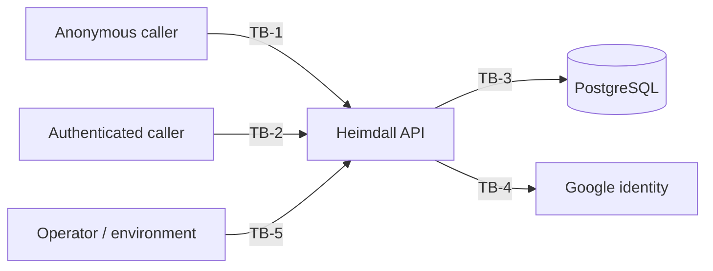

# Threat Model Document — Heimdall API

## 1. Purpose

The [System Requirements Document](System%20Requirements%20Document.md) states the security controls
this API implements. It does not state what they defend against, and a control without a stated
threat cannot be judged: there is no way to tell whether it is sufficient, whether it is the right
control, or whether removing it would matter.

This document states the threats. Each one names the asset at risk, what an attacker must already be
able to do, the control that addresses it — cited as an existing FR or NFR rather than restated — and
how anybody knows the control works. Where nothing addresses a threat, that is written down as a
finding rather than left out.

It uses the same three verification methods as the [Testing Specification
Document](Testing%20Specification%20Document.md) §11, for the same reason:

- **Test** — executed by the suite. Fails the build when the property stops holding.
- **Inspection** — established by reading the code or configuration, and re-established when it
  changes.
- **Measurement** — a number produced by a run and published.

And the same rule: **a threat whose verification method is "none" is a finding.** §11 collects them.

This is a design-level review. It is not a penetration test, and nothing here was established by
attacking a deployment.

## 2. Method

Threats are numbered `TH-nn` and grouped by the trust boundary they cross, not by the feature they
affect. Feature-organised threat models miss the crossings, and the crossings are where the defects
are: two features can each be correct and still combine into a boundary that leaks.

Residual risk is what is left *after* the control, judged on this codebase rather than in the
abstract:

- **Low** — the control addresses the threat and something checks the control.
- **Medium** — the control addresses the threat, but its coverage has a stated limit, or nothing
  checks it.
- **High** — no control, or the control does not cover the case described.

## 3. Trust boundaries

| Boundary | Crossing | What is on the other side |
| --- | --- | --- |
| TB-1 | Anonymous internet → the authentication endpoints | Credentials, tokens, and every account in the system |
| TB-2 | An authenticated caller → data belonging to a tenant | Every other tenant's persons, applications and permissions |
| TB-3 | The API → its database | Password hashes, TOTP secrets, reset tokens, the key ring |
| TB-4 | The API → Google | Whoever a Google ID token claims to be |
| TB-5 | An operator → configuration, logs and images | The signing secret, the master account, delivered tokens |

## 4. TB-1 — Anonymous internet to the authentication endpoints

Every endpoint here is `AllowAnonymous` by necessity (NFR-04): a caller cannot hold a token yet. They
are therefore the only endpoints reachable by someone with nothing at all, and they are where the
expensive work is.

| ID | Threat | Control | Verification | Residual |
| --- | --- | --- | --- | --- |
| TH-01 | Password guessing against a known address | Per-account lockout after 10 failures for 15 minutes (FR-AU-09); per-IP fixed window of 10 requests a minute | Test | Low |
| TH-02 | Enumerating which addresses and scopes exist, from the response or its timing | One message for every rejection, and a decoy Argon2id verification when no person matches (FR-AU-10) | Test + measurement (SRD §6.1) | Low |
| TH-03 | Exhausting the API's memory through login | `PasswordHashGate` bounds concurrent Argon2id derivations process-wide and sheds with `503`, behind the per-IP rate limiter | Test + measurement (SRD §6.3.1) | Low |
| TH-04 | Guessing a 6-digit second-factor code | Five attempts per code, hashed at rest, short lifetime (FR-2F-13) | Test | Low |
| TH-05 | Guessing a password-reset or verification token | 48 characters from a CSPRNG, single-use, expiring | Inspection | Low |
| TH-06 | Using an MFA-pending challenge token as a full token | Distinct claim, 5-minute fixed lifetime, rejected everywhere but second-factor verification (NFR-17) | Test | Low |

**TH-03 was the one to read twice, and it is now closed.** Each login costs a full Argon2id
verification at 600 MB and 16 threads. The rate limiter admits ten a minute per IP and releases them
together, so one address could demand roughly **6 GB of working set per minute** and remain entirely
within policy — measured at 2.8 seconds per login when it happened (SRD §6.3.1). The limiter is
partitioned by remote IP and is per-instance, so callers spread across addresses multiplied that
budget rather than sharing it, and nothing behind it bounded what got through.

`PasswordHashGate` is that second bound, and it is deliberately not partitioned by anything: four
derivations at once for the whole process, the rest refused with `503` and a `Retry-After` after ten
seconds. Two properties matter and both are tested. It covers every derivation on a request path
rather than login alone — an authenticated caller creating persons in a loop reaches the same memory,
and a bound with a way around it is not a bound. And it refuses rather than queues, because an
unbounded queue is this threat with the pressure moved from memory into the thread pool.

The refusal is a load condition, not a rejection, so it answers 503 rather than 500 and says nothing
about the account: the decoy verification AF-11a spends passes through the same gate as a real check,
so saturation cannot be used to tell an existing address from an absent one.

What remains, and is why this is Low rather than absent: the gate bounds one process. Two instances
behind a load balancer will each permit four, so the deployment's total is the bound times the
replica count — which is the ordinary arithmetic of horizontal scaling (§6.2) rather than a gap, but
it means the number to size against is per instance.

## 5. TB-2 — An authenticated caller to another tenant's data

Authentication runs in `ClaimsOnly` mode: the caller is rebuilt from the token's claims and no data
store is consulted, which is what keeps an ordinary request free of a per-request lookup. Everything
in this section follows from that decision — a claim is a statement about the past, and the question
each threat asks is what happens when the present disagrees with it.

| ID | Threat | Control | Verification | Residual |
| --- | --- | --- | --- | --- |
| TH-07 | A Scope Admin reaching a scope they do not own | `ScopeOwnershipChecker` re-reads ownership from the database on every attempt, and excludes a deleted person | Test | Low |
| TH-08 | A demoted person keeping the authority they held when their token was issued | `ActorLivenessFilter` compares the role claim against the stored role on every request, and refuses the token when they disagree | Test | Low |
| TH-09 | A deleted or removed identity continuing to act on an unexpired token | `ActorLivenessFilter` re-reads both identity tables per request (FR-AU-05, FR-GO-12) | Test | Low |
| TH-10 | Inferring another tenant's row counts from sequential identifiers | Only `PublicId` GUIDs cross the boundary (NFR-15) | Test | Low |
| TH-11 | Granting oneself or another person the System Admin role | `UpdatePersonCommandHandler` refuses any role change unless the acting role is System Admin, and supports no transition other than *to* System Admin (UC-08) | Test | Low — the claim it reads is now verified against the row by TH-08's fix |
| TH-12 | Acting on a scope after being removed as its owner | `ScopeOwnershipChecker` re-reads, so removal takes effect immediately | Test | Low |

**TH-08 is the finding this section exists for, and it is now fixed.** As first written the role was
carried in the `roleId` claim and never re-read: `ActorLivenessFilter` asked only whether the person
existed and was not deleted, and `ScopeOwnershipChecker` grants an unconditional bypass when the
acting role is `SystemAdmin`, taken from the claim without a lookup.

So demoting a System Admin does not take effect until their token expires — an hour by default, and
configurable upward. For that hour the demoted account keeps cross-tenant authority over every scope
in the system, and the bypass means it does so without any query that could have noticed. This is the
one case where the design's decision to trust claims has a consequence that deletion does not: an
account that is *deleted* is stopped within one request, and an account that is merely *demoted* is
not stopped at all.

**And the window is enough to make itself permanent.** A role change is refused unless the acting
role is System Admin — read, like everything else, from the claim — and the one transition the
handler supports is a promotion *to* System Admin. A demoted account therefore spends its remaining
token lifetime able to promote itself straight back, or to promote an account it controls, and that
promotion is a database write that outlives every token involved. What looks like a bounded window of
stale privilege is a path to an unbounded one, which is why TH-11 is Medium rather than Low: its own
control is sound, and it inherits this one's weakness through the claim it trusts.

The fix is the mechanism TH-09 and TH-12 were already Low for: `ActorLivenessFilter` was reading the
`Person` row on every request anyway, so it now selects the role out of that row instead of asking
whether it exists, and refuses the request when the claim disagrees. No extra query. A promotion is
refused on the same rule as a demotion — a check that only rejected claims *above* the stored role
would be the one worth writing carefully and then getting backwards.

Two things fell out of making it true. A token whose role is out of date now gets its own message
rather than the deliberately vague one deletion gets, because a role change is not an existence
question and the caller can act on it. And a functional test that had been minting a System Admin
claim for a person stored as a User stopped passing — it was relying on exactly the forgery this
closes, and now names an actor whose claim and row agree.

## 6. TB-3 — The API to its database

The threats here assume an attacker who can read the database and nothing else: a leaked backup, a
compromised read replica, a restored snapshot, or an injection that yields rows. The question each
one asks is what that reader can do with what they find.

| ID | Threat | Control | Verification | Residual |
| --- | --- | --- | --- | --- |
| TH-13 | Recovering passwords from stolen rows | Argon2id with a per-person salt (NFR-02) | Test | Low |
| TH-14 | Taking over an account using a stolen password-reset or email-verification token | Both are stored as a SHA-256 digest and never in the form a caller presents (`SingleUseTokenHash`) | Test | Low |
| TH-15 | Recovering TOTP secrets from stolen rows | Encrypted at rest with ASP.NET Data Protection (NFR-16) | Test | Medium |
| TH-16 | Replaying a stolen second-factor recovery code | Stored as a SHA-256 hash, single-use (NFR-16) | Test | Low |
| TH-17 | Injecting SQL through a caller-supplied value | EF Core parameterises every query; no string-concatenated SQL | Inspection | Low |
| TH-18 | Denying an action that was taken | Every write produces an audit entry (NFR-09), and a database trigger refuses `UPDATE`, `DELETE` and `TRUNCATE` on the table | Test | Low — but see below on DDL |

**TH-14 was a straightforward inconsistency, and it is now fixed.** `PasswordResetService` and
`EmailVerificationService` both used to write the token they had just generated straight into the
row — `Token = token` — while a second-factor recovery code, which is *weaker* as an
account-takeover primitive since it still requires the password, was stored as a hash, and a 2FA
email code hashed and salted. A reader of the `password_reset_token` table could complete a reset for
any account holding a live token, which did not break the Argon2id work protecting the password so
much as walk around it.

Both now store a SHA-256 through `SingleUseTokenHash`, and the presented token is hashed and looked
up against a unique index on the digest. Unsalted, deliberately: these are 48 characters from a
CSPRNG, so there is no precomputed table for a salt to defend against, and a per-row salt would force
a scan of every live token on every attempt — the caller presents the token alone, with nothing to
narrow the candidates by. The migration computes the digest from the column it replaces rather than
discarding rows, so links already sitting in inboxes keep working.

What it cost is worth recording, because it is the kind of loss a table of green ticks hides. Two
functional tests used to drive issue-then-spend end to end by reading the token back out of the row.
They cannot: the suite has no inbox and no seam to substitute a sender through. They now assert what
UC-12 and UC-06 *stored*, and the spending half is covered where the plaintext is still in the test's
hands — the service tests capture it from the sender, the handler tests seed through the same helper.
Both halves go through `SingleUseTokenHash`, so they would fail together if it changed.

**TH-15 is Medium rather than Low for a reason worth stating.** The TOTP secrets are encrypted, and
since the key ring is persisted to the database so that a second instance can decrypt them (SRD
§6.2), the ciphertext and the keys that open it now live in the same store. That was the right call
for availability — before it, a recreated container silently locked every authenticator user out —
but it means the encryption at rest defends against a stolen *table* and not against a stolen
*database*. Naming that is the point of writing it down; moving the key ring to a separate secret
store is a real change with its own operational cost, and is not being recommended here without one.

**TH-18 was Medium because the audit log was append-only by convention.** `AuditLog` had said
"append-only: never updated or logically deleted after creation" since it was written, and nothing
enforced it: the API's own credentials were sufficient to rewrite the trail, so it was evidence
against an ordinary caller and none at all against anyone who reached the database.

A trigger now refuses `UPDATE`, `DELETE` and `TRUNCATE` on the table. A trigger rather than a
permission grant, because a grant depends on the deployment connecting as a role that lacks those
rights, and this repository's compose file, the functional suite and most development setups all
connect as the owner; a trigger holds regardless of who is connected and travels with the schema.
`TRUNCATE` needs naming separately because it skips `BEFORE DELETE` entirely, and the triggers fire
per statement rather than per row so that a `DELETE` matching nothing is refused too — otherwise the
rule would depend on what the statement happened to hit.

It does not defend against somebody who can also run DDL: a superuser can drop the trigger and then
rewrite history. That is smaller than the hole it closes — it leaves a schema change behind, where an
`UPDATE` left nothing — but it is not zero, which is why the row above is qualified rather than
simply Low.

## 7. TB-4 — The API to Google

| ID | Threat | Control | Verification | Residual |
| --- | --- | --- | --- | --- |
| TH-19 | Presenting a forged or replayed Google ID token | Signature, issuer, audience and expiry are all verified before any claim is trusted (NFR-13) | Test (audience) + inspection (Google's own checks) | Low |
| TH-20 | Presenting a token minted for a different OAuth client | The configured client IDs are the trusted audience, and a test requires that constraint to be present | Test | Low |
| TH-21 | Reaching an existing password account by signing in with the same address through Google | The two identity tables are never joined on email: the sign-in resolves by Google's `sub` within the scope, the token names the Google User's own `PublicId`, and UC-25 issues the `User` role unconditionally | Test | Low |

**TH-21 was the one gap this document opened against itself, and it has now been traced.** The answer
is that a Google sign-in cannot reach a password account, for three independent reasons: the account
is looked up by Google's `sub` within the scope and never by email, so a Person is never a candidate;
the token names the Google User's own `PublicId`, which is a different GUID from any Person's; and
UC-25 mints the `User` role unconditionally, which `ActorLivenessFilter` now enforces for any Google
identity. Two tests pin it — one that the colliding sign-in creates a separate row and leaves the
admin's record untouched, one that the token it returns is refused by an endpoint the admin whose
address it shares could reach.

What the trace did turn up is narrower, and is recorded here as accepted rather than as a defect.
AF-25c asks whether the address is free *within the scope*, and asks the person half of that question
only of persons holding a `SCOPE_USER` row. An admin has none — UC-06 path b creates them with no
scope association — so an admin's address does not read as taken and the sign-up proceeds. The
address then exists twice across the two tables.

That is left as it is on purpose. The alternative is that any address belonging to a system-wide
admin blocks Google sign-up in every scope, which is a worse rule than the one being avoided: it
turns a system-wide account into a veto over per-scope sign-ups, for no gain that the three
separations above do not already provide. Nothing in the system keys off an email across the two
tables — login and password recovery read Persons, Google sign-in reads Google Users — so the
duplicate is an operational surprise rather than a way in. It is written down because a reader of
FR-GO-07 would not expect it.

## 8. TB-5 — An operator to configuration, logs and images

| ID | Threat | Control | Verification | Residual |
| --- | --- | --- | --- | --- |
| TH-22 | Minting a valid token for any identity, using the signing secret | The secret is supplied by environment and never logged | Inspection | Medium |
| TH-23 | Reading a delivered verification, reset or 2FA code out of the logs | Production fails startup when email delivery is unconfigured, rather than falling back to logging the token | Inspection | Medium |
| TH-24 | Using the seeded master account | Credentials are supplied by environment and required at startup | Inspection | Medium |

**TH-22 is Medium because there is no rotation story.** Tokens carry no key identifier, so the
signing secret cannot be rotated without invalidating every token in flight, which means in practice
that it is rarely rotated at all. A leaked secret is total — it mints any identity at any role — and
the only remediation available today is a hard cutover.

**TH-23's control covers Production and by design does not cover anything else.** A developer or
staging deployment without Mailgun credentials logs verification tokens, reset tokens and 2FA codes
in plaintext, which is deliberate and documented: the functional suite and a local run both need
those flows to work without credentials or network. It is listed here because a staging deployment
with real users' addresses in it turns a convenience into an account-takeover primitive for anyone
who can read a log.

## 9. What this model does not cover

- **No dynamic testing.** Nothing here was found by attacking a running deployment. A design review
  finds missing and mismatched controls; it does not find the ones that are present and broken.
- **Denial of service beyond TH-03.** The load runs (SRD §6.3) establish what the API delivers under
  concurrency, not what it does under a hostile request pattern chosen to be expensive.
- **The infrastructure the API runs on.** Container escape, host access, network position and
  PostgreSQL's own configuration are all out of scope, and the Operations & Infrastructure Document
  is where they would belong.
- **The api-client.** The published client is not modelled here; every threat above is stated from
  the API's side of the boundary.
- **Supply chain beyond known advisories.** `scripts/vulnerabilities.py` fails the build on a
  published advisory. It says nothing about a dependency that is malicious and not yet reported.

## 10. Adding a threat

The same rule as a use case and a non-functional requirement: it does not exist until something
checks it.

A change that crosses a trust boundary in §3 — a new anonymous endpoint, a new claim trusted for
authorization, a new table holding a secret, a new external identity source — needs a `TH-nn` entry
before it merges, with a control and a verification method. If the method is "none", that is
permitted and it goes in §11, because an acknowledged gap is worth more than a table of green ticks
that hides one. What is not permitted is the entry being absent.

## 11. Findings register

The threats above with no control, or with a control whose coverage is narrower than the threat.
Ordered by what they cost to fix against what they prevent, which is not the same as by severity.

| Rank | Threat | Why it is here | Shape of the fix | Where |
| ---: | --- | --- | --- | --- |
| 1 | TH-22 | The signing secret cannot be rotated without invalidating every token in flight | A key identifier in the token, and acceptance of two keys during a rotation | **Not this repository** |

TH-22 is the only one left, and it cannot be closed here. Tokens are signed by
`ArturRios.Jwt`'s `JwtHandler.CreateToken`, which takes a `JwtConfiguration` carrying a single
`Secret` string and writes no key identifier; they are validated by `ArturRios.Util.WebApi`'s
`JwtMiddleware`, which is constructed with that same single configuration. There is no seam in either
for a second key, so nothing in this repository can accept an old signature while issuing a new one.

The two ways forward, neither of which belongs in an unrelated pull request:

1. **Change the libraries.** `JwtConfiguration` grows a key set with identifiers, `CreateToken` stamps
   `kid` on the header, and `JwtMiddleware` resolves the key by it — accepting any key in the set
   while signing with the current one. That is the real fix, and it is a change to two packages this
   API depends on rather than to the API.
2. **Stop using them for this.** Issue and validate tokens here, which means owning the middleware
   and duplicating what the libraries already do correctly, to gain one property.

Until one of those happens, a leaked signing secret is remediated by a hard cutover: change the
secret, and every token in flight becomes invalid at once. That is survivable — the default lifetime
is an hour — but it is an outage rather than a rotation, and it is worth knowing before the day it is
needed rather than during it.

### 11.1 Closed

Kept rather than deleted, because a register that only ever lists open items gives no sense of what
this document has been worth.

| Threat | What it was | What closed it |
| --- | --- | --- |
| TH-14 | Password-reset and email-verification tokens were stored in plaintext, while the weaker recovery codes beside them were hashed | `SingleUseTokenHash`: both are stored as a SHA-256 digest, the migration converts existing rows rather than dropping them, and the issue and spend paths share one helper |
| TH-08 | A demoted account kept its authority until its token expired, and could spend that window promoting itself back permanently | `ActorLivenessFilter` compares the role claim against the row it was already reading, and refuses a token whose role is out of date |
| TH-21 | Nobody had established what a Google sign-in does with an address that already belongs to a password account | Traced: resolution is by Google's `sub`, the token names the Google User's own `PublicId`, and the role is always `User`. Two tests state the answer |
| TH-03 | The per-IP rate limiter was the only bound on login's memory demand, and one address could ask for 6 GB of Argon2id working set a minute within policy | `PasswordHashGate`: four concurrent derivations process-wide, every derivation on a request path, `503` rather than an unbounded queue. Measured at no latency cost |
| TH-18 | The audit log was append-only by convention; the API's own credentials could rewrite the trail | A trigger refusing `UPDATE`, `DELETE` and `TRUNCATE`, per statement so an empty `DELETE` is refused too |

TH-14 and TH-08 were found by reading the code while writing this document, and neither was visible
from the requirements they were supposed to follow from. TH-21 was found by this document admitting
it did not know — the case for the rule that an unanswered question is written down rather than
assumed safe. TH-03 and TH-18 were known limits from the first draft, closed later once their cost
was understood; TH-03's fix, in particular, was worth measuring rather than reasoning about, since
the obvious prediction — that bounding concurrency would slow login down — turned out to be wrong.
