# Use Case Specification Document — Heimdall API

## 1. Introduction

### 1.1 Purpose

This document specifies the use cases for the **Heimdall API**. Each use case describes actor interactions, preconditions, postconditions, main flows, and alternative/exception flows.

Note on identifiers: every `{id}` / `{scopeId}` / `{personId}` referenced in these flows is the entity's `PublicId` (a GUID). Internally, each entity also has an auto-increment `bigint Id` used only for storage and joins — it is never seen by any actor in these use cases (see the System Requirements Document, §4.0).

### 1.2 Actors

| Actor | Description |
| ------- | ------------- |
| **System Admin** | Has full access to all scopes, persons, and applications across the entire system; belongs to no scope |
| **Scope Admin** | Owns one or more scopes and manages the users and applications within those scopes; can add co-owners to a scope they own by creating a new Scope Admin or promoting an existing User |
| **User** | An authenticated person belonging to exactly one scope, with basic access to their own profile |
| **Anonymous** | An unauthenticated caller (can only access public endpoints) |
| **Email Service** | External system that delivers emails for verification and password recovery |
| **Google User** | A person authenticated via Google Sign-In rather than a password; always equivalent to the `User` role, stored in a separate table from Person |
| **Google Identity Platform** | External system (Google) that authenticates the end user and issues a signed ID token containing their identity claims |

### 1.3 Use Case Overview

```mermaid
graph LR
    subgraph Actors
        SA(("System Admin"))
        SCA(("Scope Admin"))
        U(("User"))
        AN(("Anonymous"))
        ES(("Email Service"))
        GU(("Google User"))
        GIP(("Google Identity Platform"))
    end

    subgraph "Scope Management"
        UC01[UC-01: Create Scope]
        UC02[UC-02: View Scope]
        UC03[UC-03: Update Scope]
        UC04[UC-04: Logical Delete Scope]
        UC05[UC-05: Hard Delete Scope]
        UC21[UC-21: Add Scope Owner]
        UC22[UC-22: Remove Scope Owner]
        UC23[UC-23: Promote User to Scope Owner]
    end

    subgraph "Person Management"
        UC06[UC-06: Create Person]
        UC07[UC-07: View Person]
        UC08[UC-08: Update Person]
        UC09[UC-09: Logical Delete Person]
        UC10[UC-10: Hard Delete Person]
    end

    subgraph "Authentication & Security"
        UC11[UC-11: Login]
        UC12[UC-12: Password Recovery]
        UC13[UC-13: Reset Password]
        UC14[UC-14: Email Verification]
        UC15[UC-15: Resend Verification Email]
    end

    subgraph "Application Management"
        UC16[UC-16: Create Application]
        UC17[UC-17: View Application]
        UC18[UC-18: Update Application]
        UC19[UC-19: Logical Delete Application]
        UC20[UC-20: Hard Delete Application]
    end

    subgraph "Google Sign-In"
        UC24[UC-24: Enable/Disable Google Sign-In]
        UC25[UC-25: Sign Up / Sign In via Google]
        UC26[UC-26: Sign Out via Google]
        UC27[UC-27: View Google User]
        UC28[UC-28: Logical Delete Google User]
        UC29[UC-29: Hard Delete Google User]
    end

    subgraph "Scope Permission Management"
        UC31[UC-31: Create Scope Permission]
        UC32[UC-32: View Scope Permission]
        UC33[UC-33: Update Scope Permission]
        UC34[UC-34: Logical Delete Scope Permission]
        UC35[UC-35: Hard Delete Scope Permission]
    end

    subgraph "Two-Factor Authentication"
        UC36[UC-36: Enable Two-Factor Authentication]
        UC37[UC-37: Confirm Two-Factor Authentication Setup]
        UC38[UC-38: Verify Second Factor]
        UC39[UC-39: Disable Two-Factor Authentication]
        UC40[UC-40: Regenerate Recovery Codes]
    end

    SA --> UC01 & UC02 & UC03 & UC04 & UC05
    SA --> UC21 & UC22 & UC23
    SCA --> UC02 & UC21 & UC22 & UC23
    SA --> UC06 & UC07 & UC08 & UC09 & UC10
    SCA --> UC06 & UC07 & UC08 & UC09
    U --> UC07 & UC08
    SA & SCA & U --> UC11 & UC15
    AN --> UC11 & UC12 & UC13 & UC14
    UC12 --> ES
    UC14 --> ES
    UC06 --> ES
    UC15 --> ES
    SA --> UC16 & UC17 & UC18 & UC19 & UC20
    SCA --> UC16 & UC17 & UC18 & UC19
    SA --> UC24 & UC27 & UC28 & UC29
    SCA --> UC24 & UC27 & UC28
    AN --> UC25
    UC25 --> GIP
    GU --> UC26 & UC27
    UC25 -.-> GU
    SA --> UC31 & UC32 & UC33 & UC34 & UC35
    SCA --> UC31 & UC32 & UC33 & UC34
    SA & SCA & U --> UC36 & UC37 & UC39 & UC40
    AN --> UC38
    UC36 --> ES
    UC38 --> ES
```

---

## 2. Use Case Specifications

---

### UC-01: Create Scope

| Field | Value |
| ------- | ------- |
| **ID** | UC-01 |
| **Name** | Create Scope |
| **Actors** | System Admin |
| **Description** | Allows a System Admin to create a new scope to onboard a client system, designating at least one Scope Admin as its initial owner |
| **Preconditions** | Actor is authenticated and has the `SystemAdmin` role; each specified initial owner is an existing, non-logically-deleted person with the `ScopeAdmin` role |
| **Postconditions** | A new scope record exists in the system, with one or more `SCOPE_OWNER` rows linking it to its initial owners |

**Main Flow:**

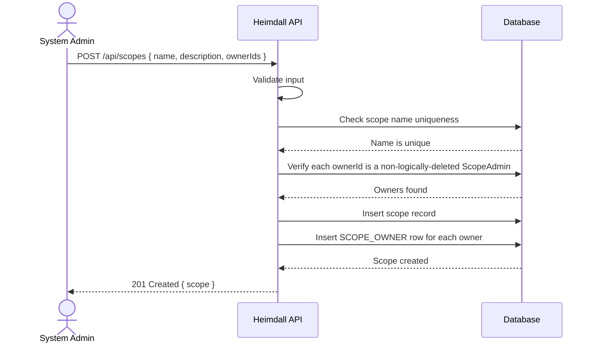

1. System Admin sends a request with scope name, optional description, and at least one owner ID.
2. The system validates the input fields.
3. The system verifies the scope name is unique.
4. The system verifies each referenced owner is an existing, non-logically-deleted person with the `ScopeAdmin` role.
5. The system creates the scope record with `IsDeleted = false` and a `SCOPE_OWNER` row for each initial owner.
6. The system returns the created scope.

**Alternative Flows:**

| ID | Condition | Outcome |
| ---- | ----------- | --------- |
| AF-01a | Scope name already exists | Return `409 Conflict` |
| AF-01b | Invalid input data, or no owner specified | Return `400 Bad Request` with validation errors |
| AF-01c | Actor is not System Admin | Return `403 Forbidden` |
| AF-01d | An owner ID does not reference an existing, non-logically-deleted `ScopeAdmin` | Return `400 Bad Request` |

---

### UC-02: View Scope

| Field | Value |
| ------- | ------- |
| **ID** | UC-02 |
| **Name** | View Scope |
| **Actors** | System Admin, Scope Admin, User |
| **Description** | Retrieve scope details by ID, or list scopes. There are two distinct reads: (a) a single scope by ID, via `GET /api/scopes/{id}`, open to any authenticated actor; or (b) the list of scopes, via `GET /api/scopes`, restricted to System Admins |
| **Preconditions** | Actor is authenticated |
| **Postconditions** | Scope information is returned |

**Main Flow (read a — scope by ID):**

1. Actor requests scope details by ID.
2. The system loads the scope, filtering out logically deleted scopes unless explicitly requested.
3. The system checks authorization:
   - System Admin: can view any scope.
   - Scope Admin: can view only the scopes they own.
   - User: can view only the scope they belong to.
4. The system returns the scope data.

**Main Flow (read b — list scopes):**

1. A System Admin requests a list of scopes, optionally filtering by name (case-insensitive) and
   paging the result (FR-SC-03).
2. The system filters out logically deleted scopes unless explicitly requested.
3. The system returns the page of scopes.

**Alternative Flows:**

| ID | Condition | Outcome |
| ---- | ----------- | --------- |
| AF-02a | Scope not found, or logically deleted and not explicitly requested (read a) | Return `404 Not Found` |
| AF-02b | Actor not authorized for the requested scope (read a); actor is not a System Admin (read b) | Return `403 Forbidden` |

> **On the list read being System-Admin-only.** The list endpoint is not opened to every actor with
> the page filtered to what they may see. A Scope Admin reaches the scopes they own through the
> `ownedScopeIds` their token carries plus read (a); a User has exactly one scope and likewise reads
> it by ID. Restricting the collection endpoint keeps the total number of scopes — a fact about
> other tenants — out of reach of any caller who is not a System Admin. This is what the System
> Requirements Document §5.1 specifies and §7 records.

---

### UC-03: Update Scope

| Field | Value |
| ------- | ------- |
| **ID** | UC-03 |
| **Name** | Update Scope |
| **Actors** | System Admin |
| **Description** | Modify an existing scope's name or description |
| **Preconditions** | Actor is authenticated with `SystemAdmin` role; scope exists and is not logically deleted |
| **Postconditions** | Scope record is updated |

**Main Flow:**

1. System Admin sends an update request with the scope ID and new field values.
2. The system validates the input.
3. The system verifies the scope exists and is not logically deleted.
4. The system applies the updates and sets `UpdatedAt`.
5. The system returns the updated scope.

**Alternative Flows:**

| ID | Condition | Outcome |
| ---- | ----------- | --------- |
| AF-03a | Scope not found or logically deleted | Return `404 Not Found` |
| AF-03b | Name conflicts with another scope | Return `409 Conflict` |

---

### UC-04: Logical Delete Scope

| Field | Value |
| ------- | ------- |
| **ID** | UC-04 |
| **Name** | Logical Delete Scope |
| **Actors** | System Admin |
| **Description** | Soft-delete a scope by setting `IsDeleted = true` |
| **Preconditions** | Actor is authenticated with `SystemAdmin` role; scope exists |
| **Postconditions** | Scope `IsDeleted` is set to `true`; all Users belonging to the scope (via `SCOPE_USER`), all Google Users in the scope, and all applications in the scope are also logically deleted. Scope Admins who own the scope are unaffected, since they may own other active scopes. The response reports the scope's identifier and the total number of Users, Google Users, and applications belonging to the scope |

**Main Flow:**

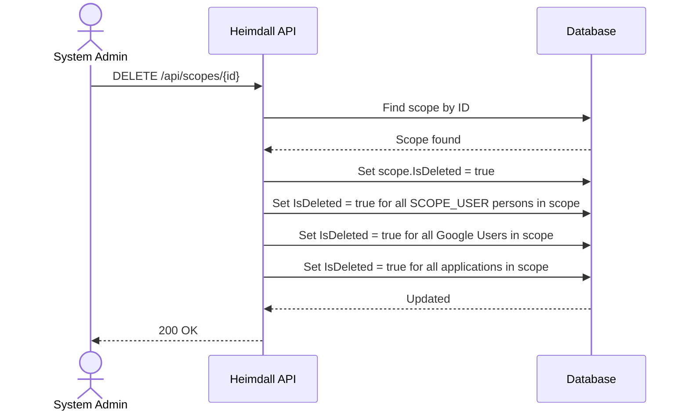

1. System Admin sends a delete request for a scope.
2. The system locates the scope.
3. The system sets `IsDeleted = true` on the scope.
4. The system sets `IsDeleted = true` on all Users belonging to the scope (via `SCOPE_USER`), all Google Users in the scope, and all applications in the scope. Scope Admins who own the scope are not modified.
5. The system returns success, including the scope's identifier and the total number of Users, Google Users, and applications belonging to the scope (counted regardless of their individual deletion state).

**Alternative Flows:**

| ID | Condition | Outcome |
| ---- | ----------- | --------- |
| AF-04a | Scope not found | Return `404 Not Found` |
| AF-04b | Scope already logically deleted | Return `200 OK` (idempotent); the scope and its Users/Google Users/applications are left unchanged, and the response still reports the scope's identifier and its User/Google User/application totals |

---

### UC-05: Hard Delete Scope

| Field | Value |
| ------- | ------- |
| **ID** | UC-05 |
| **Name** | Hard Delete Scope |
| **Actors** | System Admin |
| **Description** | Permanently remove a scope, its Users, its applications, and its scope permissions |
| **Preconditions** | Actor is authenticated with `SystemAdmin` role; scope exists |
| **Postconditions** | Scope, its `SCOPE_OWNER`/`SCOPE_USER` rows, its Users, its Google Users, its applications, and its scope permissions are permanently removed from the database. Scope Admin person records are not removed, since they may own other scopes |

**Main Flow:**

1. System Admin sends a hard delete request.
2. The system locates the scope.
3. The system permanently deletes all Users belonging to the scope (via `SCOPE_USER`), all Google Users in the scope, and all applications in the scope.
4. The system removes all `SCOPE_OWNER` and `SCOPE_USER` rows referencing the scope, and cascade-deletes any remaining scope permissions.
5. The system permanently deletes the scope record.
6. The system returns success, including the count of scope permissions removed.

**Alternative Flows:**

| ID | Condition | Outcome |
| ---- | ----------- | --------- |
| AF-05a | Scope not found | Return `404 Not Found` |

> **On NFR-12 and this use case.** There is deliberately no last-owner guard here, unlike UC-10.
> NFR-12 protects a scope from losing its owners; a scope being removed outright has nothing left to
> protect. An already logically deleted scope can be hard-deleted too — soft deletion is a state a
> cleanup pass starts from, not a block on it.
>
> **On an owner left with no scope.** A `ScopeAdmin` whose only scope this removes is left owning
> none, which FR-PE-11 describes as a state that should not exist. Their person record is kept
> anyway: they may be given another scope next (UC-21), and destroying a person as a side effect of
> deleting a scope is not something this use case promises. They cannot authenticate meanwhile
> (AF-11e), so the dangling state grants nothing; removing them is UC-10. See §8 of the System
> Requirements Document.

---

### UC-06: Create Person

| Field | Value |
| ------- | ------- |
| **ID** | UC-06 |
| **Name** | Create Person |
| **Actors** | System Admin, Scope Admin |
| **Description** | Register a new person. There are three distinct paths depending on the target role and actor: (a) a `User`, created by a Scope Admin (owner) or System Admin within a specific scope, via `POST /api/scopes/{scopeId}/persons`; (b) a `ScopeAdmin` or `SystemAdmin`, created by a System Admin with no scope, via `POST /api/persons`; or (c) a `ScopeAdmin`, created by an existing owner of a scope (or a System Admin) directly as a co-owner of that scope, via `POST /api/scopes/{scopeId}/owners` |
| **Preconditions** | Actor is authenticated; for paths (a) and (c), the target scope exists and is not logically deleted |
| **Postconditions** | A new person record exists (with a `SCOPE_USER` row for path (a), a `SCOPE_OWNER` row for path (c), and no scope association for path (b)); a verification email is sent |

**Main Flow (path a — Create User in a scope):**

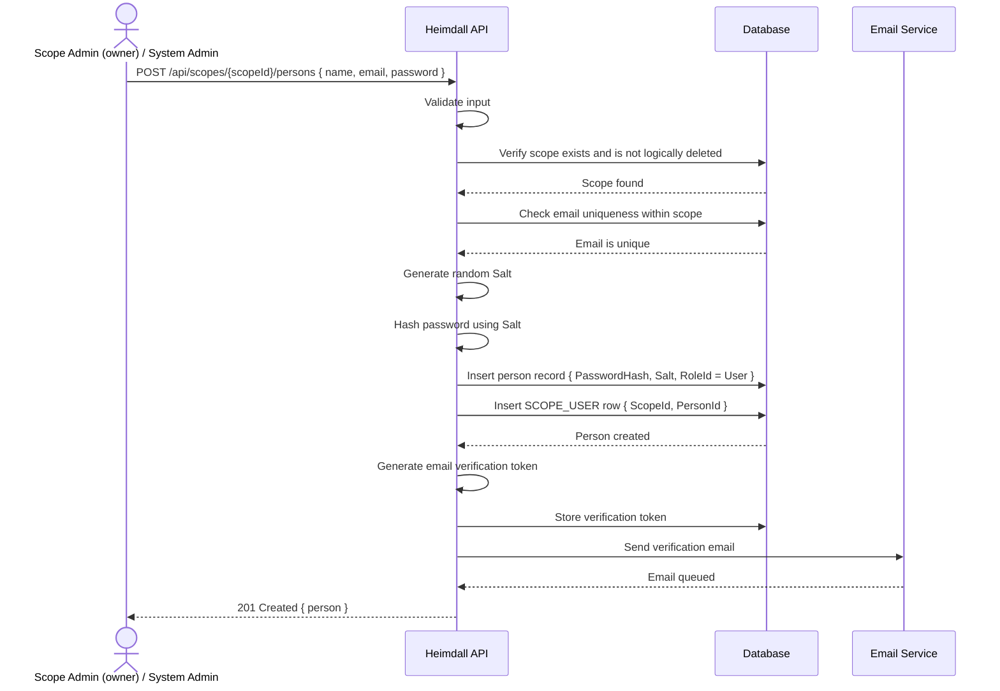

1. Scope Admin (an owner of the scope) or System Admin sends a request with person data (name, email, password) targeting a scope.
2. The system validates all fields and verifies the scope exists and is not logically deleted.
3. The system checks that the email is unique within the scope.
4. The system generates a random `Salt` and hashes the password using it.
5. The system creates the person record with `RoleId = User`, `IsDeleted = false`, `EmailVerified = false`, storing `PasswordHash` and `Salt` as byte arrays, and inserts a `SCOPE_USER` row linking the person to the scope.
6. The system generates a verification token and sends a verification email.
7. The system returns the created person (excluding `PasswordHash` and `Salt`).

**Main Flow (path b — Create Scope Admin / System Admin, no scope):**

1. System Admin sends a request to `POST /api/persons` with person data (name, email, password, roleId referencing `ScopeAdmin` or `SystemAdmin`).
2. The system validates all fields and verifies the email is not already held by another
   `ScopeAdmin` or `SystemAdmin` anywhere in the system (FR-PE-09).
3. The system generates a random `Salt` and hashes the password using it.
4. The system creates the person record with the requested `RoleId`, `IsDeleted = false`, `EmailVerified = false`. No `SCOPE_OWNER` or `SCOPE_USER` row is created (a `ScopeAdmin` created this way becomes an owner separately, via UC-21).
5. The system generates a verification token and sends a verification email.
6. The system returns the created person.

**Main Flow (path c — Scope Admin creates a new co-owner):**

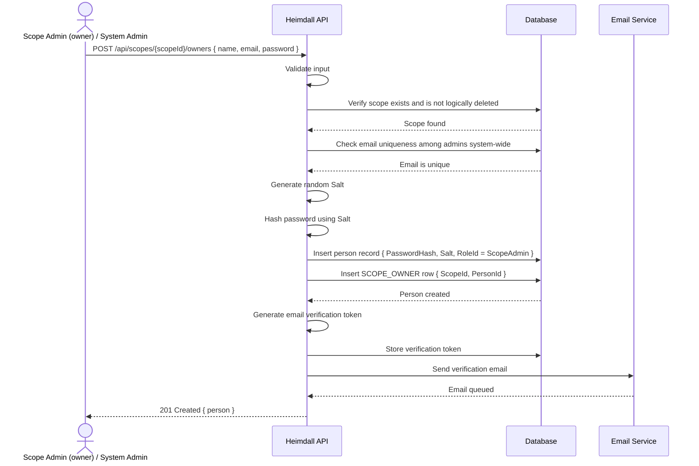

1. A Scope Admin who owns the scope, or a System Admin, sends a request with person data (name, email, password) targeting the scope.
2. The system validates all fields and verifies the target scope exists and is not logically deleted.
3. The system checks that the email is not already held by another `ScopeAdmin` or `SystemAdmin`
   anywhere in the system (since `ScopeAdmin` emails are not scoped — FR-PE-09).
4. The system generates a random `Salt` and hashes the password using it.
5. The system creates the person record with `RoleId = ScopeAdmin`, `IsDeleted = false`, `EmailVerified = false`, and inserts a `SCOPE_OWNER` row linking the person to the scope as a co-owner.
6. The system generates a verification token and sends a verification email.
7. The system returns the created person.

**Alternative Flows:**

| ID | Condition | Outcome |
| ---- | ----------- | --------- |
| AF-06a | Email already belongs to a `User` of the target scope (path a), or to a `ScopeAdmin`/`SystemAdmin` anywhere in the system (paths b, c) — see FR-PE-09 | Return `409 Conflict` |
| AF-06b | Scope not found or logically deleted (paths a, c) | Return `404 Not Found` |
| AF-06c | Actor other than System Admin attempts path (b) | Return `403 Forbidden` |
| AF-06d | Invalid input | Return `400 Bad Request` |
| AF-06e | Scope Admin attempts path (a) or (c) on a scope they do not own | Return `403 Forbidden` |

---

### UC-07: View Person

| Field | Value |
| ------- | ------- |
| **ID** | UC-07 |
| **Name** | View Person |
| **Actors** | System Admin, Scope Admin, User |
| **Description** | Retrieve a person's details or list the persons associated with a scope. There are three distinct reads: (a) a single person by ID, via `GET /api/persons/{id}`; (b) the `User` persons of a scope, via `GET /api/scopes/{scopeId}/persons`; or (c) the `ScopeAdmin` owners of a scope, via `GET /api/scopes/{scopeId}/owners` |
| **Preconditions** | Actor is authenticated; for reads (b) and (c), the target scope exists and is not logically deleted |
| **Postconditions** | Person information is returned, never including `PasswordHash` or `Salt` |

**Main Flow (read a — person by ID):**

1. Actor requests a person by ID.
2. The system loads the person, excluding logically deleted persons unless `includeDeleted` is explicitly requested (FR-PE-08).
3. The system checks authorization, allowing the read when any of the following holds:
   - The actor is a System Admin — they may view any person.
   - The actor is the requested person — every actor may view their own record.
   - The actor is a Scope Admin and the requested person is a `User` of a scope the actor owns.
   - The actor is a Scope Admin and the requested person is another Scope Admin co-owning one of the actor's scopes.
4. The system returns the person data (excluding `PasswordHash` and `Salt`).

**Main Flow (read b — list the Users of a scope):**

1. A System Admin or a Scope Admin requests the Users of a scope, optionally filtering by name or email and paging the result (FR-PE-04).
2. The system verifies the scope exists and is not logically deleted.
3. The system verifies the actor may read the scope: a System Admin always may; a Scope Admin must own it.
4. The system returns the scope's `User` persons, excluding logically deleted persons unless explicitly requested. The scope's owners are not part of this listing.

**Main Flow (read c — list the owners of a scope):**

1. A System Admin or a Scope Admin requests the owners of a scope, optionally filtering by name or email and paging the result (FR-PE-04).
2. The system applies the same scope and authorization checks as read (b).
3. The system returns the scope's `ScopeAdmin` owners, excluding logically deleted persons unless explicitly requested. The scope's Users are not part of this listing.

**Alternative Flows:**

| ID | Condition | Outcome |
| ---- | ----------- | --------- |
| AF-07a | Person not found, or logically deleted and not explicitly requested (read a); target scope not found or logically deleted (reads b, c) | Return `404 Not Found` |
| AF-07b | Actor not authorized to view the requested person (read a); actor is not an owner of the target scope (reads b, c) | Return `403 Forbidden` |

---

### UC-08: Update Person

| Field | Value |
| ------- | ------- |
| **ID** | UC-08 |
| **Name** | Update Person |
| **Actors** | System Admin, Scope Admin, User |
| **Description** | Modify person's name, email, or role |
| **Preconditions** | Actor is authenticated; person exists and is not logically deleted |
| **Postconditions** | Person record is updated |

**Main Flow:**

1. Actor sends an update request to `PUT /api/persons/{id}` with the person ID and new values. `Name`
   and `Email` are replaced; `RoleId` is optional and, when omitted, leaves the role unchanged.
2. The system validates the input.
3. The system checks authorization, allowing the update when any of the following holds:
   - The actor is a System Admin — they may update any person, including `RoleId`.
   - The actor **is** the person being updated — every actor may update their own name and email.
   - The actor is a Scope Admin and the person is a `User` of a scope the actor owns — name and email
     only; a Scope Admin may never change `RoleId`.
4. If email changes, the system checks uniqueness per FR-PE-09 — among the scope's `User`s for a
   `User`, among all `ScopeAdmin`/`SystemAdmin` persons for an admin, evaluated against the role the
   person will hold after this update — and resets `EmailVerified = false`. No verification email is sent —
   issuing a fresh token is UC-14 / UC-15's responsibility.
5. If `RoleId` changes (System Admin only), the system supports **only a change to `SystemAdmin`**,
   and removes the person's `SCOPE_USER` or `SCOPE_OWNER` rows so that a System Admin holds no scope
   association (FR-PE-10). Any other target role is refused: making someone a `ScopeAdmin` requires
   naming the scope they will own (FR-PE-11) and making someone a `User` requires naming the scope
   they will join (FR-PE-02), neither of which this request carries. Those transitions belong to
   UC-21 (Add Scope Owner) and UC-23 (Promote User to Scope Owner).
6. The system applies updates and sets `UpdatedAt`.
7. The system returns the updated person (excluding `PasswordHash` and `Salt`).

> **On FR-RO-05.** FR-RO-05 states that Scope Admins may assign the `User` role to persons within
> their scope. That is satisfied by UC-06 path (a), where a Scope Admin creates a person in a scope
> they own with `RoleId = User`. UC-08 keeps role changes System-Admin-only, per step 3 and AF-08c.

**Alternative Flows:**

| ID | Condition | Outcome |
| ---- | ----------- | --------- |
| AF-08a | Person not found or logically deleted | Return `404 Not Found` |
| AF-08b | New email conflicts within the person's scope, or among admins system-wide (FR-PE-09) | Return `409 Conflict` |
| AF-08c | Unauthorized role change (only System Admin may change `RoleId`) | Return `403 Forbidden` |
| AF-08d | Actor not authorized to update the person at all | Return `403 Forbidden` |
| AF-08e | Invalid input | Return `400 Bad Request` |
| AF-08f | Role change to a role that would require naming a target scope | Return `400 Bad Request` |
| AF-08g | Role change would leave a scope with no owner (NFR-12) | Return `409 Conflict` |

---

### UC-09: Logical Delete Person

| Field | Value |
| ------- | ------- |
| **ID** | UC-09 |
| **Name** | Logical Delete Person |
| **Actors** | System Admin, Scope Admin |
| **Description** | Soft-delete a person by setting `IsDeleted = true` |
| **Preconditions** | Actor is authenticated; person exists; the actor is not the person being deleted |
| **Postconditions** | Person's `IsDeleted` is `true`. Nothing else changes: their `SCOPE_USER`/`SCOPE_OWNER` rows, tokens, and owned applications are left untouched (see §8 of the System Requirements Document) |

**Main Flow:**

1. Actor sends `DELETE /api/persons/{id}` for a person.
2. The system loads the person **in any deletion state** — an already-deleted person must be found so
   AF-09b can answer idempotently rather than as a `404`.
3. The system checks authorization: System Admin may delete any person; a Scope Admin may only delete
   a `User` within a scope they own.
4. The system sets `IsDeleted = true` on the person record and stamps `UpdatedAt`.
5. The system returns success, reporting whether the person was already deleted.

**Alternative Flows:**

| ID | Condition | Outcome |
| ---- | ----------- | --------- |
| AF-09a | Person not found | Return `404 Not Found` |
| AF-09b | Already logically deleted | Return `200 OK` (idempotent) |
| AF-09c | Actor not authorized to delete the person (a Scope Admin targeting a person who is not a `User` of a scope they own) | Return `403 Forbidden` |
| AF-09d | Actor is the person being deleted | Return `403 Forbidden` |
| AF-09e | Person is a `ScopeAdmin` and is the sole owner of one or more scopes (NFR-12) | Return `409 Conflict` — "Cannot remove the last owner of a scope" |

> **On AF-09e.** NFR-12 names only *removing* an owner (UC-22) and *hard*-deleting the last owning
> person (UC-10). It is applied to a logical deletion too because a soft-deleted `ScopeAdmin` can no
> longer authenticate, so a scope whose only owner is soft-deleted is effectively ownerless — the
> state NFR-12 exists to prevent. UC-08 resolves the same tension the same way for its role change.
>
> **On the order of AF-09b and AF-09e.** An already-deleted person is answered before the last-owner
> check runs. Such an owner is already out of the scope, so re-checking would turn the idempotent
> success AF-09b requires into a conflict.
>
> **On AF-09d.** UC-09 grants a System Admin the right to delete "any person", which would literally
> include themselves. Self-deletion is refused so a single call cannot lock an administrator out of
> the system.

---

### UC-10: Hard Delete Person

| Field | Value |
| ------- | ------- |
| **ID** | UC-10 |
| **Name** | Hard Delete Person |
| **Actors** | System Admin |
| **Description** | Permanently remove a person record from the database |
| **Preconditions** | Actor is authenticated with `SystemAdmin` role; person exists; the actor is not the person being deleted; if the person is a `ScopeAdmin`, removing them must not leave any owned scope without an owner |
| **Postconditions** | Person record, all associated tokens, their `SCOPE_USER`/`SCOPE_OWNER` rows, and any applications they own are permanently removed |

**Main Flow:**

1. System Admin sends a hard delete request to `DELETE /api/persons/{id}/hard`.
2. The system loads the person **in any deletion state** — a logically deleted person is exactly what a
   cleanup pass starts from, so soft deletion must not block a hard one.
3. If the person is a `ScopeAdmin`, the system verifies that every scope they own has at least one other owner.
4. The system permanently deletes all tokens (password reset, email verification) associated with the person.
5. The system permanently deletes any applications owned by the person.
6. The system removes the person's `SCOPE_USER` row (if a `User`) or `SCOPE_OWNER` rows (if a `ScopeAdmin`).
7. The system permanently deletes the person record.
8. The system returns success, reporting how many applications and tokens went with the person.

**Alternative Flows:**

| ID | Condition | Outcome |
| ---- | ----------- | --------- |
| AF-10a | Person not found | Return `404 Not Found` |
| AF-10b | Person is the sole owner of one or more scopes | Return `409 Conflict` — "Cannot remove the last owner of a scope" |
| AF-10c | Actor is the person being deleted | Return `403 Forbidden` |

> **On AF-10c.** UC-10 grants a System Admin the right to remove a person, which would literally include
> themselves. Self-deletion is refused so a single, irreversible call cannot destroy the caller's own
> account. UC-09 refuses the same thing for the same reason (AF-09d).
>
> **On AF-10b and an already-deleted target.** The last-owner check runs even when the person is
> *already* logically deleted — deliberately the opposite of UC-09, where the idempotent AF-09b is
> answered before the guard. NFR-12 names hard-deleting the last owning person outright, and applying
> the guard unconditionally keeps every scope backed by at least one `SCOPE_OWNER` row. Removing a
> soft-deleted sole owner therefore takes two steps: add another owner (UC-21) or hard-delete the scope
> (UC-05) first.
>
> **On the cascade.** Hard deletion is the mirror image of UC-09: where a logical deletion touches
> nothing but the flag, this removes the person's tokens, the applications they own (NFR-11), and their
> join rows (System Requirements Document §8). Google Users are unaffected — they belong to a scope
> rather than to a person, and cannot own an application.

---

### UC-11: Login

| Field | Value |
| ------- | ------- |
| **ID** | UC-11 |
| **Name** | Login (Authenticate) |
| **Actors** | Anonymous, User, Scope Admin, System Admin |
| **Description** | Authenticate a person with email and password to obtain a token. A `User` must also provide their scope ID, since their email is only unique within that scope; a `ScopeAdmin` or `SystemAdmin` logs in with email and password only |
| **Preconditions** | None |
| **Postconditions** | An authentication token is issued, and the response reports whether the person's email is verified |

**Main Flow (User):**

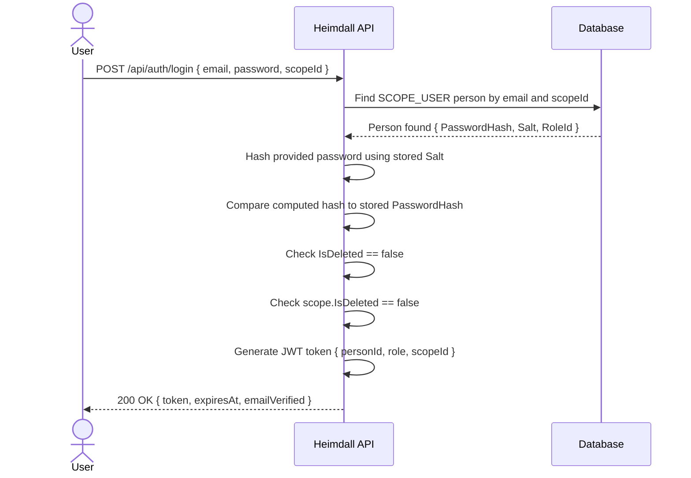

**Main Flow (Scope Admin / System Admin):**

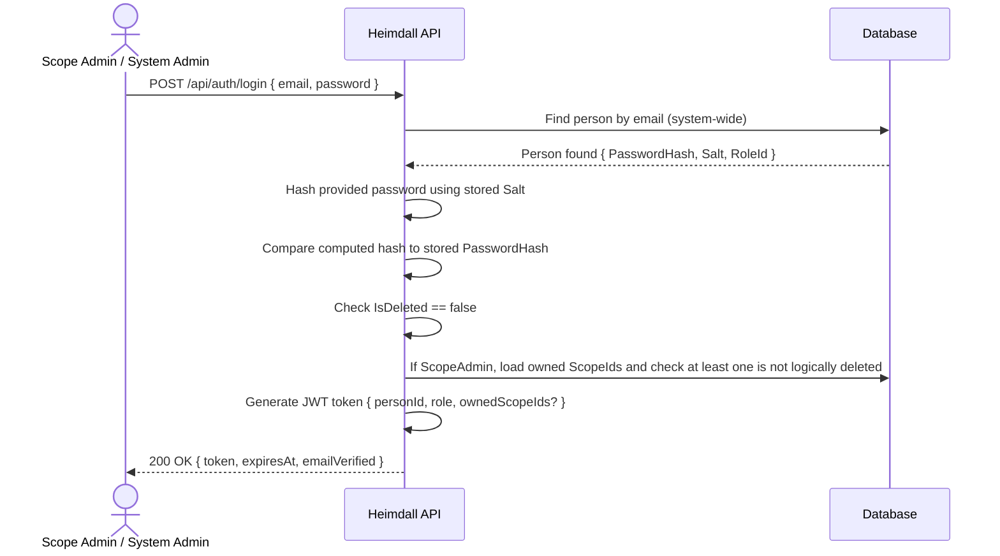

1. Caller sends email and password to `POST /api/auth/login` (a `User` also sends their scope ID). The endpoint is open to anonymous callers — it is where every other endpoint's token comes from.
2. The system locates the person: a `User` is looked up by email within the given scope; a `ScopeAdmin`/`SystemAdmin` is looked up by email system-wide. Emails are compared case-insensitively, and the lookup does not filter logically deleted persons — AF-11c rejects them at step 4.
3. The system hashes the provided password using the person's stored `Salt` and compares it to the stored `PasswordHash`.
4. The system confirms the person is not logically deleted.
5. For a `User`, the system confirms their scope is not logically deleted. For a `ScopeAdmin`, the system confirms at least one owned scope is not logically deleted.
6. If the person does not have active two-factor authentication (`TWO_FACTOR_AUTH.IsActive`), the system generates and returns the full authentication token containing the person's `PublicId` and role, plus: the scope's `PublicId` for a `User`; the list of owned scopes' `PublicId`s for a `ScopeAdmin` — only those not logically deleted; no scope claim for a `SystemAdmin`. The response also reports when the token expires. If the person does have active two-factor authentication, go to AF-11g instead.

**Alternative Flows:**

| ID | Condition | Outcome |
| ---- | ----------- | --------- |
| AF-11a | Person not found | Return `401 Unauthorized` |
| AF-11b | Password mismatch | Return `401 Unauthorized` |
| AF-11c | Person is logically deleted | Return `401 Unauthorized` |
| AF-11d | User's scope is logically deleted | Return `401 Unauthorized` |
| AF-11e | Scope Admin's owned scopes are all logically deleted | Return `401 Unauthorized` |
| AF-11f | Email missing or malformed, or password missing | Return `400 Bad Request` |
| AF-11g | Person has active two-factor authentication (FR-2F-07) | Return `200 OK` with a short-lived challenge token and the available second-factor methods, instead of the full authentication token; if the Email method is enabled, also send a fresh email code (FR-2F-08). See UC-38 for how the login is completed |

> **On the single rejection.** AF-11a through AF-11e are five different conditions with one
> indistinguishable response: the same `401` and the same message. Telling them apart would turn the
> login endpoint into a directory — confirming which emails are registered, which accounts have been
> deleted, and which scopes still exist — to a caller who has proved nothing. UC-12 takes the same
> position for password recovery.
>
> **On AF-11f.** NFR-10 requires every input to be validated, so a request missing an email or
> password is refused as malformed before any lookup happens. The validation deliberately stops
> short of a minimum password length, unlike person creation: at login a short password is a wrong
> password (401), and answering `400` to it would tell the caller their guess was too short to be
> anyone's password.

---

### UC-12: Password Recovery

| Field | Value |
| ------- | ------- |
| **ID** | UC-12 |
| **Name** | Request Password Recovery |
| **Actors** | Anonymous |
| **Description** | Request a password reset email |
| **Preconditions** | None |
| **Postconditions** | A password reset token is generated and emailed to the person |

**Main Flow:**

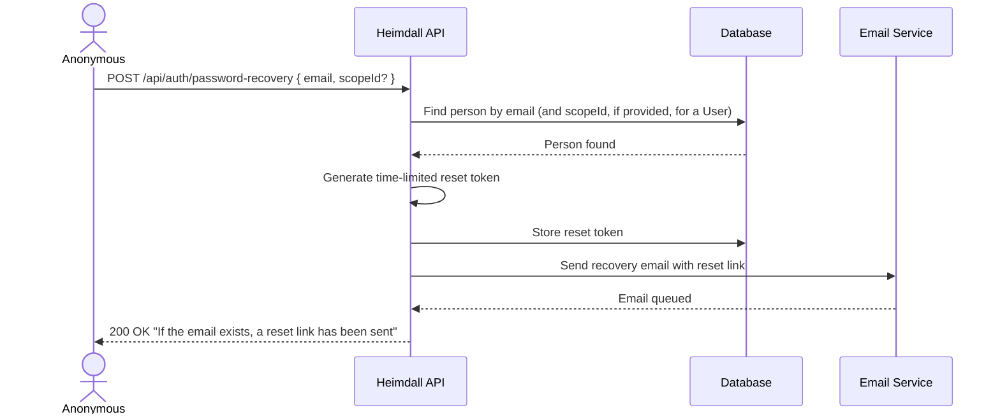

1. Caller provides their email (and scope ID, if they are a `User`, since email is only unique within a scope for Users).
2. The system locates the person.
3. The system generates a time-limited password reset token.
4. The system stores the token and sends a recovery email.
5. The system returns a generic success message (does not reveal whether the email exists).

**Alternative Flows:**

| ID | Condition | Outcome |
| ---- | ----------- | --------- |
| AF-12a | Email not found | Return `200 OK` with same generic message (prevents enumeration) |

---

### UC-13: Reset Password

| Field | Value |
| ------- | ------- |
| **ID** | UC-13 |
| **Name** | Reset Password |
| **Actors** | Anonymous |
| **Description** | Set a new password using a valid reset token |
| **Preconditions** | A valid, non-expired reset token exists |
| **Postconditions** | Person's password is updated; the token is marked as used |

**Main Flow:**

1. Caller provides the reset token and a new password.
2. The system validates the token (exists, not expired, not used).
3. The system generates a new random `Salt`, hashes the new password using it, and updates the person's `PasswordHash` and `Salt`.
4. The system marks the token as used.
5. The system returns success.

**Alternative Flows:**

| ID | Condition | Outcome |
| ---- | ----------- | --------- |
| AF-13a | Token expired | Return `400 Bad Request` — "Token expired" |
| AF-13b | Token already used | Return `400 Bad Request` — "Token already used" |
| AF-13c | Token not found | Return `400 Bad Request` — "Invalid token" |
| AF-13d | New password fails validation | Return `400 Bad Request` with validation errors |

---

### UC-14: Email Verification

| Field | Value |
| ------- | ------- |
| **ID** | UC-14 |
| **Name** | Verify Email |
| **Actors** | Anonymous (via email link) |
| **Description** | Confirm a person's email address |
| **Preconditions** | A valid, non-expired verification token exists |
| **Postconditions** | Person's `EmailVerified` is set to `true`; the token is marked as used |

**Main Flow:**

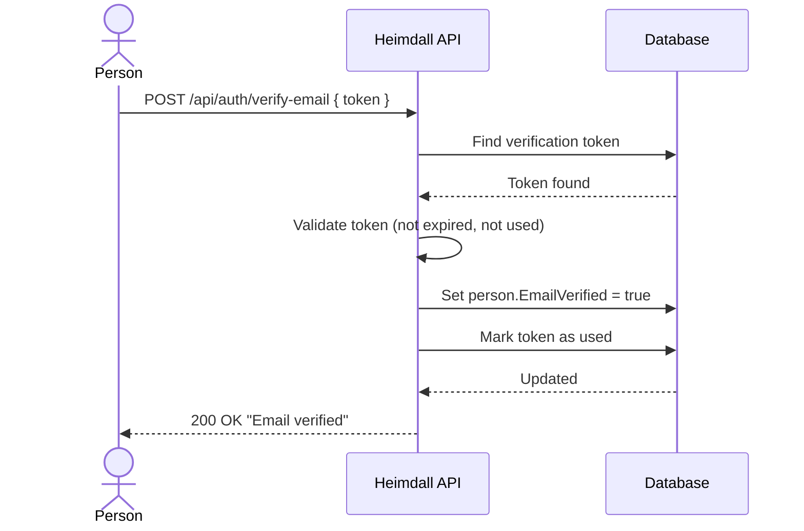

1. Person clicks the verification link which calls the API with the token.
2. The system locates and validates the token.
3. The system sets `EmailVerified = true` on the person record.
4. The system marks the token as used.
5. The system returns success.

**Alternative Flows:**

| ID | Condition | Outcome |
| ---- | ----------- | --------- |
| AF-14a | Token expired | Return `400 Bad Request` — "Token expired" |
| AF-14b | Token already used | Return `400 Bad Request` — "Token already used" |
| AF-14c | Token not found | Return `400 Bad Request` — "Invalid token" |

---

### UC-15: Resend Verification Email

| Field | Value |
| ------- | ------- |
| **ID** | UC-15 |
| **Name** | Resend Verification Email |
| **Actors** | User, Scope Admin, System Admin |
| **Description** | Resend the email verification message |
| **Preconditions** | Actor is authenticated; email is not already verified |
| **Postconditions** | A new verification token is generated and emailed |

**Main Flow:**

1. Authenticated person requests a new verification email.
2. The system checks that the email is not already verified.
3. The system invalidates any existing verification tokens.
4. The system generates a new time-limited verification token.
5. The system sends the verification email.
6. The system returns success.

**Alternative Flows:**

| ID | Condition | Outcome |
| ---- | ----------- | --------- |
| AF-15a | Email already verified | Return `400 Bad Request` — "Email already verified" |

---

### UC-16: Create Application

| Field | Value |
| ------- | ------- |
| **ID** | UC-16 |
| **Name** | Create Application |
| **Actors** | System Admin, Scope Admin |
| **Description** | Register a new application (a non-person identity representing another system) within a scope |
| **Preconditions** | Actor is authenticated; target scope exists and is not logically deleted; the owner is an existing, non-logically-deleted `ScopeAdmin` who owns the scope (via `SCOPE_OWNER`) |
| **Postconditions** | A new application record exists, associated with the scope and owned by the specified `ScopeAdmin` |

**Main Flow:**

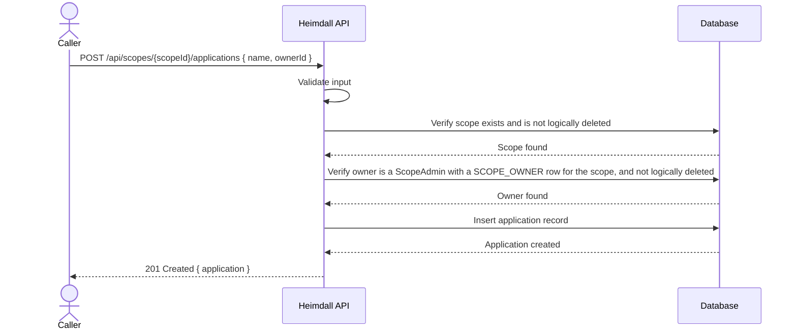

1. Caller sends a request with application data (name, ownerId) targeting a scope.
2. The system validates all fields.
3. The system verifies the target scope exists and is not logically deleted.
4. The system verifies the owner is an existing, non-logically-deleted `ScopeAdmin` who owns the scope.
5. The system creates the application record with `IsDeleted = false`.
6. The system returns the created application.

**Alternative Flows:**

| ID | Condition | Outcome |
| ---- | ----------- | --------- |
| AF-16a | Scope not found or logically deleted | Return `404 Not Found` |
| AF-16b | Owner not found, logically deleted, not a `ScopeAdmin`, or not an owner of the scope (no `SCOPE_OWNER` row) | Return `400 Bad Request` |
| AF-16c | Scope Admin attempts to set an owner other than themself | Return `403 Forbidden` |
| AF-16d | Invalid input | Return `400 Bad Request` |
| AF-16e | Scope Admin does not own the target scope | Return `403 Forbidden` |

---

### UC-17: View Application

| Field | Value |
| ------- | ------- |
| **ID** | UC-17 |
| **Name** | View Application |
| **Actors** | System Admin, Scope Admin |
| **Description** | Retrieve an application's details or list applications within a scope |
| **Preconditions** | Actor is authenticated |
| **Postconditions** | Application information is returned |

**Main Flow:**

1. Actor requests an application by ID, or a list of the applications within a scope.
2. The system checks authorization:
   - System Admin: can view every application, in any scope.
   - Scope Admin: can view only the applications they own. To list a scope's applications they must also own that scope.
3. Logically deleted applications are excluded unless explicitly requested.
4. The system returns application data.

**Alternative Flows:**

| ID | Condition | Outcome |
| ---- | ----------- | --------- |
| AF-17a | Application not found, or — when listing — the scope is not found or is logically deleted | Return `404 Not Found` |
| AF-17b | Actor not authorized: a Scope Admin who does not own the requested application, a Scope Admin who does not own the scope being listed, or a `User` | Return `403 Forbidden` |

---

### UC-18: Update Application

| Field | Value |
| ------- | ------- |
| **ID** | UC-18 |
| **Name** | Update Application |
| **Actors** | System Admin, Scope Admin |
| **Description** | Modify an application's name or owner |
| **Preconditions** | Actor is authenticated; application exists and is not logically deleted |
| **Postconditions** | Application record is updated |

**Main Flow:**

1. Actor sends an update request with the application ID and new values.
2. The system validates the input.
3. The system checks authorization:
   - System Admin: can update any application.
   - Scope Admin: can update only the applications they own.
4. If the owner changes, the system verifies the new owner is an existing, non-logically-deleted `ScopeAdmin` who owns the application's scope.
5. The system applies the updates and sets `UpdatedAt`.
6. The system returns the updated application.

**Alternative Flows:**

| ID | Condition | Outcome |
| ---- | ----------- | --------- |
| AF-18a | Application not found or logically deleted | Return `404 Not Found` |
| AF-18b | New owner not found, logically deleted, not a `ScopeAdmin`, or not an owner of the application's scope | Return `400 Bad Request` |
| AF-18c | Actor not authorized | Return `403 Forbidden` |

---

### UC-19: Logical Delete Application

| Field | Value |
| ------- | ------- |
| **ID** | UC-19 |
| **Name** | Logical Delete Application |
| **Actors** | System Admin, Scope Admin |
| **Description** | Soft-delete an application by setting `IsDeleted = true` |
| **Preconditions** | Actor is authenticated; application exists |
| **Postconditions** | Application's `IsDeleted` is `true` |

**Main Flow:**

1. Actor sends a delete request for an application.
2. The system checks authorization (System Admin, or the `ScopeAdmin` who owns the application).
3. The system sets `IsDeleted = true` on the application record.
4. The system returns success.

**Alternative Flows:**

| ID | Condition | Outcome |
| ---- | ----------- | --------- |
| AF-19a | Application not found | Return `404 Not Found` |
| AF-19b | Already logically deleted | Return `200 OK` (idempotent) |
| AF-19c | Actor not authorized | Return `403 Forbidden` |

---

### UC-20: Hard Delete Application

| Field | Value |
| ------- | ------- |
| **ID** | UC-20 |
| **Name** | Hard Delete Application |
| **Actors** | System Admin |
| **Description** | Permanently remove an application record from the database |
| **Preconditions** | Actor is authenticated with `SystemAdmin` role; application exists |
| **Postconditions** | Application record is permanently removed |

**Main Flow:**

1. System Admin sends a hard delete request.
2. The system permanently deletes the application record.
3. The system returns success.

**Alternative Flows:**

| ID | Condition | Outcome |
| ---- | ----------- | --------- |
| AF-20a | Application not found | Return `404 Not Found` |

---

### UC-21: Add Scope Owner

| Field | Value |
| ------- | ------- |
| **ID** | UC-21 |
| **Name** | Add Scope Owner |
| **Actors** | System Admin, Scope Admin (existing owner) |
| **Description** | Add an existing `ScopeAdmin` person as an additional owner of a scope. To make a brand-new person a co-owner, see UC-06 (path c); to make an existing `User` of the scope a co-owner, see UC-23 (Promote User to Scope Owner) |
| **Preconditions** | Actor is authenticated with `SystemAdmin` role, or is an existing owner of the target scope; the target person exists, is not logically deleted, and has the `ScopeAdmin` role |
| **Postconditions** | A new `SCOPE_OWNER` row links the scope to the person |

**Main Flow:**

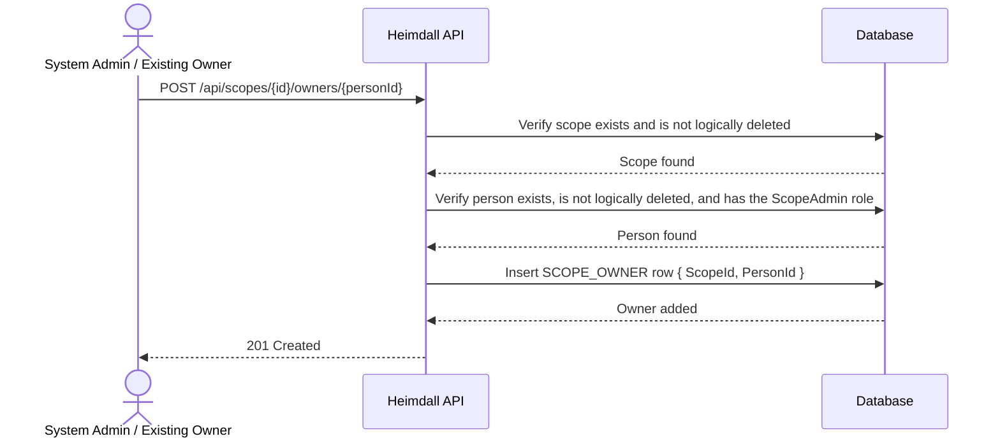

1. Actor sends a request to add a person as an owner of a scope.
2. The system verifies the scope exists and is not logically deleted.
3. The system verifies the person exists, is not logically deleted, and has the `ScopeAdmin` role.
4. The system inserts a `SCOPE_OWNER` row linking the scope to the person (no-op if it already exists).
5. The system returns success.

**Alternative Flows:**

| ID | Condition | Outcome |
| ---- | ----------- | --------- |
| AF-21a | Scope not found or logically deleted | Return `404 Not Found` |
| AF-21b | Person not found, logically deleted, or not a `ScopeAdmin` | Return `400 Bad Request` |
| AF-21c | Actor not authorized (not System Admin nor an existing owner) | Return `403 Forbidden` |
| AF-21d | Person is already an owner of the scope | Return `200 OK` (idempotent) |

---

### UC-22: Remove Scope Owner

| Field | Value |
| ------- | ------- |
| **ID** | UC-22 |
| **Name** | Remove Scope Owner |
| **Actors** | System Admin, Scope Admin (existing owner) |
| **Description** | Remove a Scope Admin's ownership of a scope |
| **Preconditions** | Actor is authenticated with `SystemAdmin` role, or is an existing owner of the target scope; the scope has more than one owner |
| **Postconditions** | The `SCOPE_OWNER` row linking the scope to the person is removed |

**Main Flow:**

1. Actor sends a request to remove a person's ownership of a scope.
2. The system verifies the scope exists and that the person is currently an owner.
3. The system verifies the scope has more than one owner.
4. The system removes the `SCOPE_OWNER` row.
5. The system returns success.

**Alternative Flows:**

| ID | Condition | Outcome |
| ---- | ----------- | --------- |
| AF-22a | Scope not found, or person is not an owner of it | Return `404 Not Found` |
| AF-22b | Scope has only one owner (this one) | Return `409 Conflict` — "Cannot remove the last owner of a scope" |
| AF-22c | Actor not authorized (not System Admin nor an existing owner) | Return `403 Forbidden` |

---

### UC-23: Promote User to Scope Owner

| Field | Value |
| ------- | ------- |
| **ID** | UC-23 |
| **Name** | Promote User to Scope Owner |
| **Actors** | System Admin, Scope Admin (existing owner) |
| **Description** | Promote an existing `User` of a scope to `ScopeAdmin`, making them a co-owner of that scope |
| **Preconditions** | Actor is authenticated with `SystemAdmin` role, or is an existing owner of the target scope; the target person exists, is not logically deleted, and is currently a `User` belonging to that scope (via `SCOPE_USER`) |
| **Postconditions** | The person's `RoleId` is changed to `ScopeAdmin`; their `SCOPE_USER` row is removed; a new `SCOPE_OWNER` row links them to the scope |

**Main Flow:**

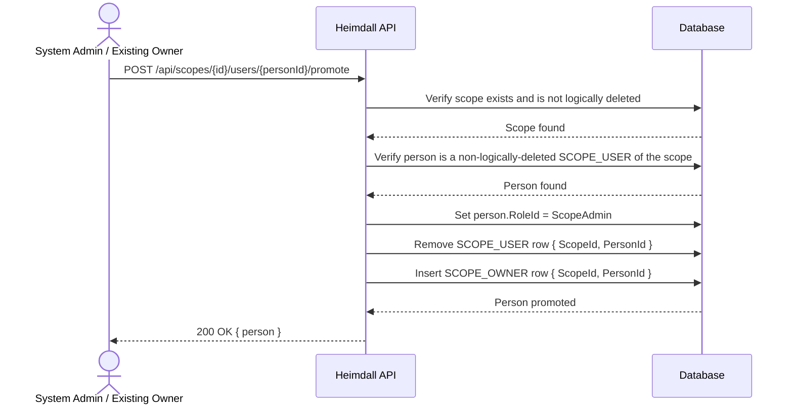

1. Actor sends a request to promote a person to owner of a scope.
2. The system verifies the scope exists and is not logically deleted.
3. The system verifies the person exists, is not logically deleted, and is currently a `User` belonging to that scope.
4. The system changes the person's `RoleId` to `ScopeAdmin`.
5. The system removes the person's `SCOPE_USER` row and inserts a `SCOPE_OWNER` row linking them to the scope.
6. The system returns the updated person.

**Alternative Flows:**

| ID | Condition | Outcome |
| ---- | ----------- | --------- |
| AF-23a | Scope not found or logically deleted | Return `404 Not Found` |
| AF-23b | Person not found, logically deleted, or not a `User` of that scope | Return `400 Bad Request` |
| AF-23c | Actor not authorized (not System Admin nor an existing owner) | Return `403 Forbidden` |
| AF-23d | Person is already a `ScopeAdmin` | Return `409 Conflict` — "Person already holds the ScopeAdmin role" |
| AF-23e | Person's email collides with an existing `ScopeAdmin`/`SystemAdmin` elsewhere in the system (FR-PE-09) — the promoted person moves from the scope-local `User` email namespace to the global admin namespace | Return `409 Conflict` |

> **On AF-23e.** A `User`'s email is unique only within their scope; a `ScopeAdmin`'s is unique
> system-wide (FR-PE-09). Promotion moves the person between those two namespaces, so the same email
> that was fine as a `User` can collide with an existing admin the moment it becomes global. This is
> checked the same way UC-08's role change re-checks uniqueness against the role the person is about
> to hold.

---

### UC-24: Enable/Disable Google Sign-In

| Field | Value |
| ------- | ------- |
| **ID** | UC-24 |
| **Name** | Enable/Disable Google Sign-In |
| **Actors** | System Admin, Scope Admin (existing owner) |
| **Description** | Turn Google Sign-In on or off for a scope, controlling whether Users of that scope may sign up/sign in with a Google account |
| **Preconditions** | Actor is authenticated with `SystemAdmin` role, or is an existing owner of the target scope; the scope exists |
| **Postconditions** | The scope's `GoogleSignInEnabled` flag is updated |

**Main Flow:**

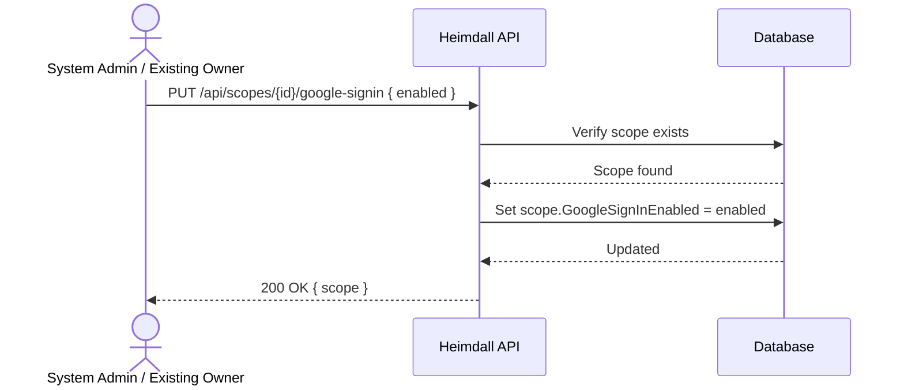

1. Actor sends a request to enable or disable Google Sign-In for a scope.
2. The system validates the input fields.
3. The system verifies the scope exists.
4. The system checks authorization: System Admin, or an existing owner of the scope.
5. The system sets `GoogleSignInEnabled` to the requested value.
6. The system returns the updated scope.

**Alternative Flows:**

| ID | Condition | Outcome |
| ---- | ----------- | --------- |
| AF-24a | Scope not found | Return `404 Not Found` |
| AF-24b | Actor not authorized (not System Admin nor an existing owner) | Return `403 Forbidden` |
| AF-24c | `enabled` not supplied | Return `400 Bad Request` |

> **On AF-24c.** The request body carries a single boolean, so an omitted `enabled` cannot be
> distinguished from an explicit `false` once bound — a malformed request would silently perform the
> *disable* half of this use case. The value is therefore required rather than defaulted, and is
> checked before the scope is looked up (step 2, as in UC-01). NFR-10 already asks for this; the flow
> is named here so the refusal is specified rather than incidental.

---

### UC-25: Sign Up / Sign In via Google

| Field | Value |
| ------- | ------- |
| **ID** | UC-25 |
| **Name** | Sign Up / Sign In via Google |
| **Actors** | Anonymous, Google Identity Platform |
| **Description** | Authenticate with a Google account against a specific scope. If no Google User exists yet for that Google account in that scope, one is created (sign-up); otherwise the existing Google User is authenticated (sign-in). Only usable for scopes with `GoogleSignInEnabled = true`, and only ever produces a `User`-equivalent identity |
| **Preconditions** | The target scope exists, is not logically deleted, and has `GoogleSignInEnabled = true`; the caller holds a valid Google ID token |
| **Postconditions** | A Google User record exists for this Google account within the scope (created if this was the first sign-in), with its stored `EmailVerified` refreshed from the token's claims when they differ (FR-GO-19); an authentication token is issued, and the response reports whether the account's email is verified |

**Main Flow:**

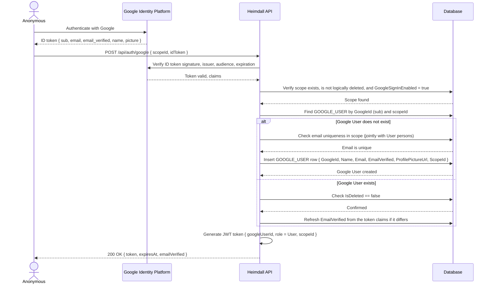

1. The caller authenticates with Google (outside this API) and obtains a signed ID token.
2. The caller sends the ID token and target scope ID to the API.
3. The system verifies the ID token's signature, issuer, audience, and expiration.
4. The system verifies the target scope exists, is not logically deleted, and has `GoogleSignInEnabled = true`.
5. The system looks up a Google User by `GoogleId` (the token's `sub` claim) within the scope.
6. If none exists: the system verifies the token's `email` is unique within the scope (jointly with `User` persons' emails), then creates a new Google User populated from the token's claims (`Name`, `Email`, `EmailVerified`, `ProfilePictureUrl`).
7. If one exists: the system confirms it is not logically deleted, and refreshes the stored `EmailVerified` from the token's claims when the two differ (FR-GO-19).
8. The system issues an authentication token containing the Google User's ID, `role = User`, and the scope ID.

**Alternative Flows:**

| ID | Condition | Outcome |
| ---- | ----------- | --------- |
| AF-25a | ID token invalid, expired, or fails verification | Return `401 Unauthorized` |
| AF-25b | Scope not found, logically deleted, or `GoogleSignInEnabled = false` | Return `403 Forbidden` |
| AF-25c | Email from the token already used by another Google User or `User` person in the scope | Return `409 Conflict` |
| AF-25d | Existing Google User is logically deleted | Return `401 Unauthorized` |

---

### UC-26: Sign Out via Google

| Field | Value |
| ------- | ------- |
| **ID** | UC-26 |
| **Name** | Sign Out via Google |
| **Actors** | Google User |
| **Description** | End a Google User's authenticated session |
| **Preconditions** | The caller holds a valid authentication token issued via UC-25 |
| **Postconditions** | The token is invalidated/discarded and no longer usable |

**Main Flow:**

1. The Google User sends a sign-out request with their current token.
2. The system invalidates the token (e.g., via a revocation list) or instructs the client to discard it, per the configured token strategy.
3. The system returns success.

**Alternative Flows:**

| ID | Condition | Outcome |
| ---- | ----------- | --------- |
| AF-26a | Token missing or already invalid | Return `401 Unauthorized` |

---

### UC-27: View Google User

| Field | Value |
| ------- | ------- |
| **ID** | UC-27 |
| **Name** | View Google User |
| **Actors** | System Admin, Scope Admin, Google User |
| **Description** | Retrieve a Google User's details or list Google Users within a scope |
| **Preconditions** | Actor is authenticated |
| **Postconditions** | Google User information is returned |

**Main Flow:**

1. Actor requests a Google User by ID or a list of Google Users within a scope.
2. The system checks authorization:
   - System Admin: can view any Google User.
   - Scope Admin: can view the Google Users of the scopes they own.
   - Google User: can view only their own record.
3. Logically deleted Google Users are excluded unless explicitly requested.
4. The system returns Google User data.

**Alternative Flows:**

| ID | Condition | Outcome |
| ---- | ----------- | --------- |
| AF-27a | Google User not found | Return `404 Not Found` |
| AF-27b | Actor not authorized | Return `403 Forbidden` |

---

### UC-28: Logical Delete Google User

| Field | Value |
| ------- | ------- |
| **ID** | UC-28 |
| **Name** | Logical Delete Google User |
| **Actors** | System Admin, Scope Admin |
| **Description** | Soft-delete a Google User by setting `IsDeleted = true` |
| **Preconditions** | Actor is authenticated; Google User exists |
| **Postconditions** | Google User's `IsDeleted` is `true` |

**Main Flow:**

1. Actor sends a delete request for a Google User.
2. The system checks authorization: System Admin, or an owner of the Google User's scope.
3. The system sets `IsDeleted = true` on the Google User record.
4. The system returns success.

**Alternative Flows:**

| ID | Condition | Outcome |
| ---- | ----------- | --------- |
| AF-28a | Google User not found | Return `404 Not Found` |
| AF-28b | Already logically deleted | Return `200 OK` (idempotent) |
| AF-28c | Actor not authorized | Return `403 Forbidden` |

---

### UC-29: Hard Delete Google User

| Field | Value |
| ------- | ------- |
| **ID** | UC-29 |
| **Name** | Hard Delete Google User |
| **Actors** | System Admin |
| **Description** | Permanently remove a Google User record from the database |
| **Preconditions** | Actor is authenticated with `SystemAdmin` role; Google User exists |
| **Postconditions** | Google User record is permanently removed |

**Main Flow:**

1. System Admin sends a hard delete request.
2. The system permanently deletes the Google User record.
3. The system returns success.

**Alternative Flows:**

| ID | Condition | Outcome |
| ---- | ----------- | --------- |
| AF-29a | Google User not found | Return `404 Not Found` |

---

### UC-31: Create Scope Permission

| Field | Value |
| ------- | ------- |
| **ID** | UC-31 |
| **Name** | Create Scope Permission |
| **Actors** | System Admin, Scope Admin |
| **Description** | Register a new scope-specific permission within a scope. The permission carries a `Name`, an optional `Description`, and an `IncludeAsJwtClaim` flag controlling whether the `Name` is folded into the JWT issued to identities acting within the scope (FR-AU-08). A scope permission has no separate owner of its own — owning the scope is the whole of the authorization |
| **Preconditions** | Actor is authenticated; target scope exists and is not logically deleted; for a Scope Admin, the actor must own the target scope |
| **Postconditions** | A new scope permission record exists, associated with the scope, with `IsDeleted = false` and `IncludeAsJwtClaim` set as supplied (default `false`) |

**Main Flow:**

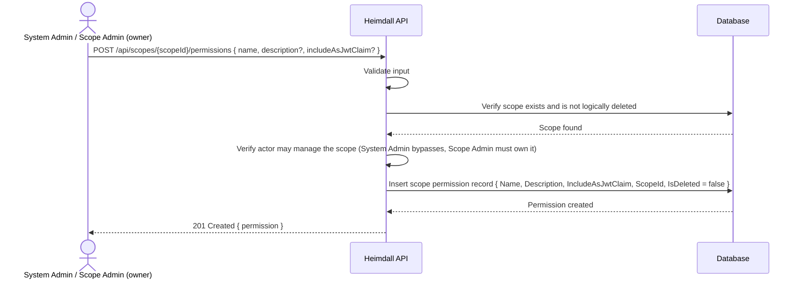

1. Caller sends a request with the permission `Name`, an optional `Description`, and an optional `IncludeAsJwtClaim` flag, targeting a scope.
2. The system validates the input shape: `Name` is required and at most 200 characters; `Description`, when supplied, is at most 500 characters.
3. The system verifies the target scope exists and is not logically deleted.
4. The system verifies the actor may manage the scope — a System Admin bypasses the check; a Scope Admin must own it.
5. The system creates the scope permission record with `IsDeleted = false` and `IncludeAsJwtClaim` as supplied (defaulting to `false` when omitted).
6. The system returns the created permission.

**Alternative Flows:**

| ID | Condition | Outcome |
| ---- | ----------- | --------- |
| AF-31a | Scope not found or logically deleted | Return `404 Not Found` |
| AF-31d | Invalid input — `Name` missing or over 200 characters, or `Description` over 500 characters | Return `400 Bad Request` with validation errors |
| AF-31e | Scope Admin does not own the target scope | Return `403 Forbidden` |

> **On the role gate.** The endpoint carries `[RoleRequirement(SystemAdmin, ScopeAdmin)]`, so a `User` is refused with `403` before the handler runs — independently of the data-dependent AF-31e. The same framework-level refusal applies to every scope-permission endpoint in UC-31 through UC-34; only UC-35 restricts further, to `SystemAdmin` alone. These framework refusals are not listed as separate alternative flows because they are settled by the attribute, not by the use case's data rules.

---

### UC-32: View Scope Permission

| Field | Value |
| ------- | ------- |
| **ID** | UC-32 |
| **Name** | View Scope Permission |
| **Actors** | System Admin, Scope Admin |
| **Description** | Retrieve a scope permission's details or list the permissions within a scope. There are two distinct reads: (a) a single permission by ID, via `GET /api/scopes/{scopeId}/permissions/{id}`; or (b) the permissions of a scope, via `GET /api/scopes/{scopeId}/permissions` |
| **Preconditions** | Actor is authenticated |
| **Postconditions** | Scope permission information is returned |

**Main Flow (read a — permission by ID):**

1. Actor requests a scope permission by ID within a scope.
2. The system loads the permission, qualifying the lookup by the route's `scopeId`, and excluding logically deleted permissions unless `includeDeleted` is explicitly requested (FR-SP-09).
3. The system checks authorization: a System Admin sees any permission; a Scope Admin must own the permission's scope.
4. The system returns the permission data.

**Main Flow (read b — list a scope's permissions):**

1. A System Admin or a Scope Admin requests the permissions of a scope, optionally filtering by `Name` (case-insensitive) and paging the result (FR-SP-05).
2. The system verifies the scope exists and is not logically deleted.
3. The system verifies the actor may manage the scope: a System Admin always may; a Scope Admin must own it.
4. The system returns the page of the scope's permissions, excluding logically deleted permissions unless explicitly requested. There is no per-owner narrowing — a scope permission has no owner of its own, so owning the scope is the whole of the rule.

**Alternative Flows:**

| ID | Condition | Outcome |
| ---- | ----------- | --------- |
| AF-32a | Permission not found under the addressed scope, or logically deleted and not explicitly requested (read a) | Return `404 Not Found` |
| AF-32b | Scope not found or logically deleted (read b — reuses AF-31a) | Return `404 Not Found` |
| AF-32e | Actor not authorized — a Scope Admin who does not own the target scope (reads a, b) | Return `403 Forbidden` |

---

### UC-33: Update Scope Permission

| Field | Value |
| ------- | ------- |
| **ID** | UC-33 |
| **Name** | Update Scope Permission |
| **Actors** | System Admin, Scope Admin |
| **Description** | Modify a scope permission's `Name`, `Description`, and `IncludeAsJwtClaim` flag |
| **Preconditions** | Actor is authenticated; permission exists under the addressed scope and is not logically deleted |
| **Postconditions** | Scope permission record is updated |

**Main Flow:**

1. Actor sends an update request to `PUT /api/scopes/{scopeId}/permissions/{id}` with the new `Name`, `Description`, and `IncludeAsJwtClaim` values.
2. The system validates the input shape, reusing UC-31's rules.
3. The system loads the permission inside the addressed scope, excluding logically deleted permissions.
4. The system checks authorization: a System Admin may update any permission; a Scope Admin must own the permission's scope.
5. The system applies the updates and stamps `UpdatedAt`.
6. The system returns the updated permission.

**Alternative Flows:**

| ID | Condition | Outcome |
| ---- | ----------- | --------- |
| AF-33a | Permission not found under the addressed scope, or logically deleted | Return `404 Not Found` |
| AF-33d | Invalid input (reuses AF-31d) | Return `400 Bad Request` with validation errors |
| AF-33e | Scope Admin does not own the permission's scope | Return `403 Forbidden` |

---

### UC-34: Logical Delete Scope Permission

| Field | Value |
| ------- | ------- |
| **ID** | UC-34 |
| **Name** | Logical Delete Scope Permission |
| **Actors** | System Admin, Scope Admin |
| **Description** | Soft-delete a scope permission by setting `IsDeleted = true`. Nothing cascades — a scope permission owns no dependent row |
| **Preconditions** | Actor is authenticated; the permission exists under the addressed scope |
| **Postconditions** | The permission's `IsDeleted` is `true` |

**Main Flow:**

1. Actor sends `DELETE /api/scopes/{scopeId}/permissions/{id}`.
2. The system locates the permission inside the addressed scope in **any** deletion state — an already-deleted permission must be found so AF-34b can answer idempotently rather than as a `404`.
3. The system checks authorization: a System Admin may delete any permission; a Scope Admin must own the permission's scope. This runs before the idempotent check, so an already-deleted permission cannot be used to probe for scopes the caller may not act on.
4. If the permission is already logically deleted, the system returns success with `alreadyDeleted = true` and writes nothing.
5. Otherwise the system sets `IsDeleted = true`, stamps `UpdatedAt`, and returns success with `alreadyDeleted = false`.

**Alternative Flows:**

| ID | Condition | Outcome |
| ---- | ----------- | --------- |
| AF-34a | Permission not found under the addressed scope | Return `404 Not Found` |
| AF-34b | Already logically deleted | Return `200 OK` (idempotent), with `alreadyDeleted = true` |
| AF-34e | Scope Admin does not own the permission's scope | Return `403 Forbidden` |

---

### UC-35: Hard Delete Scope Permission

| Field | Value |
| ------- | ------- |
| **ID** | UC-35 |
| **Name** | Hard Delete Scope Permission |
| **Actors** | System Admin |
| **Description** | Permanently remove a scope permission record from the database |
| **Preconditions** | Actor is authenticated with `SystemAdmin` role; the permission exists under the addressed scope |
| **Postconditions** | The scope permission record is permanently removed. Nothing cascades — a scope permission is a leaf in the data model |

**Main Flow:**

1. System Admin sends `DELETE /api/scopes/{scopeId}/permissions/{id}/hard`.
2. The system locates the permission inside the addressed scope in **any** deletion state — a logically deleted permission is exactly what a cleanup pass starts from, so soft deletion must not block a hard one.
3. The system permanently deletes the record. No dependent is removed first — no entity carries a foreign key to a scope permission.
4. The system returns success.

**Alternative Flows:**

| ID | Condition | Outcome |
| ---- | ----------- | --------- |
| AF-35a | Permission not found under the addressed scope (includes a repeated call — the row is already gone, and UC-35 has no idempotent path) | Return `404 Not Found` |

> **On UC-35's only refusals.** Authorization is settled entirely by the endpoint's `[RoleRequirement(SystemAdmin)]`: a `ScopeAdmin` or `User` is refused with `403` before the handler runs, and an unauthenticated caller is refused with `401`. No data-dependent authorization rule is left for the handler to apply, which is why no AF-35e appears here — unlike UC-31 through UC-34, whose scope-ownership rule is data-dependent and lives in the handler.

---

### UC-36: Enable Two-Factor Authentication

| Field | Value |
| ------- | ------- |
| **ID** | UC-36 |
| **Name** | Enable Two-Factor Authentication (Initiate Setup) |
| **Actors** | User, Scope Admin, System Admin |
| **Description** | Begin opting an authenticated person into two-factor authentication, selecting an authenticator-app method, an email method, or both. Setup is inactive until confirmed by UC-37 |
| **Preconditions** | Actor is authenticated; the person has no active two-factor configuration (`TWO_FACTOR_AUTH.IsActive` is not already `true`) |
| **Postconditions** | A `TWO_FACTOR_AUTH` row exists for the person with `IsActive = false`; for the App method, a TOTP secret has been generated and returned; for the Email method, a first code has been emailed |

**Main Flow:**

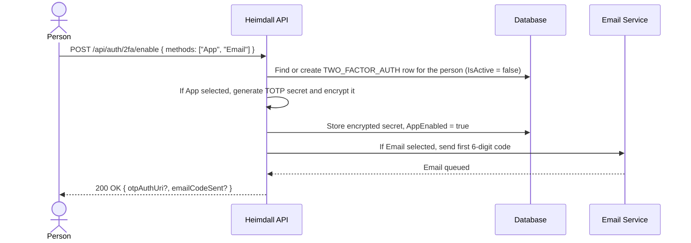

1. Caller sends `POST /api/auth/2fa/enable` with the method(s) they want: `App`, `Email`, or both.
2. The system confirms the caller has no already-active two-factor configuration, then creates (or reuses a not-yet-confirmed) `TWO_FACTOR_AUTH` row for them.
3. If `App` was selected, the system generates a random TOTP secret (RFC 6238), stores it encrypted, and returns an `otpauth://` provisioning URI for QR scanning. The plaintext secret is never stored — only the encrypted form.
4. If `Email` was selected, the system generates a random 6-digit code, stores it (hashed, 10-minute expiry), and sends it through the email service.
5. The system returns success, confirming which method(s) are pending confirmation. Nothing is active yet — UC-37 finishes the job.

**Alternative Flows:**

| ID | Condition | Outcome |
| ---- | ----------- | --------- |
| AF-36a | Two-factor authentication is already active for the person | Return `409 Conflict` |
| AF-36b | Caller is a Google User | Return `403 Forbidden` — Google Users are not eligible (FR-2F-01) |
| AF-36c | Neither `App` nor `Email` selected | Return `400 Bad Request` |
| AF-36d | Re-initiating setup while a prior, unconfirmed setup exists | Overwrite the pending configuration with the new selection (regenerates the TOTP secret and/or resends the email code); return `200 OK` exactly as the main flow |

---

### UC-37: Confirm Two-Factor Authentication Setup

| Field | Value |
| ------- | ------- |
| **ID** | UC-37 |
| **Name** | Confirm Two-Factor Authentication Setup |
| **Actors** | User, Scope Admin, System Admin |
| **Description** | Prove control of every method selected in UC-36 to activate two-factor authentication and receive the one-time set of recovery codes |
| **Preconditions** | A pending (`IsActive = false`) `TWO_FACTOR_AUTH` row exists for the person, from UC-36 |
| **Postconditions** | `TWO_FACTOR_AUTH.IsActive` is `true`; exactly ten recovery codes exist, hashed, and were returned to the caller in plaintext this one time |

**Main Flow:**

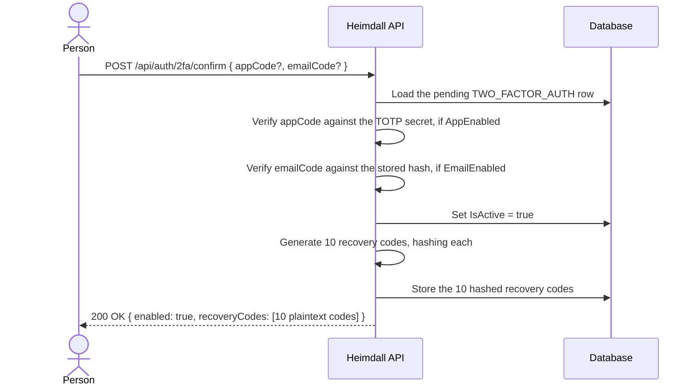

1. Caller sends `POST /api/auth/2fa/confirm` with a code for every method they selected in UC-36 (an `appCode` if `AppEnabled`, an `emailCode` if `EmailEnabled` — both, if both).
2. The system verifies each provided code against its method: the TOTP code against the stored secret, the email code against its stored hash and expiry.
3. Only once every required code checks out, the system sets `IsActive = true`.
4. The system generates ten random recovery codes, hashes each, and stores the hashes.
5. The system returns the ten recovery codes in plaintext. This is the only response that will ever contain them — they are not retrievable again (only regenerable, via UC-40).

**Alternative Flows:**

| ID | Condition | Outcome |
| ---- | ----------- | --------- |
| AF-37a | No pending setup exists for the person | Return `404 Not Found` |
| AF-37b | `appCode` missing or incorrect, when `AppEnabled` | Return `400 Bad Request` |
| AF-37c | `emailCode` missing, incorrect, expired, or already used, when `EmailEnabled` | Return `400 Bad Request` |
| AF-37d | Setup is already active (repeated confirm) | Return `409 Conflict` |

> **On requiring every selected method's code.** If both `App` and `Email` were chosen in UC-36, both codes are required in the same confirmation request. Confirming with only one channel would activate a method whose configuration was never actually exercised — for the app, that a QR code was scanned into a real authenticator; for email, that the address reliably receives mail — leaving a silently broken second factor discovered only at the next login.

---

### UC-38: Verify Second Factor (Login Challenge)

| Field | Value |
| ------- | ------- |
| **ID** | UC-38 |
| **Name** | Verify Second Factor |
| **Actors** | Anonymous (holding a challenge token from UC-11) |
| **Description** | Complete a login for a person with active two-factor authentication by exchanging a short-lived challenge token and a code — app, email, or a recovery code — for the real authentication token |
| **Preconditions** | UC-11's password check succeeded for a person with `TWO_FACTOR_AUTH.IsActive = true`, and UC-11 issued a challenge token instead of a full authentication token |
| **Postconditions** | A full authentication token is issued, exactly as FR-AU-03/FR-AU-04 describe for a direct login; if a recovery code was used, it is marked used |

**Main Flow:**

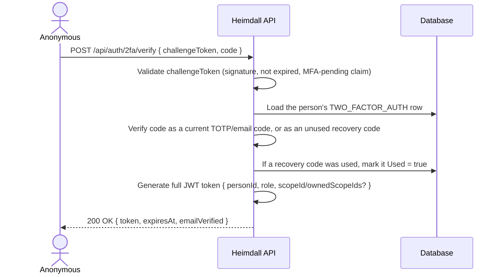

1. Caller sends the challenge token from UC-11's login response, together with either a current app/email code or a recovery code.
2. The system validates the challenge token: signature, expiration, and that it carries the MFA-pending claim (FR-2F-10) — this endpoint is the only one that accepts such a token.
3. The system checks the supplied value: a TOTP code against the stored secret, an email code against its stored hash and expiry, or a recovery code against the stored hashes.
4. If a recovery code was used, the system marks it consumed — it cannot be used again.
5. The system generates and returns the full authentication token, identical in shape to a direct UC-11 success.

**Alternative Flows:**

| ID | Condition | Outcome |
| ---- | ----------- | --------- |
| AF-38a | Challenge token expired or invalid | Return `401 Unauthorized` |
| AF-38b | Code does not match any valid app code, email code, or unused recovery code | Return `401 Unauthorized` |
| AF-38c | Recovery code already used | Return `401 Unauthorized`, same message as AF-38b (does not reveal that the code existed) |
| AF-38d | The submitted factor checks out, but the person's scope eligibility (AF-11d/AF-11e) no longer holds by the time this runs | Return `401 Unauthorized` with a distinct message, since — unlike AF-38a through AF-38c — nothing about the challenge token or the factor was wrong |

> **On the single rejection.** As with UC-11's own AF-11a..e, AF-38a through AF-38c collapse to one indistinguishable `401` — telling an unauthenticated caller which part of their guess was wrong would leak whether a challenge token is merely expired versus outright forged, or whether a recovery code was ever real.
>
> **On AF-38d being separate.** AF-38d is not folded into that collapse: the caller who reaches it proved both a valid challenge token and a genuine factor, so the failure is not "you guessed wrong" but "your account stopped qualifying between UC-11 and now." There is nothing to hide by distinguishing it — the caller already holds proof they are who they say they are.

---

### UC-39: Disable Two-Factor Authentication

| Field | Value |
| ------- | ------- |
| **ID** | UC-39 |
| **Name** | Disable Two-Factor Authentication |
| **Actors** | User, Scope Admin, System Admin |
| **Description** | Turn off two-factor authentication for the caller's own account |
| **Preconditions** | Actor is authenticated; `TWO_FACTOR_AUTH.IsActive = true` for the person |
| **Postconditions** | The person's `TWO_FACTOR_AUTH` row and all of its recovery codes are permanently removed |

**Main Flow:**

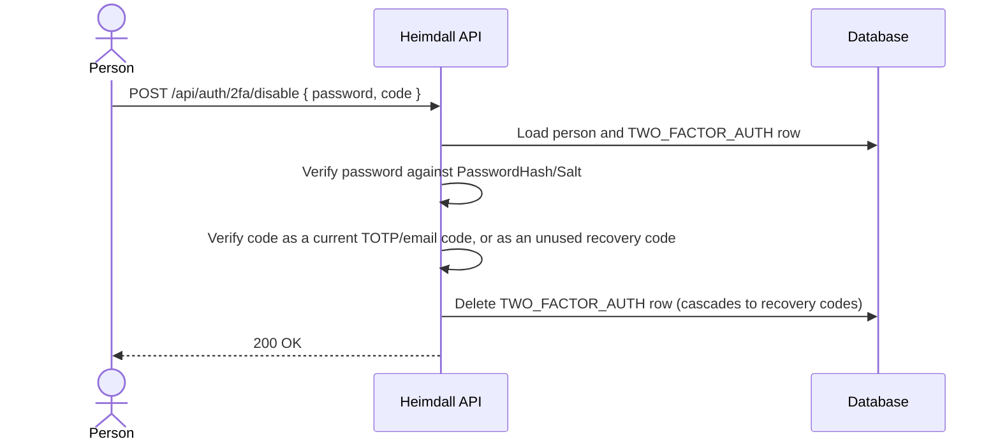

1. Caller sends their current password together with a valid second factor — an app/email code or a recovery code.
2. The system verifies the password, exactly as UC-11 does.
3. The system verifies the second factor, exactly as UC-38 does.
4. Only when both check out, the system deletes the `TWO_FACTOR_AUTH` row, which cascades to its recovery codes.
5. The system returns success. Two-factor authentication no longer applies to the next login.

**Alternative Flows:**

| ID | Condition | Outcome |
| ---- | ----------- | --------- |
| AF-39a | Two-factor authentication is not active for the person | Return `404 Not Found` |
| AF-39b | Password mismatch | Return `401 Unauthorized` |
| AF-39c | Second factor invalid (per AF-38b/AF-38c) | Return `401 Unauthorized` |

> **On requiring both factors to disable.** Password alone is not enough: an attacker holding only a stolen session or a leaked password should not be able to strip two-factor protection off an account they don't fully control. Requiring the second factor too makes disabling exactly as hard as a login.

---

### UC-40: Regenerate Recovery Codes

| Field | Value |
| ------- | ------- |
| **ID** | UC-40 |
| **Name** | Regenerate Recovery Codes |
| **Actors** | User, Scope Admin, System Admin |
| **Description** | Invalidate the caller's current recovery codes and issue a fresh set of ten |
| **Preconditions** | Actor is authenticated; `TWO_FACTOR_AUTH.IsActive = true` for the person |
| **Postconditions** | The previous ten recovery codes no longer validate; ten new ones exist, hashed, and were returned to the caller in plaintext this one time |

**Main Flow:**

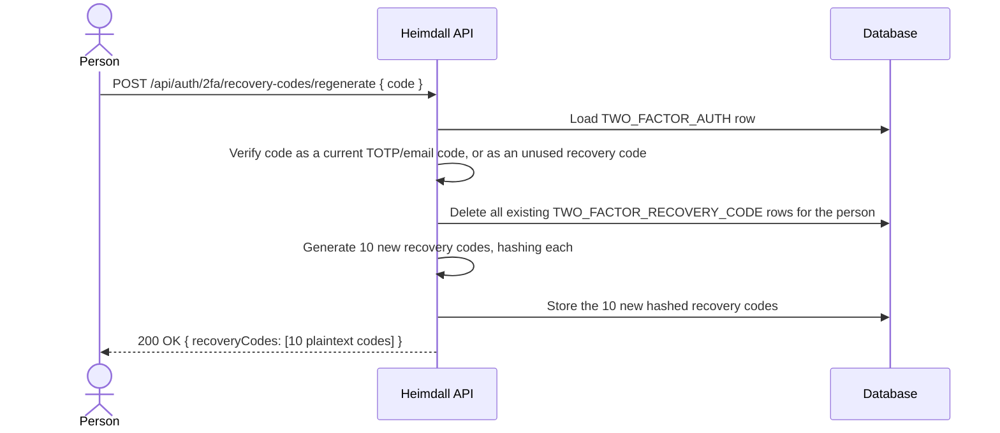

1. Caller sends a valid second factor — an app/email code, or one of their remaining recovery codes.
2. The system verifies it, exactly as UC-38 does.
3. The system deletes every existing recovery code row for the person, including any still unused.
4. The system generates ten new codes, hashes each, and stores them.
5. The system returns the ten new codes in plaintext — the only response that will ever contain them.

**Alternative Flows:**

| ID | Condition | Outcome |
| ---- | ----------- | --------- |
| AF-40a | Two-factor authentication is not active for the person | Return `404 Not Found` |
| AF-40b | Second factor invalid (per AF-38b/AF-38c) | Return `401 Unauthorized` |

> **On invalidating the whole set.** Regeneration replaces all ten codes at once rather than topping up the used ones back to ten: a partial refill would leave old, already-distributed codes valid alongside new ones, defeating the point of rotating them.

---

## 3. Use Case — Requirements Traceability

| Use Case | Requirements Covered |
| ---------- | --------------------- |
| UC-01: Create Scope | FR-SC-01, FR-SC-08 |
| UC-02: View Scope | FR-SC-02, FR-SC-03, FR-SC-07 |
| UC-03: Update Scope | FR-SC-04 |
| UC-04: Logical Delete Scope | FR-SC-05, FR-SC-07 |
| UC-05: Hard Delete Scope | FR-SC-06 |
| UC-06: Create Person | FR-PE-01, FR-PE-02, FR-PE-09, FR-PE-10, FR-PE-11, FR-RO-01, FR-RO-02, FR-RO-03, FR-SC-12, FR-EV-01, FR-EV-02 |
| UC-07: View Person | FR-PE-03, FR-PE-04, FR-PE-08 |
| UC-08: Update Person | FR-PE-05, FR-RO-02, FR-RO-03, FR-RO-05 |
| UC-09: Logical Delete Person | FR-PE-06, FR-PE-08 |
| UC-10: Hard Delete Person | FR-PE-07 |
| UC-11: Login | FR-AU-01, FR-AU-02, FR-AU-03, FR-AU-04, FR-AU-05, FR-AU-06, FR-AU-07, FR-2F-07 |
| UC-12: Password Recovery | FR-PR-01, FR-PR-02 |
| UC-13: Reset Password | FR-PR-03, FR-PR-04 |
| UC-14: Email Verification | FR-EV-03 |
| UC-15: Resend Verification Email | FR-EV-04 |
| UC-16: Create Application | FR-AP-01, FR-AP-02, FR-AP-03 |
| UC-17: View Application | FR-AP-04, FR-AP-05, FR-AP-09 |
| UC-18: Update Application | FR-AP-06 |
| UC-19: Logical Delete Application | FR-AP-07, FR-AP-09 |
| UC-20: Hard Delete Application | FR-AP-08 |
| UC-21: Add Scope Owner | FR-SC-08, FR-SC-09 |
| UC-22: Remove Scope Owner | FR-SC-08, FR-SC-10 |
| UC-23: Promote User to Scope Owner | FR-SC-08, FR-SC-13, FR-RO-03 |
| UC-24: Enable/Disable Google Sign-In | FR-GO-01, FR-GO-02 |
| UC-25: Sign Up / Sign In via Google | FR-GO-03 through FR-GO-11 |
| UC-26: Sign Out via Google | FR-GO-18 |
| UC-27: View Google User | FR-GO-14, FR-GO-17 |
| UC-28: Logical Delete Google User | FR-GO-15, FR-GO-17 |
| UC-29: Hard Delete Google User | FR-GO-16 |
| UC-31: Create Scope Permission | FR-SP-01, FR-SP-02, FR-SP-03 |
| UC-32: View Scope Permission | FR-SP-04, FR-SP-05, FR-SP-09 |
| UC-33: Update Scope Permission | FR-SP-06 |
| UC-34: Logical Delete Scope Permission | FR-SP-07, FR-SP-09 |
| UC-35: Hard Delete Scope Permission | FR-SP-08 |
| UC-36: Enable Two-Factor Authentication | FR-2F-01, FR-2F-02, FR-2F-03 |
| UC-37: Confirm Two-Factor Authentication Setup | FR-2F-04, FR-2F-05 |
| UC-38: Verify Second Factor | FR-2F-06, FR-2F-08, FR-2F-09, FR-2F-10 |
| UC-39: Disable Two-Factor Authentication | FR-2F-11 |
| UC-40: Regenerate Recovery Codes | FR-2F-12 |

---

## 4. State Diagrams

### 4.1 Person Lifecycle

```mermaid
stateDiagram-v2
    [*] --> Created: UC-06 Create Person
    Created --> Active: UC-14 Email Verified
    Created --> LogicallyDeleted: UC-09 Logical Delete
    Active --> LogicallyDeleted: UC-09 Logical Delete
    Active --> Active: UC-08 Update Person
    LogicallyDeleted --> Active: Restore (set IsDeleted = false)
    LogicallyDeleted --> [*]: UC-10 Hard Delete
    Active --> [*]: UC-10 Hard Delete
    Created --> [*]: UC-10 Hard Delete
```

### 4.2 Scope Lifecycle

```mermaid
stateDiagram-v2
    [*] --> Active: UC-01 Create Scope
    Active --> Active: UC-03 Update Scope
    Active --> LogicallyDeleted: UC-04 Logical Delete
    LogicallyDeleted --> Active: Restore (set IsDeleted = false)
    LogicallyDeleted --> [*]: UC-05 Hard Delete
    Active --> [*]: UC-05 Hard Delete
```

Note: Ownership (`SCOPE_OWNER` rows, added/removed via UC-21/UC-22) can change at any time while a scope is `Active`, independently of this lifecycle.

### 4.3 Application Lifecycle

```mermaid
stateDiagram-v2
    [*] --> Active: UC-16 Create Application
    Active --> Active: UC-18 Update Application
    Active --> LogicallyDeleted: UC-19 Logical Delete
    LogicallyDeleted --> Active: Restore (set IsDeleted = false)
    LogicallyDeleted --> [*]: UC-20 Hard Delete
    Active --> [*]: UC-20 Hard Delete
```

### 4.4 Google User Lifecycle

```mermaid
stateDiagram-v2
    [*] --> Active: UC-25 Sign Up via Google (first sign-in)
    Active --> Active: UC-25 Sign In via Google (subsequent sign-ins)
    Active --> LogicallyDeleted: UC-28 Logical Delete
    LogicallyDeleted --> Active: Restore (set IsDeleted = false)
    LogicallyDeleted --> [*]: UC-29 Hard Delete
    Active --> [*]: UC-29 Hard Delete
```

Note: A Google User has no `Created`/unverified-email intermediate state — Google has already verified the account before the ID token is issued, so the record is `Active` immediately upon sign-up.

### 4.5 Scope Permission Lifecycle

```mermaid
stateDiagram-v2
    [*] --> Active: UC-31 Create Scope Permission
    Active --> Active: UC-33 Update Scope Permission
    Active --> LogicallyDeleted: UC-34 Logical Delete
    LogicallyDeleted --> Active: Restore (set IsDeleted = false)
    LogicallyDeleted --> [*]: UC-35 Hard Delete
    Active --> [*]: UC-35 Hard Delete
```

Note: Logically deleting a scope (UC-04) does **not** cascade to its scope permissions — they keep whatever `IsDeleted` state they had. They become unreachable through the listing endpoint (which gates on the scope's deletion) and are excluded from the JWT-claim fold at login, but are not purged; a restored scope recovers its permission set unchanged. Hard-deleting a scope (UC-05) does purge its scope permissions, via the `scope_permission → scope` foreign key's `ON DELETE CASCADE`.

### 4.6 Two-Factor Authentication Lifecycle

```mermaid
stateDiagram-v2
    [*] --> Pending: UC-36 Enable (Initiate)
    Pending --> Pending: UC-36 Re-initiate (change method selection)
    Pending --> Active: UC-37 Confirm Setup
    Active --> Active: UC-40 Regenerate Recovery Codes
    Pending --> [*]: UC-39 Disable (n/a — nothing to disable until Active)
    Active --> [*]: UC-39 Disable
```

Note: There is no `Pending → [*]` transition through UC-39 in practice — UC-39's precondition requires `IsActive = true`, so an abandoned `Pending` configuration is only ever replaced (UC-36 re-initiation) or superseded by hard-deleting the person (UC-10), never explicitly disabled. UC-38 (Verify Second Factor) does not appear on this diagram — it acts on a login attempt, not on the two-factor configuration's own state.
