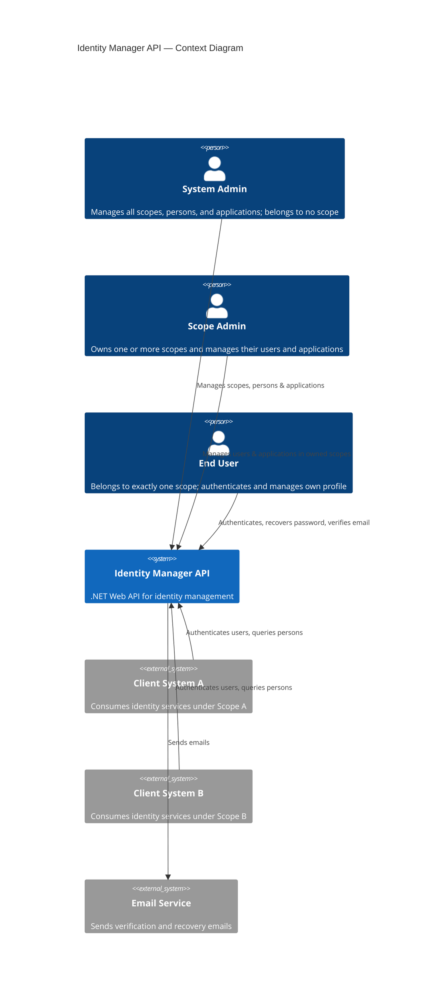
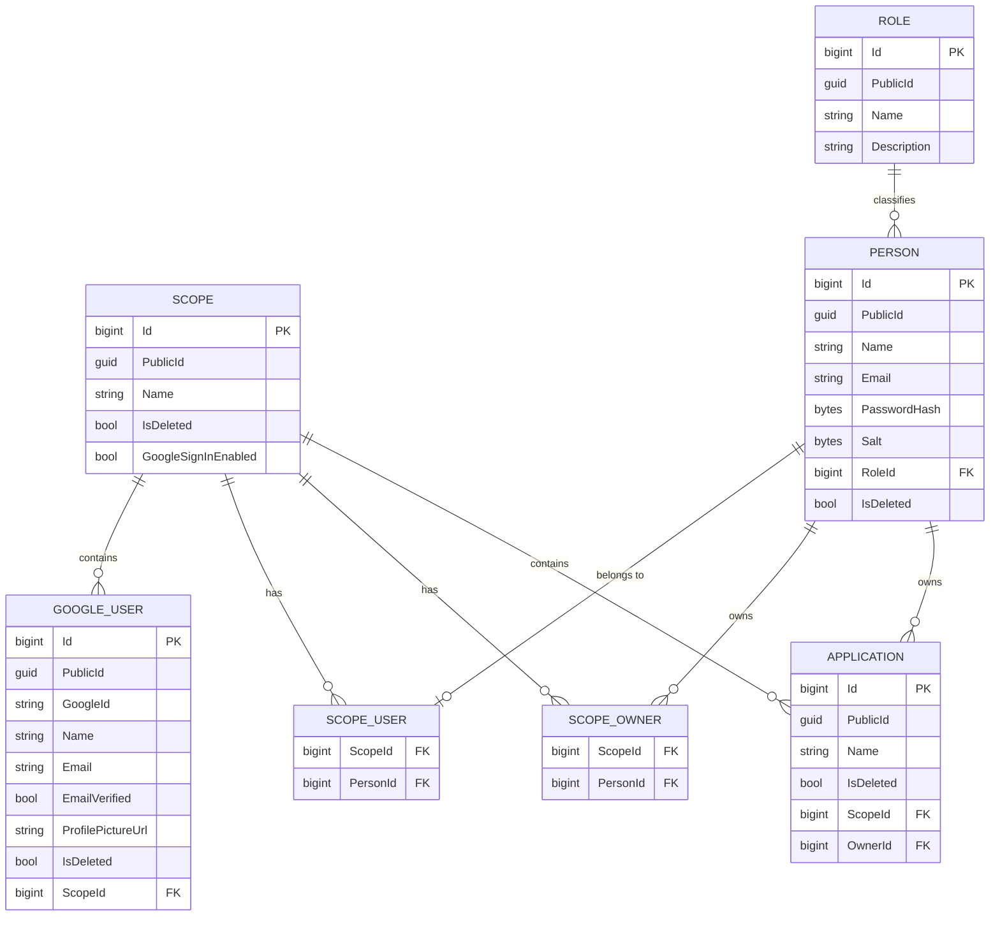
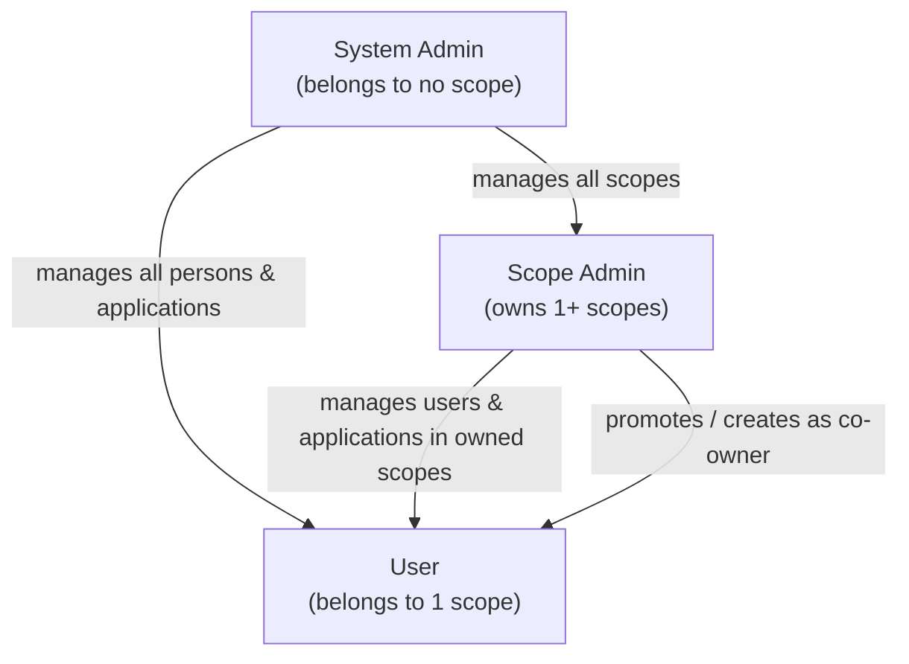

# Vision Document — Identity Manager API

## 1. Introduction

### 1.1 Purpose

This document establishes the vision for the **Identity Manager API**, a .NET Web API responsible for centralized management of user identities, authentication, and authorization across multiple independent systems.

### 1.2 Scope

The Identity Manager API will serve as a single source of truth for person management, application management, authentication, role-based access control, and multi-tenant scoping. It is designed to be consumed by multiple client systems, each operating within its own isolated scope. Beyond human persons, the system also registers **Applications** — non-human identities representing other systems, each owned by a Person.

### 1.3 Definitions and Acronyms

| Term | Definition |
| ------ | ----------- |
| **Scope** | A logical tenant boundary that isolates owners, users, and applications belonging to different client systems |
| **Person** | A registered identity whose relationship to scopes depends on its role: a User belongs to exactly one scope, a Scope Admin owns one or more scopes, and a System Admin belongs to no scope |
| **Application** | A non-human registered identity within exactly one scope, representing another system rather than a person, and owned by exactly one Person |
| **Scope Owner** | A Scope Admin who owns a scope; a scope may have multiple owners and a Scope Admin may own multiple scopes |
| **Scope User** | A User belonging to exactly one scope |
| **Role** | A permission level assigned to a person (User, Scope Admin, System Admin), stored as a reference to a dedicated Role table |
| **Salt** | A random byte array unique to each person, combined with their password before hashing |
| **Google User** | A registered identity within exactly one scope, authenticated via Google Sign-In instead of a password; always equivalent to the `User` role and never a Scope Admin or System Admin |
| **Internal Id** | An auto-incrementing `bigint` primary key used only inside the database, for joins and foreign keys. Never exposed in API responses, URLs, or tokens |
| **Public Id** | A GUID assigned to every top-level entity at creation, used as its externally-facing identifier in API paths, response bodies, and authentication tokens, keeping internal record counts and ordering opaque to callers |
| **Logical Deletion** | Soft-deleting a record by flagging it as inactive without removing it from the database |
| **Hard Deletion** | Permanently removing a record from the database |

---

## 2. Problem Statement

Organizations integrating multiple systems face a recurring challenge: each system independently manages users, credentials, and permissions, leading to duplicated data, inconsistent security policies, and poor user experience. There is no unified mechanism for authentication, user lifecycle management, or cross-system identity governance.

---

## 3. Product Position Statement

| Attribute | Description |
| ----------- | ------------- |
| **For** | Development teams and organizations operating multiple systems |
| **Who** | Need centralized user identity and authentication management |
| **The Identity Manager API** | Is a .NET Web API |
| **That** | Provides scoped person management, role-based access, authentication, password recovery, and email verification |
| **Unlike** | System-specific user management modules that create data silos |
| **Our product** | Offers a single, multi-tenant identity service with clear scope isolation and flexible deletion strategies |

---

## 4. Stakeholders

| Stakeholder | Role | Concern |
| ------------- | ------ | --------- |
| System Admin | Global administrator, belongs to no scope | Full control over all scopes, persons, and applications |
| Scope Admin | Owner of one or more scopes | Management of the users and applications within the scopes they own |
| End User | Consumer of client systems, belongs to exactly one scope | Seamless authentication, password recovery, and email verification |
| Client Systems | External applications | Reliable API for authentication and person data retrieval |

---

## 5. High-Level Architecture

---

## 6. Core Features

| ID | Feature | Description |
| ---- | --------- | ------------- |
| F-01 | Person CRUD | Create, read, update, and delete person records |
| F-02 | Scope CRUD | Create, read, update, and delete scope records |
| F-03 | Logical Deletion | Soft-delete persons and scopes via a boolean flag |
| F-04 | Hard Deletion | Permanently remove persons and scopes from storage |
| F-05 | Scope Isolation | Every User belongs to exactly one scope; every scope may have one or more owners (Scope Admins) and one or more Users |
| F-06 | Role Assignment | Each person is assigned a role: User, Scope Admin, or System Admin, each with a distinct relationship to scopes |
| F-07 | Authentication | Verify credentials and issue authentication tokens |
| F-08 | Password Recovery | Allow users to reset their password via email |
| F-09 | Email Verification | Confirm person email addresses through a verification flow |
| F-10 | Application Management | Create, read, update, and delete Application records representing non-person systems, each owned by a Person within a scope |
| F-11 | Google Sign-In | Allow a Scope Admin to enable Google-based sign-up/sign-in for their scope, letting Users register and authenticate with a Google account instead of a password |

---

## 7. Domain Model Overview

Note: `PERSON` has no `ScopeId` attribute. A `User`'s scope comes from its single `SCOPE_USER` row; a `ScopeAdmin`'s scopes come from its one-or-more `SCOPE_OWNER` rows; a `SystemAdmin` has neither. `GOOGLE_USER` is a separate table from `PERSON` — it has its own `ScopeId` FK directly, since a Google User always represents the `User` role and never needs the owner/multi-scope semantics that justify `SCOPE_OWNER`/`SCOPE_USER` for `PERSON`. Its fields mirror `PERSON` as closely as the Google identity claims allow (`Id`, `Name`, `Email`, `IsDeleted`), replacing `PasswordHash`/`Salt` with `GoogleId`, `EmailVerified`, and `ProfilePictureUrl` sourced from Google's ID token.

Every top-level entity (`SCOPE`, `ROLE`, `PERSON`, `APPLICATION`, `GOOGLE_USER`) has two identifiers: an internal `Id` (`bigint`, auto-increment) used only for storage and foreign keys, and a `PublicId` (`GUID`) used everywhere the entity is addressed from outside the database — API paths, response bodies, and authentication token claims. Foreign keys (`ScopeId`, `RoleId`, `OwnerId`, and the columns in `SCOPE_OWNER`/`SCOPE_USER`) reference the internal `bigint Id`, not the `PublicId`. Join tables (`SCOPE_OWNER`, `SCOPE_USER`) are not directly addressable resources, so they carry no `PublicId` of their own.

---

## 8. Roles Hierarchy

| Role | Scope Relationship | Permissions |
| ------ | --------------------- | ------------ |
| **System Admin** | Belongs to no scope | Full access: manage all scopes, all persons, and all applications across the entire system |
| **Scope Admin** | Owns one or more scopes | Manage the users and applications within the scopes they own; add co-owners to their own scope either by creating a new Scope Admin or by promoting an existing User of that scope; add/remove existing Scope Admins as co-owners |
| **User** | Belongs to exactly one scope | Authenticate, view own profile, recover password, verify email, manage owned applications |

---

## 9. Constraints

- The API must be built with **.NET** (ASP.NET Core Web API). The full technology stack and versions are defined in the [Technology Stack Document](Technology%20Stack%20Document.md).
- A person has no direct scope attribute; its scope relationship is determined by its role.
- A `User` person must belong to exactly one scope.
- A `ScopeAdmin` person must own at least one scope, and does not belong to any scope as a user.
- A `SystemAdmin` person must not belong to any scope, either as an owner or as a user, and has all permissions across the system.
- A scope must have one or more owners, each a `ScopeAdmin`, and may have one or more `User` persons.
- A Scope Admin may add a co-owner to a scope they own either by creating a brand-new Scope Admin person, or by promoting an existing User of that scope (which removes that person's User scope membership).
- Logical deletion must not remove data; it must set a flag.
- Hard deletion must permanently erase data.
- Email verification and password recovery require an external email delivery mechanism.
- Passwords must be stored as a `PasswordHash` byte array together with a per-person `Salt` byte array.
- Roles must be stored in a dedicated Role table (`Id`, `Name`, `Description`) and referenced by persons, not stored as a raw string or enum on the person record.
- Every application must belong to exactly one scope and have exactly one owner, which must be a Person associated with that scope (a User who belongs to it, or a Scope Admin who owns it).
- A scope has a `GoogleSignInEnabled` flag, off by default, that only its owners (or a System Admin) may turn on or off.
- Only accounts equivalent to the `User` role may sign up or sign in via Google; Google authentication must never create or authenticate a Scope Admin or System Admin.
- A Google User belongs to exactly one scope and is subject to the same `IsDeleted` lifecycle (logical and hard deletion) as a Person.
- A Google User's email must be unique within its scope, considered jointly with the emails of `User` persons in that scope — the same email cannot be registered twice via Google, nor shared with a password-based User account in the same scope.
- Every top-level entity has an internal auto-increment `bigint Id` (never exposed) and a `PublicId` GUID (used in all API paths, responses, and tokens), to keep resource enumeration and record counts opaque to callers.

---

## 10. Success Criteria

- Client systems can register, authenticate, and manage users within their own scope without affecting other scopes.
- System admins can govern all scopes, persons, and applications from a single API, without belonging to any scope themselves.
- A scope can be co-owned by multiple Scope Admins, and a Scope Admin can own multiple scopes.
- Password recovery and email verification flows complete end-to-end.
- Both logical and hard deletion strategies are available and operate correctly.
- Persons can register and manage Applications representing other systems within their own scope.
- A Scope Admin can turn on Google Sign-In for a scope they own, letting Users of that scope sign up and sign in with a Google account.
